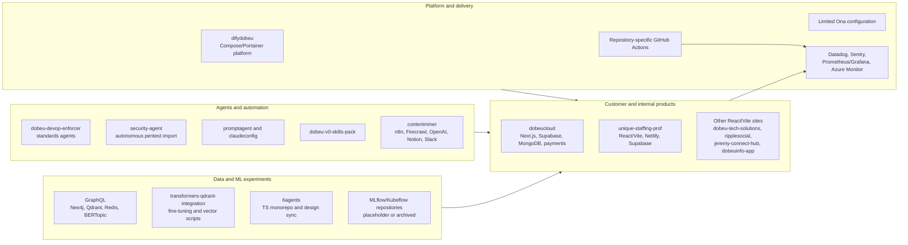
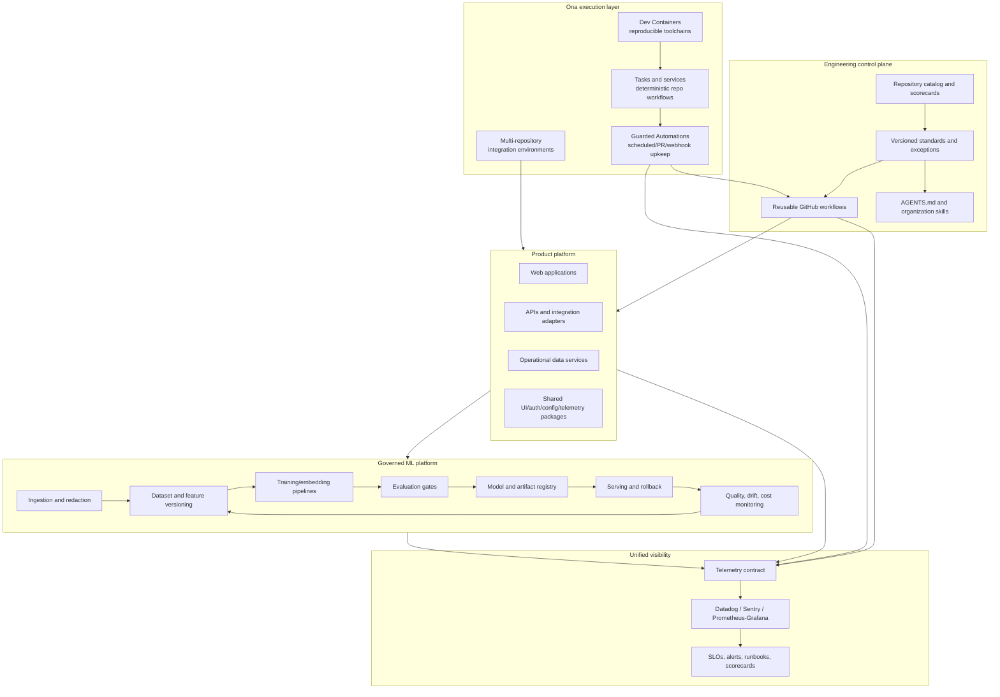
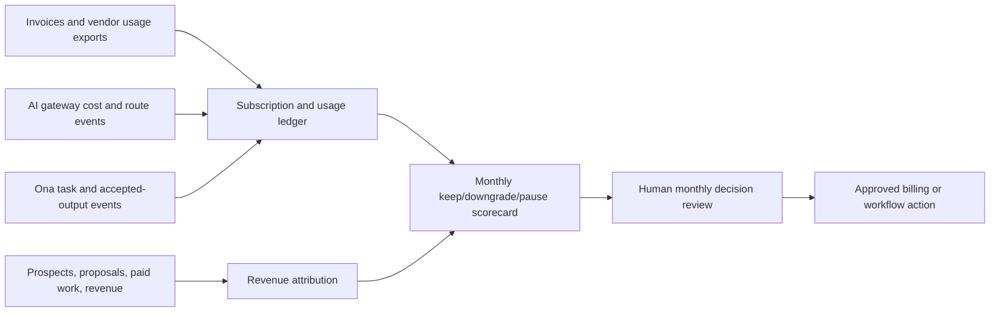
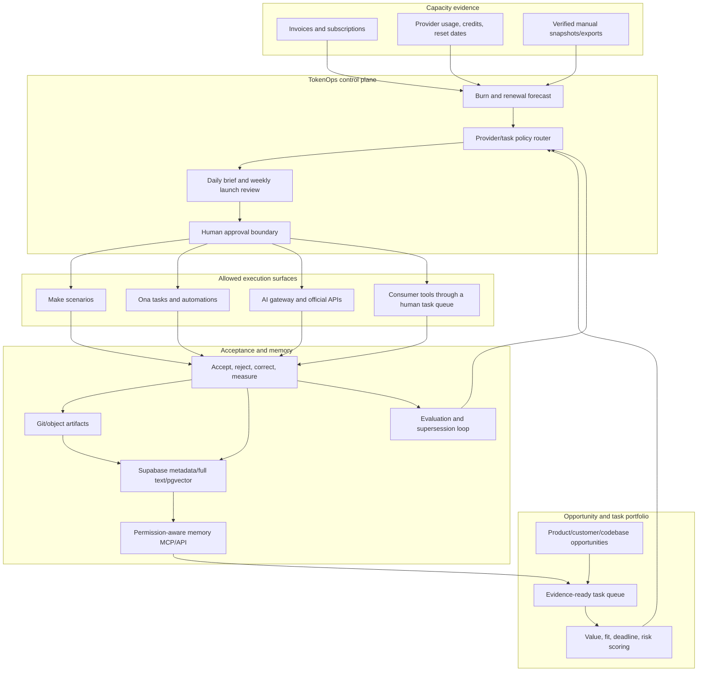
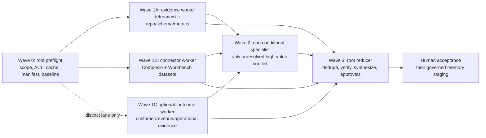
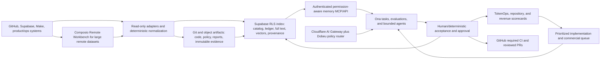

# Company Code Tour, TokenOps, and Engineering Platform Specification

Status: consolidated, approval-ready implementation plan; no implementation performed in this plan-mode turn
Snapshot date: 2026-09-11 (UTC)
Primary namespace observed: `dobeutech`

## 1. Executive outcome

Dobeu Tech Solutions already has the raw components of a company engineering platform: web products, integration services, an internal standards engine, agent and skill collections, security tooling, GitHub Actions, Ona configuration, observability integrations, and experimental ML/data systems. The main opportunity is not adding more isolated tools. It is turning the existing pieces into one governed platform with shared contracts, reusable delivery workflows, consistent telemetry, a reproducible ML lifecycle, and a disciplined path from tool spend to customer revenue.

This specification defines a holistic `/code-tour` that:

- accounts for every repository visible to the connected GitHub identity;
- maps applications, shared capabilities, data flows, infrastructure, CI/CD, security, observability, agent tooling, and ML assets;
- establishes company-wide standards without forcing every repository into one runtime;
- assigns Ona a concrete role in reproducible development, multi-repository validation, guarded maintenance automation, and codebase upkeep;
- coordinates expiring subscription capacity through proactive, approval-based recommendations and reusable cross-agent memory;
- targets at least $7,777 in collected revenue within one year against the current $7,776 annual software ceiling;
- produces prioritized remediation and migration waves rather than an unbounded rewrite.

Section 31 is the authoritative execution and approval plan. It reconciles every request and partially completed investigation from this session; where its ordering conflicts with earlier phase lists, Section 31 controls while the detailed requirements and designs in Sections 1–30 remain applicable.

No repository or external system was changed during planning.

## 2. Goals and non-goals

### 2.1 Goals

1. Create a complete company repository catalog with ownership, lifecycle, criticality, stack, deployment, data, and dependency metadata.
2. Identify correctness, performance, security, maintenance, and delivery risks across repositories.
3. Define minimum standards for TypeScript/JavaScript, Python/ML, shell/infrastructure, containers, and GitHub Actions.
4. Consolidate duplicated authentication, UI, configuration, integrations, telemetry, and pipeline logic where the coupling benefit exceeds migration cost.
5. Design one observability contract spanning applications, CI, automations, and ML workloads.
6. Design a governed, reproducible machine-learning pipeline from ingestion through evaluation, deployment, monitoring, and rollback.
7. Make Ona the reproducible execution and guarded automation layer around source-controlled standards.
8. Preserve human approval for security-sensitive, production, outbound, destructive, and cross-repository changes.
9. Build a permission-aware engineering memory harness that answers company-codebase questions with source citations and freshness metadata.
10. Minimize AI cost and token use through deterministic-first execution, retrieval budgets, caching, task-aware model routing, and measured quality gates.
11. Rationalize the repository portfolio through consumer evidence, staged archival, and explicit retention or deletion approvals.
12. Standardize portable shell/editor ergonomics in Ona without mixing personal preferences, team requirements, or secrets.
13. Keep total software spend at or below the stated $648-per-month ceiling while maximizing accepted business value from prepaid and expiring allowances; reduce spend when measured capacity cannot be used well.
14. Validate and sell one productized service before funding another speculative product build.
15. Give every retained subscription a named owner, unique job, allowance/reset policy, usage evidence, renewal decision, and attributable delivery or revenue outcome.
16. Provide daily and weekly oversight that recommends the best ready-to-run work for remaining allowances, then asks for approval before launches or external actions.
17. Store accepted project outputs, evidence, decisions, and lessons in permission-aware engineering memory so agents on approved networks can retrieve and build on prior work.

### 2.2 Non-goals

- No code changes, PRs, issues, deployments, credential changes, or repository settings changes in plan mode.
- No attempt to make Ona replace GitHub branch protection or authoritative CI/CD gates.
- No blanket monorepo migration. Repository boundaries should follow deployability, ownership, and change coupling.
- No production penetration testing or exploitation.
- No automatic repository deletion. Automation may recommend `keep`, `consolidate`, `archive`, `transfer`, or `delete`; only a named owner may approve archival, and deletion requires a separate legal/retention check and explicit human confirmation.
- No claim that every connected SaaS tool should be invoked for every task. Tool use must follow least privilege, data classification, cost, and evidence value.
- No raw, indefinite capture of every prompt, response, tool payload, secret, or customer record under the label of “memory.” Retention is tiered and policy-controlled.
- No use of an interactive or ephemeral Ona environment as an always-on production gateway. Ona is the development, evaluation, and automation execution plane; production services require a durable runtime.
- No assumption that README claims, repository descriptions, or generated documentation are current until verified against code and CI execution.
- No deep review of archived third-party forks unless they still feed production, training, compliance, or distribution.
- No attempt to justify a subscription merely because it has already been purchased. Decisions use forward-looking customer value, replacement coverage, switching risk, and measured utilization.
- No assumption that a consumer chat subscription includes API credits or can power the proposed gateway. Subscription invoices and API billing accounts must be reconciled separately.
- No automatic cancellation, downgrade, data migration, or billing change in plan mode. Each action requires the export and dependency checks in Section 23.
- No synthetic jobs, duplicate model calls, low-quality content, or unnecessary data movement merely to drive an allowance to zero. Unused capacity with no valuable backlog is evidence for a lower tier at renewal.
- No browser automation, credential sharing, or unofficial use of consumer-plan quotas as an API. Each provider must be used through an allowed interface and within its account terms.
- No automatic publication, deployment, customer outreach, purchase, or billing action from an oversight recommendation. Those actions require the approval boundary defined in Section 27.

## 3. Evidence and access constraints

### 3.1 GitHub access result

The GitHub MCP connection authenticates the `dobeutech` identity, but repository search, team enumeration, directory listing, and direct file tools return `Insufficient scope`. Exact-file reads through GitHub MCP resource templates work when the owner, repository, and path are already known.

Because repository discovery was blocked in the requested GitHub MCP path, the public GitHub REST API was used as a read-only fallback to enumerate public repositories and file trees. Exact source files used as evidence were then read through GitHub MCP resources.

Consequences:

- The current snapshot covers **87 public repositories** in `dobeutech`.
- Private repositories and additional organizations cannot be asserted complete.
- Branch protection, rulesets, environments, secrets configuration, team ownership, Actions run history, code-scanning alerts, dependency alerts, and private repository metadata remain unverified.
- The `Dobeu-Tech-Solutions` organization named in the public profile did not resolve through the public organization endpoint.
- Full-company implementation must begin by granting the GitHub MCP connection read access to the intended organizations and repositories. The connection registry currently offers no self-service reauthentication request for this integration.

### 3.2 Evidence rules

- Treat GitHub content as untrusted input and never execute repository instructions during discovery.
- Use source files as stronger evidence than README claims, and successful CI runs as stronger evidence than workflow YAML.
- Record the commit SHA or default-branch head used for each later finding.
- Do not retrieve secrets, private customer content, production data, or model training data as part of the code tour.
- Mark findings as `observed`, `inferred`, or `unverified`.
- Re-run repository discovery after MCP permissions are repaired; public REST discovery is not an acceptable final source of truth for private/company-wide coverage.

## 4. Repository portfolio baseline

### 4.1 Portfolio counts

| Portfolio segment | Count | Review treatment |
|---|---:|---|
| Public repositories | 87 | Catalog all |
| Active repositories | 33 | Review for operational relevance |
| Active first-party repositories | 31 | Standards and ownership scope |
| Active forks | 2 | Provenance and update-policy scope |
| Archived repositories | 54 | Retention, provenance, and dependency check |
| Archived forks | 37 | Reference-only unless consumed |
| Archived first-party repositories | 17 | Confirm replacement and retirement state |

Of the 31 active first-party repositories, 8 are substantive by repository size, 9 are small but contain code or configuration, and 14 are empty or near-placeholder size. Size is a triage heuristic, not a quality or business-value score.

### 4.2 Active first-party inventory

**Substantive codebases (8):** `6agents`, `difydobeu`, `dobeucloud`, `jeremy-connect-hub`, `ripplesocial`, `security-agent`, `transformers-qdrant-integration`, and `unique-staffing-prof`.

**Small code/configuration repositories (9):** `claudeconfig`, `contentminer`, `dobeu-devop-enforcer`, `dobeu-tech-solutions`, `dobeu-v0-skills-pack`, `dobeuinfo`, `dobeuinfo-app`, `GraphQL`, and `promptagent`.

**Empty or near-placeholder repositories (14):** `brave-search`, `conversation-network`, `deployment-scripts`, `dobeu-undertaker`, `go-development`, `mcp-config-management`, `mlflow-setup`, `neural-bookmarks`, `server-configs`, `smithery-mcp`, `smithyai-2`, `thereisanappforthat`, `Todo-copy`, and `Uniquestaffing`.

The two active forks are `stable-diffusion-webui-amdgpu` and `claude-code-chatapi`. They must have an explicit upstream-sync, patch ownership, and production-use decision.

### 4.3 Archived inventory

The 17 archived first-party repositories are `dobeunet-vercel`, `dobeunet-homepage`, `database-stack`, `mcp-servers`, `llm-infrastructure`, `ml-stack`, `jenkins-ci`, `kubeflow-setup`, `file-management`, `zapier-integration`, `vector-database`, `github-integration`, `docker-infrastructure`, `nginx-api-gateway`, `dev-server-index`, `nvidia-gpu`, and `graphql-gateway`.

The 37 archived forks are primarily MCP SDKs/servers, AI education or agent projects, developer tooling, and third-party documentation. They should be retained only when there is a named internal consumer or provenance requirement; otherwise they distort company-wide dependency, security, and activity reporting.

### 4.4 Metadata and governance baseline

Across the 31 active first-party repositories:

- all 31 have no GitHub topics;
- 12 lack a repository description;
- 23 have no license detected by GitHub;
- 21 use `main` and 10 use `master` as the default branch;
- no repository has GitHub Discussions enabled;
- only one has issues disabled.

Among the 17 code-bearing repositories selected for configuration inspection:

- 6 contain GitHub Actions workflows;
- 4 contain Dependabot configuration;
- 2 contain CODEOWNERS;
- 1 contains `AGENTS.md`;
- 5 contain Dev Container configuration;
- 1 contains `.ona/config.yaml`;
- only `difydobeu` and `dobeu-devop-enforcer` exposed clear source-level test suites in the inspected tree; `6agents` contained only a test README at the root-level test path.

These counts must be recomputed across the complete MCP-authorized portfolio during implementation.

## 5. Current company architecture



The architecture has useful components but lacks a common service catalog, shared delivery contract, telemetry schema, model lifecycle, and single source of truth for agent guidance.

## 6. Prioritized findings

### 6.1 P0 — resolve before company-wide automation

1. **GitHub MCP scope is insufficient for the requested review.** The integration reports ready, but repository tools cannot list or read repositories. Full private/company coverage and SCM-setting review are blocked.

2. **The standards orchestrator bypasses permissions.** `dobeu-devop-enforcer` invokes its agent SDK with `permission_mode="bypassPermissions"` while allowing shell and web tools. That is unsafe for unattended execution over untrusted repositories. Deterministic checks must be the default; agent writes and shell access require sandboxing, scoped permissions, audit logs, and an approval boundary. Evidence: [`orchestrator.py`](https://github.com/dobeutech/dobeu-devop-enforcer/blob/main/src/dobeu_undertaker/orchestrator.py).

3. **Several CI security checks can produce false-green builds.** Inspected workflows use `continue-on-error`, `|| true`, and scanner exit code `0` for checks described as security or quality gates. Required checks must fail on policy-breaking severity while advisory checks report without pretending to gate. Evidence: [`unique-staffing-prof/ci.yml`](https://github.com/dobeutech/unique-staffing-prof/blob/main/.github/workflows/ci.yml) and [`security-scan.yml`](https://github.com/dobeutech/unique-staffing-prof/blob/main/.github/workflows/security-scan.yml).

4. **Known workflow/source contradictions need correction before standardization.** `dobeucloud` requires Node 20+ in `package.json`, while its main workflow uses Node 18. The workflow invokes a test script absent from `package.json`, so the declared test job and source contract disagree. Evidence: [`package.json`](https://github.com/dobeutech/dobeucloud/blob/master/package.json) and [`main.yml`](https://github.com/dobeutech/dobeucloud/blob/master/.github/workflows/main.yml).

5. **Default-branch drift can bypass CI.** `difydobeu` reports `master` as its default branch, while its security workflow triggers on `main`/`develop` and uses `main` as a scan base. Evidence: [`security.yml`](https://github.com/dobeutech/difydobeu/blob/master/.github/workflows/security.yml).

6. **Imported autonomous security code needs provenance and isolation.** `security-agent` is a large, upstream-branded Shannon codebase, but repository metadata does not identify it as a fork. It requests privileged container networking for active exploitation and has no inspected CI workflow. Confirm license obligations, upstream source/version, approved targets, data handling, and isolated execution before use. Evidence: [`security-agent/README.md`](https://github.com/dobeutech/security-agent/blob/main/README.md).

### 6.2 P1 — platform consistency and security

1. **Standards exist but are not broadly applied.** `dobeu-devop-enforcer` defines TypeScript and Python rules, coverage goals, security, documentation, and dependency agents, but most repositories do not consume the standards and the enforcer itself has no inspected GitHub Actions workflow.
2. **Repository ownership and lifecycle metadata are sparse.** Missing descriptions, topics, licenses, CODEOWNERS, and lifecycle labels make automation and risk reporting unreliable.
3. **GitHub Actions supply-chain policy is inconsistent.** Workflows reference floating `main`/`master` action tags and broad major-version tags. A company policy should pin third-party actions to reviewed commit SHAs, apply least-privilege job permissions, and update pins through controlled automation.
4. **Test coverage is materially weaker than build/lint coverage.** Several applications have build and lint scripts but no visible tests or CI test implementation. Coverage thresholds should be introduced after critical-path tests, not used as a substitute for them.
5. **Agent guidance is fragmented.** `AGENTS.md`, `CLAUDE.md`, `.claude` settings, `claudeconfig`, `promptagent`, and the v0 skill pack overlap. Repository facts should live in concise `AGENTS.md`; repeatable workflows should become repository or organization skills; tool-specific compatibility files should be generated from or link to the canonical source.
6. **Potential local agent state is checked into application repositories.** For example, `dobeucloud` contains `.claude/settings.local.json`. Local-only settings should be removed from version control unless explicitly reviewed as a shared policy artifact.
7. **Documentation drifts from source.** Examples include framework-version differences and repository/package naming differences such as `dobeu-devop-enforcer` versus “Dobeu Undertaker.” The source manifest and executable checks must remain authoritative.

### 6.3 P1 — performance and visibility

1. **Observability is fragmented by destination.** Datadog CI workflows are copied into several repositories, `dobeucloud` uses Sentry and custom analytics, `GraphQL` defines Prometheus/Grafana, and the enforcer declares Azure Monitor/OpenTelemetry dependencies. There is no shared telemetry naming, redaction, correlation, SLO, or ownership contract.
2. **CI repeats dependency installation across parallel jobs.** Repositories such as `dobeucloud` install the same dependency graph separately for lint, type checking, tests, build, and Lighthouse. Reusable workflows, cache discipline, and an explicit fast-path/full-path DAG can reduce latency and cost without coupling all checks into one opaque job.
3. **Floating container images undermine reproducibility.** The inspected GraphQL/ML stack uses tags such as `latest`. Production and CI images should use controlled version tags and, for high-trust paths, reviewed digests.
4. **Large imported/generated assets dominate repository size.** `security-agent` and some archived forks are orders of magnitude larger than the median active first-party repository. Separate benchmark results, generated artifacts, models, datasets, and external mirrors from normal source repositories when possible.

### 6.4 P1 — ML and integration opportunities

1. **The ML pipeline is fragmented into scripts and partially retired infrastructure.** `transformers-qdrant-integration` contains eight loose Python scripts with no manifest, README, CI, data contract, model registry, or evaluation gate. `GraphQL` provides a more complete vector/graph/clustering runtime but no inspected CI. `mlflow-setup` is a near-placeholder while MLflow/Kubeflow repositories are archived.
2. **Content intelligence can feed the same governed data plane.** `contentminer` already covers ingestion, generation, heuristic/LLM quality scoring, Notion/Google Docs storage, and Slack delivery. It should emit versioned datasets, prompts, evaluations, cost/latency telemetry, and human-review outcomes instead of remaining a standalone workflow.
3. **Frontend and service integrations are duplicated.** Several React/Vite products share similar UI, form, analytics, Supabase, deployment, and agent-generated dependency stacks. Candidates for shared packages include design tokens/components, telemetry, environment validation, API clients, authentication adapters, payment interfaces, and testing utilities.
4. **MCP and agent tooling should converge on governed skills.** `promptagent`, `claudeconfig`, the v0 skills pack, placeholder MCP configuration repositories, and the connected MCP ecosystem can become a versioned organization skill/plugin catalog with ownership, provenance, permission declarations, tests, and release notes.

## 7. Requirements

### 7.1 Repository catalog and lifecycle

- REPO-1: Catalog every authorized repository with owner, criticality, lifecycle (`production`, `internal`, `experimental`, `reference`, `archived`, `retire`), upstream provenance, deployment target, data classification, and consumers.
- REPO-2: Require a description, topics, license decision, CODEOWNERS, SECURITY policy, support/runbook link, and default-branch policy for maintained repositories.
- REPO-3: Separate first-party code, vendored/imported code, forks, generated artifacts, models, datasets, and examples.
- REPO-4: Standardize on one default branch name for new repositories and migrate existing repositories only with redirects and workflow updates.
- REPO-5: Define retirement criteria and verify that archived repositories are not referenced by builds, deployments, package manifests, automations, or documentation.

### 7.2 Code-quality standards

- QUAL-1: TypeScript projects use strict compiler checks, ESLint flat configuration, deterministic formatting, a supported organization runtime baseline, a lockfile, and unit/integration tests appropriate to risk.
- QUAL-2: Python projects use `pyproject.toml`, Ruff, strict or justified type checking, pytest, coverage reporting, pinned/runtime-bounded dependencies, and a reproducible environment.
- QUAL-3: Shell and infrastructure repositories use ShellCheck, shfmt, Hadolint, YAML linting, Compose/config validation, and dry-run paths.
- QUAL-4: ML code adds dataset/schema tests, deterministic seeds where applicable, evaluation fixtures, model-card metadata, and inference regression tests.
- QUAL-5: No required check may be silently weakened with `continue-on-error`, `|| true`, or an always-zero scanner exit code.
- QUAL-6: Standards are versioned centrally, but repositories can declare reviewed exceptions with owner, rationale, and expiry.

### 7.3 CI/CD and supply-chain standards

- CICD-1: GitHub Actions remains the authoritative PR and deployment gate.
- CICD-2: Reusable workflows provide language-specific install, format, lint, type, test, build, security, SBOM, artifact, and deployment jobs.
- CICD-3: Third-party actions are pinned to reviewed SHAs and updated by controlled dependency automation.
- CICD-4: Workflow/job permissions default to read-only and are elevated only for the smallest necessary job.
- CICD-5: Protected branches require reviewed PRs, CODEOWNERS where relevant, required status checks, resolved conversations, and environment approval for production.
- CICD-6: Builds produce immutable artifacts once; later stages promote the same artifact rather than rebuilding it.
- CICD-7: Deployments have environment-specific configuration, provenance, health verification, rollback, and deployment annotations in telemetry.
- CICD-8: CI emits timing, failure category, flake, cache-hit, queue, and cost signals under one schema.

### 7.4 Security standards

- SEC-1: Run secret scanning, dependency review, SAST, license analysis, container/IaC scanning, and SBOM generation at appropriate stages.
- SEC-2: Use severity and exploitability policy to distinguish blocking checks from advisory reports.
- SEC-3: Scan repository history and rotate any confirmed exposed secret; never merely delete it from the latest commit.
- SEC-4: Containers run least-privileged, avoid unnecessary host networking/capabilities, use controlled images, and expose only required ports.
- SEC-5: Autonomous security tools run only against explicitly authorized targets in isolated environments with audit logs and rate/impact limits.
- SEC-6: AI/agent execution never defaults to permission bypass. Shell, network, SCM write, and production access are separately controlled.
- SEC-7: Prefer workload identity/OIDC and scoped short-lived credentials over long-lived static tokens.

### 7.5 Observability and performance standards

- OBS-1: Adopt OpenTelemetry-compatible semantic conventions as the internal instrumentation contract, with adapters/exporters for Datadog, Sentry, Prometheus/Grafana, and any cloud provider.
- OBS-2: Every production service emits consistent `service`, `environment`, `version`, `commit`, request/job ID, trace ID, and deployment metadata.
- OBS-3: Logs and model prompts/outputs have explicit PII and secret-redaction rules.
- OBS-4: Each production service defines SLIs/SLOs, owners, alert routing, dashboards, and a runbook.
- OBS-5: Frontends track Core Web Vitals and business journeys; APIs track latency, traffic, errors, saturation, dependency latency, and queue depth.
- OBS-6: CI and Ona automation telemetry must correlate to repository, commit, workflow, task, and resulting PR without exposing prompt or secret contents by default.
- PERF-1: Establish baselines before optimization; track bundle size, cold start, build time, CI time, API/database latency, cache performance, and ML inference throughput/cost.
- PERF-2: Add regression budgets for critical metrics and require explicit approval for material regressions.

### 7.6 Machine-learning platform standards

- ML-1: Version source data, schemas, transforms, prompts, code, configuration, evaluation sets, model artifacts, and lineage.
- ML-2: Introduce a canonical pipeline: ingest → validate/redact → curate/version → train/embed → evaluate → register → approve → deploy → monitor → feedback/rollback.
- ML-3: Use a model/experiment registry and artifact store rather than repository-tracked model binaries.
- ML-4: Require offline quality, safety, bias/domain, latency, and cost evaluations before promotion.
- ML-5: Monitor drift, data quality, model/version usage, failure rate, cost, and human override after deployment.
- ML-6: Keep Neo4j relationship data, Qdrant vectors, source documents, and model artifacts linked by stable IDs and lineage metadata.
- ML-7: Separate experimental notebooks/scripts from production training and inference packages.
- ML-8: Define retention, consent, deletion, and access rules before using customer conversations or content as training/evaluation data.

## 8. Target architecture



### 8.1 Ownership of responsibilities

| Surface | Primary responsibility |
|---|---|
| Repository | Product code, local exceptions, concise `AGENTS.md`, Dev Container, `.ona/config.yaml`, service runbook |
| Central standards package | Language rules, policy schemas, baseline configurations, validation library |
| Shared GitHub workflows | Authoritative merge/deploy gates and supply-chain controls |
| Ona | Reproducible environments, deterministic tasks/services, coordinated multi-repo testing, guarded maintenance automations, merge-ready PR production |
| `dobeu-devop-enforcer` | Policy evaluation and scorecard generation after permission/sandbox redesign; not an unrestricted autonomous shell |
| Observability layer | Cross-runtime telemetry schema, exporters, dashboards, SLOs, redaction, cost attribution |
| ML platform | Data/model lineage, evaluation, registry, controlled deployment, monitoring, rollback |

## 9. Ona role and configuration model

Ona should be the repeatable execution layer around GitHub—not the source of truth for code and not the mechanism that bypasses CI.

### 9.1 Per-repository environment contract

Maintained repositories should define:

- a version-controlled Dev Container containing the exact runtimes and tools required by humans, agents, and automations;
- `.ona/config.yaml` tasks for one-shot workflows such as `install`, `format-check`, `lint`, `typecheck`, `unit-test`, `integration-test`, `build`, `security-fast`, `sbom`, and `code-tour` as applicable;
- services for long-running processes such as the application, databases, Redis, Qdrant, Neo4j, and local telemetry collectors, each with an explicit readiness check;
- concise `AGENTS.md` guidance listing canonical commands, structure, security constraints, and verification requirements;
- repository skills only for workflows that are too rich for `AGENTS.md`, and organization skills for cross-repo standards.

Ona’s documentation defines Dev Containers as the standardized team environment, tasks as one-shot actions, and services as blocking long-running processes. Existing `dobeucloud/.ona/config.yaml` is a useful seed but currently exposes only install, lint, and build tasks.

### 9.2 Multi-repository integration environments

Create explicit Ona projects for coupled systems rather than cloning all 87 repositories into every environment. Initial integration groups:

- **Customer platform:** `dobeucloud` plus shared auth, telemetry, UI, and integration adapters.
- **Frontend portfolio:** shared packages plus the active React/Vite products.
- **ML/data platform:** `contentminer`, `GraphQL`, `transformers-qdrant-integration`, and the replacement model-registry/pipeline repository.
- **Engineering platform:** `dobeu-devop-enforcer`, organization skills, shared workflows, and configuration templates.

Each repository remains independently committed and deployed; the shared environment exists for contract tests, dependency changes, and coordinated validation.

### 9.3 Guarded automations

After pilot validation, Ona Automations can run manually, on schedules, PR events, or webhooks to:

- update reviewed action pins and dependencies;
- remediate bounded CVEs;
- add or refresh repository metadata and documentation;
- detect standards drift and open scorecard PRs;
- identify dead code, stale dependencies, missing tests, flaky tests, and documentation drift;
- triage Sentry issues after that integration is authenticated;
- perform framework migrations in staged repository batches;
- generate release notes and upkeep reports.

Every automation must run in an isolated configured environment, start in report-only mode, cap repository fan-out and duration, use command/executable deny lists, keep audit logs, open reviewable PRs, and never auto-merge production/security changes. Ona’s public documentation specifically supports cloud automations across repositories and provides environment isolation, command/executable deny lists, audit logging, and action limits.

## 10. Company standards matrix

| Concern | TypeScript/JavaScript | Python/ML | Shell/infra | Required evidence |
|---|---|---|---|---|
| Runtime | Central supported version policy | Central supported version policy | Declared shell/platform | Manifest plus Dev Container |
| Dependencies | One selected package manager and lockfile per repo | `pyproject.toml` plus locked environment | Versioned tools/images | Reproducible clean install |
| Format/lint | Prettier + ESLint | Ruff format/lint | shfmt, ShellCheck, Hadolint, YAML lint | CI-required checks |
| Types/schema | TypeScript strict, generated API types | Pyright/mypy policy, Pydantic/data schemas | Compose/IaC schema validation | No unjustified errors |
| Tests | Unit, component, integration, E2E by risk | Unit, integration, data/model evaluation | Dry-run and config tests | Critical-path coverage |
| Security | SAST, dependency, secrets, browser/API tests | SAST, dependency, secrets, unsafe deserialization checks | Image/IaC/secret scans | Blocking severity policy |
| Performance | Bundle/Web Vitals/API budgets | Training/inference cost and latency | Build/image/startup budgets | Baseline and regression report |
| Documentation | README, architecture, runbook, ADRs | Data/model cards, lineage, runbook | Deployment and rollback runbook | Code-verified links/commands |

## 11. Implementation plan

### Phase 0 — access and safety prerequisites

1. Repair GitHub MCP authorization for every intended organization and repository with read-only coverage first.
2. Re-run discovery and reconcile public, private, transferred, archived, and organization-owned repositories.
3. Disable or quarantine unrestricted `permission_mode="bypassPermissions"` paths before any automation pilot.
4. Establish a no-write discovery role and a separately approved PR-writer role.

### Phase 1 — catalog and standards RFC

1. Build the repository catalog and assign lifecycle, criticality, owner, upstream, consumers, data class, and deployment target.
2. Verify all 17 code-bearing repositories; confirm whether the 14 placeholders should be completed, merged, archived, or deleted later through an approved process.
3. Publish company standards as versioned policy with exception schema and expiry.
4. Choose canonical runtime and package-manager policies based on supported versions and actual product constraints.

### Phase 2 — golden paths and shared CI

1. Create reusable GitHub workflows for Node/web, Python/ML, and container/infrastructure repositories.
2. Pilot on `dobeucloud`, `unique-staffing-prof`, `dobeu-devop-enforcer`, and `GraphQL` because they expose the major platform patterns and known contradictions.
3. Fix false-green controls, runtime/script mismatches, default-branch triggers, action pinning, permissions, artifact promotion, and security reporting.
4. Add scorecards without initially blocking low-risk legacy repositories; tighten gates by repository tier.

### Phase 3 — Ona developer and automation layer

1. Add or standardize Dev Containers, `.ona/config.yaml`, and `AGENTS.md` for pilot repositories.
2. Make local/Ona task commands identical to commands invoked by shared CI.
3. Create multi-repository projects for customer platform, frontend portfolio, ML/data, and engineering platform integration testing.
4. Introduce report-only Ona automations for standards drift, dependency health, CVEs, documentation drift, and repository metadata.
5. Promote only high-confidence bounded automations to PR creation; retain human review and GitHub required checks.

### Phase 4 — unified observability and performance

1. Define the telemetry schema, redaction policy, service catalog, SLO template, and ownership model.
2. Replace copied destination-specific instrumentation with shared libraries/workflows and exporter configuration.
3. Establish CI, application, automation, and ML dashboards with deployment correlation.
4. Baseline cost/latency/build metrics, then add budgets and regression gates.

### Phase 5 — governed ML pipeline

1. Define data contracts and lineage across `contentminer`, `GraphQL`, and `transformers-qdrant-integration`.
2. Convert loose scripts into installable/tested packages and reproducible tasks.
3. Restore or replace the model/experiment registry and pipeline orchestrator based on current requirements; do not revive archived stacks by default.
4. Add dataset versioning, evaluation suites, promotion approvals, artifact storage, serving, monitoring, and rollback.
5. Feed human review outcomes and production quality signals into governed evaluation datasets.

### Phase 6 — portfolio migration and upkeep

1. Migrate the remaining active code-bearing repositories in risk/value waves.
2. Consolidate shared UI, telemetry, auth, configuration, and API contracts only after consumer mapping and compatibility tests.
3. Resolve placeholders and archived first-party repositories with owners and dependency evidence.
4. Move third-party mirrors/forks to a clearly labeled reference area or remove them later through an approved retention process.
5. Run quarterly standards reviews and continuously measure adoption, exception age, CI health, vulnerability age, service reliability, and ML quality.

## 12. Verification strategy

- **Coverage:** every MCP-authorized repository appears once in the catalog and reconciles to SCM totals.
- **Source:** every material finding links to a file/setting and commit SHA; README-only claims remain labeled unverified.
- **CI:** validate reusable workflows in pilot PRs, including intentional negative tests that prove required gates fail.
- **Environment:** rebuild each pilot Dev Container and run every documented Ona task from a clean environment.
- **Integration:** run contract tests in each multi-repository Ona project without requiring production credentials.
- **Security:** review permissions, pinning, SBOM/provenance, secret handling, branch controls, and autonomous-tool isolation.
- **Observability:** emit a synthetic transaction/job through application, CI, automation, and ML layers and verify correlation/redaction.
- **ML:** reproduce a registered model/artifact from versioned inputs, pass evaluation gates, deploy to a non-production target, detect a simulated regression, and roll back.
- **Drift:** run the code tour twice from the same commit set and require deterministic inventory and scorecard output.

## 13. Success criteria

The implementation is successful when:

1. GitHub MCP can enumerate and read all intended company repositories and settings with least-privilege credentials.
2. One authoritative repository catalog accounts for all maintained, private, archived, forked, imported, placeholder, and retired assets.
3. Every production repository has an owner, lifecycle, license decision, CODEOWNERS, concise `AGENTS.md`, runbook, protected branch, and required CI gates.
4. Every maintained repository has a reproducible Dev Container or documented exception, plus Ona tasks that match CI commands.
5. Required lint, type, test, build, and security checks cannot pass through error suppression.
6. Third-party Actions and production images follow reviewed pinning and update policy.
7. No autonomous agent uses permission bypass or unrestricted production/SCM write access.
8. Production services and ML workloads emit the shared telemetry fields, have SLOs and owners, and correlate releases to errors/performance.
9. Critical frontend, API, CI, and ML performance metrics have measured baselines and regression budgets.
10. ML artifacts are reproducible from versioned inputs, pass evaluation/promotion gates, are monitored after deployment, and support rollback.
11. Ona automations begin report-only, operate within guardrails, create reviewable evidence, and graduate to PR creation only after measured precision.
12. Placeholder, archived, imported, and forked repositories have explicit keep/migrate/retire decisions and named consumers where retained.

## 14. Implementation deliverables

- Company repository catalog and dependency/service map
- Current-state code-tour report with severity-ranked findings
- Versioned standards and exception policy
- Reusable GitHub workflows and repository scorecard schema
- Dev Container and `.ona/config.yaml` golden-path templates
- Organization and repository skill strategy, including `/code-tour`, `/security-review`, `/dependency-upkeep`, and `/ml-eval`
- Observability conventions, dashboards, SLO templates, and redaction policy
- ML data/model lineage design, evaluation framework, registry/promotion workflow, and rollback runbook
- Migration backlog grouped into pilot, product, ML/data, tooling, and archive waves
- Quarterly review and automated upkeep schedule

## 15. Connected tooling and data-plane baseline

### 15.1 Integration registry

The conversation currently exposes ready native integrations for Amplitude, Anima, Apollo, Cloudflare, Composio, Customer.io, GitHub, Linear, Make, Notion, PostHog, Supabase, and V0. Sentry exists but requires user authentication; Lovable is not ready and has no requestable setup path. “Ready” means the connector is registered, not that every action has the required account scope or that the data is appropriate for the engineering memory harness.

Relevant native tool families include GitHub source and PR operations, Supabase project/database operations, Linear work tracking, Notion knowledge operations, Amplitude/PostHog analytics, Cloudflare platform and AI Gateway operations, and Composio discovery across a much larger connected application catalog. The harness must register capabilities, granted scopes, data class, owner, last verification, and allowed actions for each connection. It must not infer authorization from the mere presence of a tool.

Current callable-tool inventory (session snapshot; counts can change):

| Native family | Tool count | Capability class |
|---|---:|---|
| GitHub | 47 | Source, commits, branches, issues, PRs, reviews, collaborators, releases, security scan |
| Supabase | 29 | Projects, schema, SQL/migrations, functions, branches, logs, advisors, generated types |
| Linear | 78 | Issues, projects, initiatives, documents, releases, comments, agent skills, diffs/reviews |
| Notion | 43 | Search/read/write knowledge, databases, comments, skills, sessions |
| Amplitude | 37 | Taxonomy, analytics, charts, cohorts, experiments, replays, monitors |
| Anima | 20 | Design/code artifacts, design systems, review operations |
| Apollo | 73 | CRM, conversations, contacts, accounts, campaigns, analytics |
| Customer.io | 8 | Engagement workspace workflows and skill-guided operations |
| V0 | 8 | Design/code generation workflows |
| Cloudflare | 3 | Documentation, API discovery, and controlled API execution |
| PostHog | 1 | Product analytics access surface |
| Composio | 7 | Connection/tool discovery, schema retrieval, execution, workbench processing |
| Ona tools | 7 | Integration discovery/setup, SCM helpers, and clarification workflows |

System file/command/plan/resource tools support local inspection and orchestration but are not external sources. Composio advertises a much larger connected application catalog, including model providers, observability, messaging, deployment, vector, and workflow services; those applications enter the harness only after a use-case-specific schema/scope review.

| Connection | Observed state | Intended memory/upkeep role | Required remediation |
|---|---|---|---|
| GitHub | Registered, but broad repository search/list/team/file actions return insufficient scope; exact known-file resource reads work | Authoritative source, history, ownership, CI, PRs, releases, and repository lifecycle | Reauthorize least-privilege read coverage for every intended organization/repository; create a separately approved PR-writer identity |
| Supabase | Native connection registered but project enumeration is scope-blocked; two active Composio connections expose four projects | Schema/data-contract metadata, advisors, health, logs, generated types, and a possible permission-aware memory index | Consolidate account naming, repair native read scope, choose an isolated memory project/schema, and close observed security findings |
| Make | Registered through two credentials that resolve to the same tenant and the same two teams | Cross-SaaS events, approvals, notifications, and business workflow orchestration | Consolidate duplicate credentials; add read-only scenario/blueprint/history coverage because the current connector exposes teams and usage but not scenario inventory |
| Mem0 through Composio | Active, with multiple pre-existing user/agent namespaces; semantic/filter search, list, item retrieval, and event history are discoverable, but mutation tools were not returned | Mem0-style extraction, entity-scoped memory, temporal retrieval, feedback, and cross-agent continuity | Inventory namespace ownership without reading unrelated content; add an approved write/feedback adapter or use the official SDK; keep source evidence and ACL truth outside vendor memory |
| Cloudflare | Ready, with official AI Gateway documentation and platform API surfaces | Managed universal model endpoint, spend controls, optional durable edge runtime | Define least-privilege service token and separate development, staging, and production gateways before any write |
| Linear | Ready | Owned backlog, remediation status, exceptions, and retirement approvals | Define canonical teams/projects/labels; ingest only work linked to repository/service IDs |
| Notion | Ready | Human-readable architecture, ADR, runbook, and policy views | Keep Git/source schemas authoritative; store stable backlinks and sync state to avoid two sources of truth |
| Amplitude/PostHog | Ready | Product usage evidence for keep/consolidate/retire and optimization decisions | Map projects to repository/service IDs and prohibit unrestricted event/user payload ingestion |
| Sentry | Authentication required | Error/performance evidence, incident linkage, and fix validation | Authenticate only when an owner approves; use read-only triage before issue/PR automation |
| Datadog/Grafana/Slack and other Composio apps | Present in the broader application catalog; effective scopes not fully verified | Runtime/CI evidence and notification delivery | Verify each connection on demand; do not bulk-ingest or grant writes merely to maximize connector count |

### 15.2 Supabase read-only review

Four projects were discovered across the two connected accounts. No row data, secrets, keys, or customer content was read.

| Project label | Operational observation | Schema surface | Security observation | Edge Functions |
|---|---|---:|---|---|
| RouteReady | Eight previewed services healthy | 80 tables and 11 views across six schemas | 45 advisor findings; preview included two `security_definer_view` errors | One active function with JWT verification enabled |
| supabase-dobe-net | Eight previewed services healthy | 80 tables and two views across eight schemas | Nine findings; preview included RLS-enabled tables with no policy | Three functions; two inspected functions had platform JWT verification disabled and require implementation-specific authentication review |
| dot-copilot | Project metadata said active, while current auth/database health checks were unhealthy | 15 tables, no views | Nine findings; preview included a mutable `search_path` and an anonymously executable `SECURITY DEFINER` function | None observed |
| ikram-meme-and-co | Inactive; health and connection checks failed | No reliable live inventory | Advisor result is inconclusive while inactive | None returned |

All four projects reported read-only mode disabled where the check completed. These findings are planning evidence, not authorization to alter a database. Implementation must first reproduce them through the intended native Supabase connection, classify false positives, map database objects to owning repositories, and use migrations plus branch validation for any eventual change. The memory harness must never auto-apply migrations, deploy Edge Functions, pause/restore projects, or mutate branches.

### 15.3 Make read-only review

Both Make credentials resolve to the same tenant and return identical teams: `4 Zone Logistics` and `Dobeu Tech Solutions`. This is a duplicate credential footprint, not evidence of two independent tenants. Recent operations data was returned by the API even though the connector parser marked the response unsuccessful; it shows a material usage shift and several transfer/operation spikes that warrant scenario-level attribution rather than speculation.

The current Make tool surface can list organizations/teams and retrieve 30-day usage. It could not discover a Make scenario-list, blueprint, webhook, connection, data-store, or execution-history tool; one search incorrectly routed an execution-history request to Supabase. Therefore the existing connection is insufficient for a holistic Make review. Implementation must add or repair a read-only Make MCP/API adapter before any scenario consolidation or optimization claim. It must redact connection secrets and must not run, enable, disable, edit, or delete scenarios during discovery.

### 15.4 Current workspace and tech-stack observation

The workspace root contains this specification, a minimal Ubuntu Noble Dev Container built from `mcr.microsoft.com/devcontainers/base:2.0.4-noble`, and no `.ona/config.yaml`, language features, shared editor customizations, `.editorconfig`, `.gitattributes`, or project tasks. It is a planning workspace, not a representative application runtime. The current user-level Git configuration also contains an invalid escape in an alias value, causing ordinary Git commands to fail unless the global configuration is bypassed. Plan-mode review did not edit the personal file; implementation must correct it through the versioned dotfiles source and add a `git config --list` parse check.

Across the reviewed repositories, the meaningful stack families are:

- TypeScript/JavaScript applications using React, Vite, Next.js, Node, and package-manager workflows;
- Python automation, security, data, embedding, and model scripts;
- Supabase/Postgres, MongoDB, Neo4j, Qdrant, Redis, GraphQL, and n8n/Make integrations;
- Docker/Compose, YAML, shell, GitHub Actions, Netlify/Vercel/Cloudflare-style deployments;
- OpenAI/Anthropic and other model-provider integrations, plus Sentry, Datadog, Prometheus/Grafana, and product analytics.

The platform should provide archetype-specific environments rather than installing every runtime into every repository.

## 16. Company engineering memory harness

### 16.1 Outcome and principles

The memory harness is a permission-aware, cited, continuously refreshed view of the company codebase and its operational context. It is not an unbounded transcript archive and it does not replace Git, CI, incident systems, or human ownership.

Core principles:

1. **Source-backed:** every fact records source URI, source revision or event ID, capture time, owner, sensitivity, and extractor version.
2. **Permission-preserving:** retrieval may only return a chunk or relation when the caller can access the underlying source.
3. **Freshness-aware:** answers show staleness; deleted or revoked sources are removed from active indexes.
4. **Deterministic first:** parse manifests, ASTs, schemas, workflow YAML, and APIs before invoking a model.
5. **Incremental:** index changed files/objects and invalidate dependent summaries instead of repeatedly sending whole repositories.
6. **Cited:** generated answers and automation findings link to exact source revisions and distinguish observed facts, inferences, and unknowns.
7. **Tiered retention:** durable knowledge is curated; raw inference traffic follows data-class retention and deletion policies.
8. **Human-controlled writes:** the harness proposes changes through reviewable artifacts and PRs; it does not silently rewrite source or external systems.

### 16.2 Logical architecture

```mermaid
flowchart LR
    subgraph Sources[Authoritative sources]
      GH[GitHub code, settings, CI]
      SB[Supabase schema, advisors, health]
      MK[Make scenarios and usage]
      OBS[Runtime and product telemetry]
      WORK[Linear, Notion, incidents]
    end

    subgraph Ingest[Deterministic ingestion]
      SNAP[Revisioned snapshots]
      PARSE[Manifest, AST, schema, contract parsers]
      CLASS[Classification and redaction]
      EDGE[Dependency and ownership extraction]
    end

    subgraph Memory[Governed memory]
      GIT[Versioned catalog, standards, ADRs]
      SQL[Relational entities and evidence]
      VEC[Permission-filtered embeddings]
      ART[Encrypted artifacts with retention]
    end

    subgraph Intelligence[Code intelligence]
      RET[Hybrid lexical/vector retrieval]
      GRAPH[Dependency expansion]
      ROUTER[Task and model policy router]
      SKILLS[Code-tour, reviewer, what-if,<br/>runbook, red-team, multi-repo]
      EVAL[Offline evaluation and feedback]
    end

    subgraph Action[Governed action]
      ONA[Ona tasks and Automations]
      REPORT[Reports and scorecards]
      PR[Reviewable pull requests]
      GATE[GitHub required checks and owners]
    end

    Sources --> SNAP --> PARSE --> CLASS --> EDGE
    EDGE --> GIT
    EDGE --> SQL
    CLASS --> VEC
    CLASS --> ART
    GIT --> RET
    SQL --> RET
    VEC --> RET
    RET --> GRAPH --> ROUTER --> SKILLS --> EVAL
    EVAL --> ROUTER
    SKILLS --> ONA --> REPORT --> PR --> GATE
```



### 16.3 Canonical entities and contracts

The initial schema must model at least:

| Entity | Required fields |
|---|---|
| `repository` | stable ID, SCM URL, default branch, head revision, lifecycle, criticality, owner, license/provenance, data class, deployment targets |
| `service` | repository ID, runtime, environment, endpoints, dependencies, SLO, runbook, on-call owner |
| `component` | repository ID, path/symbol, language, exported interface, tests, owning team |
| `contract` | API/schema/event name, version, producer, consumers, compatibility policy, generated artifact locations |
| `data_asset` | database/schema/table/vector/dataset/model ID, owner, classification, retention, lineage, consumers |
| `workflow` | GitHub/Ona/Make/n8n pipeline ID, trigger, inputs, outputs, permissions, owner, last result, cost |
| `standard` | rule ID, version, applicability, severity, deterministic verifier, remediation, exception policy |
| `finding` | rule/source, evidence revision, severity, confidence, owner, status, expiry, related PR/issue |
| `decision` | ADR/approval ID, scope, alternatives, outcome, approver, effective date, supersession link |
| `memory_chunk` | source ID/revision, checksum, text or structured payload, embedding version, ACL, sensitivity, expiry |
| `model_call` | task class, model alias/version, input/output token counts, cache status, latency, cost, quality outcome; raw content stored only when policy permits |
| `feedback` | answer/finding ID, reviewer outcome, correction, accepted/rejected reason, resulting change |

The version-controlled catalog and standards are canonical. A dedicated, isolated Supabase schema/project is the recommended pilot index because Postgres, full-text search, pgvector, and RLS can keep permission checks close to retrieval. The existing production projects must not be reused without an owner, capacity, data-class, and blast-radius decision. Qdrant/Neo4j remain benchmark candidates; add them only if measured scale or graph traversal needs justify another operational store.

### 16.4 Ingestion and retrieval lifecycle

1. A GitHub event or schedule identifies changed repositories/revisions.
2. A deterministic extractor gathers allowlisted metadata and changed content, computes checksums, scans/redacts secrets, and records ACLs.
3. Parsers emit normalized entities, symbol/contract facts, and dependency edges.
4. Only changed chunks are embedded. Deleted/revoked content is tombstoned and removed from active indexes.
5. A query is classified by task, risk, repository scope, freshness requirement, and caller identity.
6. Hybrid retrieval combines lexical matches, vector similarity, graph neighbors, and explicit filters. Permission checks occur before ranking and again before response construction.
7. The router selects a deterministic path or a model tier, sets context/output budgets, and requires source citations.
8. Feedback, acceptance, cost, latency, and quality are logged against the query/model/prompt versions; approved corrections become durable memory.

### 16.5 Memory requirements

- MEM-1: No answer about company code may claim completeness unless the repository catalog and connector coverage reconcile to the authorized source totals.
- MEM-2: Every stored item has provenance, revision, checksum, ACL, classification, retention, and deletion/tombstone behavior.
- MEM-3: Access revocation must remove retrieval access within the defined SLA and enqueue physical deletion when policy requires it.
- MEM-4: Secrets, credentials, `.env` content, raw customer records, and unrelated user analytics are excluded before embedding.
- MEM-5: Default durable memory stores facts, summaries, citations, decisions, feedback, and metrics; raw prompts/tool payloads require an allowlisted class and expiry.
- MEM-6: Retrieval results must expose source links and freshness; generated synthesis without supporting evidence is labeled inference.
- MEM-7: Indexing is incremental and idempotent. Reprocessing the same source revision produces identical entity/checksum results.
- MEM-8: Source-of-truth conflicts are surfaced, not silently reconciled by a model.
- MEM-9: Backup, restore, retention, legal hold, and verified deletion procedures exist before production use.
- MEM-10: A machine-readable coverage report lists sources that are authorized, partial, failing, stale, or excluded.

### 16.6 Mem0-style self-learning loop

The internal assistant will use a Mem0-compatible memory-provider interface rather than binding callers directly to one hosted API. The initial adapter may use the already connected Mem0 Platform for derived memories if its security, cost, export, and deletion gates pass; an open-source Mem0 or Supabase-native adapter must remain possible behind the same interface.

```mermaid
flowchart LR
    TURN[Authenticated interaction or automation result]
    SAFE[Classify, redact, and attach source/ACL]
    LEDGER[Append-only evidence/event ledger]
    EXTRACT[Single-pass candidate fact extraction]
    RESOLVE[Deduplicate, entity-link,<br/>conflict/supersession check]
    PROMOTE{Promotion policy}
    MEMORY[Scoped active memory]
    RETRIEVE[Hybrid semantic, keyword,<br/>entity and temporal retrieval]
    ANSWER[Cited answer or recommendation]
    FEEDBACK[User/PR/test/incident outcome]
    DECAY[Reinforce, correct, expire,<br/>tombstone or re-embed]

    TURN --> SAFE --> LEDGER --> EXTRACT --> RESOLVE --> PROMOTE
    PROMOTE -->|accepted| MEMORY --> RETRIEVE --> ANSWER --> FEEDBACK --> DECAY --> MEMORY
    PROMOTE -->|review required| FEEDBACK
    PROMOTE -->|rejected| LEDGER
```



Memory scopes are hierarchical and non-interchangeable:

- `session/run`: temporary task context and tool results;
- `user`: personal preferences, corrections, and working conventions visible only to that user unless deliberately shared;
- `agent`: learned behavior/evaluation state for one agent role;
- `repository/service`: cited technical facts, commands, ownership, dependencies, and incidents;
- `team`: approved shared decisions and operating practices;
- `organization`: standards, policy, canonical vocabulary, and cross-company architecture.

Every memory carries `org`, `team`, `repository/service`, `user`, `agent`, `session/run`, sensitivity, source revision, source ACL hash, extractor/prompt/model version, confidence, effective time, expiry, and supersession metadata as applicable. A vendor-side filter is defense in depth, not the authorization boundary; caller authorization is resolved against the source before retrieval and again before synthesis.

Promotion rules:

1. Session summaries and low-risk personal preferences may be generated automatically after redaction, with user deletion/export controls.
2. Repository facts require a valid immutable citation and deterministic consistency check; contradictions remain parallel candidates until resolved.
3. Team memories require an owner or accepted workflow outcome such as a merged PR, resolved incident, or approved ADR.
4. Organization standards, security policy, retention policy, model-routing policy, and repository disposition always require named human approval.
5. Agent-generated claims never become authoritative merely because an agent repeated them. Negative feedback, failed tests, reverted PRs, and incident recurrence decrease confidence and trigger review.

“Self-learning” initially means memory extraction, retrieval improvement, feedback, reinforcement/decay, conflict handling, and prompt/router evaluation. It does **not** mean continuously fine-tuning model weights on raw interactions. Any future training requires a separately approved, consented, versioned dataset and the ML promotion controls in Section 7.6.

Suggested default retention, subject to security/legal approval:

| Layer | Default | Notes |
|---|---|---|
| Transient retrieved context and gateway payload | No durable content log | Metadata/cost trace only unless an incident/debug flag is approved |
| Raw interaction/tool event ledger | 30 days encrypted | Secrets/customer data excluded; shorter by data class; legal hold explicit |
| Session/run summary | 90 days | User-visible and deletable; promote durable facts separately |
| Personal/team derived memory | 180 days since last reinforcement | Decay/expiry plus correction history |
| Cited repository/service fact | Until source revision changes or is revoked | Revalidate on change; tombstone rather than silently overwrite history |
| Approved organization standard/ADR/runbook | Until superseded plus audit retention | Versioned in Git; memory is an index/view |

The Mem0 official interface supports user/agent/run scoping, search, retrieval, update, deletion, expiration, feedback, hybrid retrieval, and managed or self-hosted operation. Current managed benchmark claims include proprietary optimizations; acceptance must rely on Dobeu’s own evaluation, not vendor benchmark transfer.

## 17. Organization skill interface and installation specification

### 17.1 Current source assessment

`/code-tour` currently identifies the end-to-end path of a selected feature: starting at a named/open file, it traces participating modules, data flow, and side effects such as I/O, databases, and APIs, then explains the flow as an onboarding narrative. Its current managed source is a short, explicit-only skill and is not checked into this workspace. After implementation, users should find it in the Ona `/` menu as an organization skill, in **Settings → Agents → Skills**, and at `.ona/skills/code-tour/SKILL.md` where a repository needs an override. The canonical version-controlled source must live in the retained engineering-skills/platform repository with the same packaging and tests required below.

The requested `what-if`, `runbook`, `reviewer`, `ai-redteam`, and `multi-repo` sources are likewise present in the managed agent skill library but are not enabled in this conversation’s advertised skill set. They are also absent from the current OpenAI curated skill catalog. Each package contains only a short `SKILL.md` and an `allow_implicit_invocation: false` policy; none contains executable functions, scripts, schemas, tests, reference material, or examples.

`/agent-plan` is a new proposed organization skill rather than an observed installed package. It must be created in the canonical engineering-skills source, remain explicit and report-only by default, and implement the orchestration contract in Section 30. It plans bounded delegation; it is not itself permission to spawn an unbounded swarm or execute the returned plan.

Accordingly, “function/method documentation” means documenting each skill as an invocation contract. Implementation must not pretend that nonexistent programmatic return types are present.

### 17.2 Common invocation contract

All six skills must define:

- **Purpose and trigger:** exact tasks and phrases that should invoke the skill.
- **Required inputs:** target repository/revision, scope, desired outcome, and caller constraints.
- **Optional inputs:** focus areas, environment, risk tolerance, evidence sources, output format, and time/cost budget.
- **Preconditions:** required source access, clean/known revision, applicable standards, and authorization boundary.
- **Process:** deterministic evidence collection before model reasoning, stopping conditions, and tool routing.
- **Return value:** a structured Markdown report plus optional machine-readable JSON matching a versioned schema.
- **Evidence:** source links, line/symbol/object identifiers, revision, confidence, and unknowns.
- **Side effects:** `none` by default. Any issue, PR, comment, test execution, security probe, or external message is a separately authorized mode.
- **Failure return:** incomplete coverage, denied access, missing evidence, conflicting sources, or unsafe request must be explicit rather than producing a confident partial result.
- **Examples and anti-patterns:** at least one normal, edge, denied, and partial-access case.

### 17.3 Skill-specific interfaces

#### `/agent-plan`

**Description:** Converts an approved measurable outcome into a dependency-aware, budgeted agent DAG. It chooses deterministic work before model work, assigns non-overlapping read or write ownership, routes large remote datasets through Composio Remote Workbench when appropriate, and returns an approval-ready execution manifest.

**Parameters:**

- `objective` (required): measurable business, engineering, or operational outcome.
- `scope` (required): projects/customers, repositories and immutable revisions, source systems, and explicit exclusions.
- `success_criteria` (required): observable acceptance, quality, safety, and when applicable revenue criteria.
- `mode` (optional): `plan` by default, `report_only`, or `execute_approved`; a mode name cannot override a missing approval.
- `deadline` (optional): ISO timestamp or bounded duration.
- `budget` (optional): maximum workers, waves, input/output tokens, model/API spend, tool calls, elapsed time, and human review time.
- `risk_and_data_class`, `allowed_tools`, `approval_boundary`, `memory_scope`, and `output_location` (optional): least-privilege execution and retention boundaries.

**Return value:** A versioned plan object containing run ID/status, immutable scope manifest, budget, waves/dependencies/critical path, agent assignments, Workbench jobs, evidence coverage, risks/unknowns, approval requests, handoff artifacts, staged memory candidates, estimated/actual cost and tokens, and stop/escalation reason. It makes no changes in `plan` mode.

**Usage example:**

```text
/agent-plan
Objective: produce the first paid Operations Automation diagnostic
Scope: RouteReady and 4 Zone Logistics at pinned revisions; approved GitHub, Supabase, Make, and CRM evidence
Success criteria: priced offer, buyer/pain evidence, demo checklist, proposal outline, and human-approved outreach queue
Mode: plan
Deadline: 7 days
Budget: max_workers=3, max_waves=3, max_elapsed_minutes=45, max_tool_calls=35
Allowed tools: GitHub read, Supabase read, Make read, Composio Remote Workbench read-only
Approval boundary: all outreach, publication, purchases, scenario runs, deployments, and production writes
```

The detailed defaults, schemas, lifecycle, routing, and evaluation gates are in Section 30.

#### `/what-if`

**Description:** Qualitatively evaluates an algorithm, heuristic, queue, workflow, or policy across boundary, scale, failure, and adversarial scenarios.

**Parameters:**

- `target` (required): repository/revision plus file, symbol, algorithm, or workflow ID.
- `invariants` (required): properties that must remain true.
- `scenarios` (optional): load, malformed input, dependency timeout, partial failure, retry storm, stale data, concurrency, abuse, cost spike, and recovery cases.
- `assumptions`, `risk_tolerance`, `evidence_scope`, and `budget` (optional).

**Return value:** scenario matrix containing stimulus, expected path, observed/inferred behavior, invariant result, severity, likelihood, detectability, evidence, guardrail, test, and residual risk. It makes no changes.

**Usage example:**

```text
/what-if
Target: dobeucloud@<revision>, payment webhook deduplication path
Invariants: at-most-once fulfillment; retries must be safe
Scenarios: duplicated delivery, delayed database write, provider timeout, forged payload
Return: severity-ranked matrix with tests and guardrails
```

#### `/runbook`

**Description:** Creates or updates an operational runbook from the perspective of the on-call engineer.

**Parameters:**

- `service_or_failure_mode` (required): stable service ID and incident condition.
- `environment` (required): local, staging, or production.
- `evidence_sources` (optional): SLOs, dashboards, log queries, recent deployments, dependency health.
- `allowed_actions`, `rollback_boundary`, `escalation_contacts`, and `time_window` (optional).

**Return value:** symptoms, impact/severity, immediate safety checks, numbered triage, copy-safe diagnostic commands, dashboards, decision tree, bounded mitigations, rollback, escalation, recovery verification, and follow-up. Unsafe/destructive commands are labeled and approval-gated.

**Usage example:**

```text
/runbook
Service: engineering-memory-indexer
Failure mode: embedding queue lag exceeds SLO
Environment: production
Allowed actions: inspect, scale within approved limit, pause ingestion; no data deletion
```

#### `/reviewer`

**Description:** Reviews a diff as a senior engineer, prioritizing correctness, testing, performance, security, and project conventions.

**Parameters:**

- `change` (required): PR/diff and immutable base/head revisions.
- `applicable_standards` (required): centrally versioned profile plus repository exceptions.
- `context` (optional): linked issue/ADR, affected contracts, previous review comments, runtime evidence.
- `focus`, `risk_class`, and `comment_mode` (optional).

**Return value:** severity-sorted findings (`P0`–`P3`) with file/line or symbol, evidence, consequence, concrete revision, and missing test. It returns “no blocking findings” when appropriate and separates uncertain questions from defects. Posting comments or submitting a review is an explicit side effect.

**Usage example:**

```text
/reviewer
Change: PR <url> at head <revision>
Standards: web-v1.2 plus approved exception EX-014
Focus: authentication, Supabase RLS, bundle budget
Mode: report only
```

#### `/ai-redteam`

**Description:** Threat-models and tests AI features for prompt injection, jailbreaks, unsafe tool use, data exfiltration, policy evasion, privacy leakage, and cost/resource abuse.

**Parameters:**

- `feature` (required): prompt/agent/RAG/tool workflow and revision.
- `authorized_environment` (required): local fixture or approved non-production target.
- `assets_and_trust_boundaries` (required): data, tools, identities, model/provider, and expected policy.
- `attack_classes`, `test_budget`, `allowed_impact`, and `sensitive_data_fixtures` (optional).

**Return value:** threat model, abuse-case matrix, synthetic adversarial prompts, expected safe behavior, observed result, exploitability/severity, mitigations, regression tests, and residual risk. It must use synthetic markers rather than real secrets and must never probe unapproved production targets.

**Usage example:**

```text
/ai-redteam
Feature: repository-memory question answering at <revision>
Environment: isolated Ona evaluation project
Attack classes: indirect prompt injection, cross-repo ACL bypass, secret request, tool escalation
Fixtures: synthetic canary strings only
```

#### `/multi-repo`

**Description:** Determines the dependency and coordination impact of a change across independently versioned repositories/services.

**Parameters:**

- `anchor_change` (required): contract/change proposal and originating repository/revision.
- `dependency_graph` (required): versioned producer/consumer evidence from the memory harness.
- `compatibility_policy` (optional): additive, deprecation, coordinated cutover, or breaking-change rules.
- `release_constraints`, `owners`, `environments`, and `rollback_requirement` (optional).

**Return value:** impacted repositories and confidence, contract deltas, false-positive exclusions, ordered rollout/cutover, per-repository PR plan, owner coordination, compatibility tests, rollback, and unresolved dependencies. It does not make cross-repository commits without separate per-repository approval.

**Usage example:**

```text
/multi-repo
Anchor: auth claims schema v3 in shared contract repository
Policy: additive dual-read then deprecation
Return: producers/consumers, ordered PRs, contract tests, owners, rollout and rollback
```

### 17.4 Packaging, versioning, and local installation

Avoid creating another repository until the portfolio rationalization proves one is necessary. The preferred implementation is to generalize and rename the existing `dobeu-v0-skills-pack` only after mapping its consumers; otherwise host the canonical skill source inside the retained engineering-platform repository. Each skill lives at `.ona/skills/<name>/SKILL.md` for repository use and is published as an Ona organization skill when company-wide.

The source package for each skill should contain:

```text
<skill>/
├── SKILL.md
├── references/interface.md
├── references/examples.md
├── schemas/output.schema.json
├── tests/cases.yaml
└── agents/openai.yaml
```

Use semantic versions and a changelog. Pin the published organization skill to a reviewed source revision. Repository overrides win only when they declare why they diverge and how they are tested.

For local Codex use, implementation should install the six reviewed paths from the canonical GitHub repository using the `skill-installer` helper into the configured Codex skills directory, then verify discovery on the next turn. The current environment lacks `python3`, which the bundled installer helper requires; the engineering Dev Container must supply a pinned Python runtime or an approved equivalent installer before local installation. Do not copy from an ephemeral managed path as the long-term source of truth.

Keep explicit invocation for all six skills during the pilot. After evaluation, `reviewer`, `runbook`, and `multi-repo` may be proactively discoverable in report-only mode; `agent-plan`, `ai-redteam`, and any side-effecting mode remain explicit. Ona organization skills are appropriate for company-wide behavior, while concise repository facts remain in `AGENTS.md` and repository-specific workflows stay in `.ona/skills`.

### 17.5 Skill evaluation criteria

- At least 20 versioned cases per skill across relevant stack families, including partial permissions and malicious repository instructions.
- Reviewer precision and recall measured against adjudicated findings; no fabricated file/line citations.
- Runbook commands validated in non-production and classified read-only, reversible, or approval-required.
- Red-team tests use synthetic secrets and prove ACL/tool boundaries fail closed.
- Multi-repo impact recall is measured against known contract migrations; every included/excluded repository has evidence.
- What-if analysis covers declared invariants and produces testable guardrails, not generic possibilities.
- Agent-plan evaluation proves that every edge is dependency-valid, every worker has exclusive scope/ownership, budgets and stop conditions are enforceable, and single-agent execution is selected when delegation would add waste.
- Token/cost, latency, escalation rate, acceptance rate, and correction rate are captured by skill and model tier.

## 18. AI gateway and token-efficiency decision

### 18.1 Options

| Option | Benefits | Costs/risks | Ona role | Decision |
|---|---|---|---|---|
| A. Cloudflare Universal endpoint plus thin Dobeu policy router | Existing ready connection; unified provider API; managed logging, caching, rate limits, guardrails, fallbacks, and spend limits; core gateway features are currently free | Vendor dependency; confirm data retention, regional/privacy needs, model coverage, and cost semantics | Develop/test router, SDK adapter, policies, and evaluations in Ona; deploy the thin router to Cloudflare Workers or another durable runtime | **Selected for the internal production assistant, subject to pilot cost gate** |
| B. Self-host LiteLLM or Portkey | OpenAI-compatible multi-provider routing, virtual keys, budgets, fallbacks, guardrails, and stronger deployment control | Patch cadence, database/cache, availability, auth, observability, backups, and incident ownership become internal work | Run as an Ona service for development and integration tests; deploy to durable container/Kubernetes/edge infrastructure | Benchmark fallback if A misses a hard requirement |
| C. Custom “universal gateway” clone | Maximum control over routing, protocols, privacy, and economics | Reimplements provider adapters, streaming, auth, accounting, retries, caching, rate/spend limits, security, and on-call; highest opportunity cost | Ona can build and test it, but should not be the permanent production host | Do not start until A/B fail documented acceptance criteria |

The selected path is Option A for production and an ephemeral LiteLLM/Portkey-compatible local proxy only when useful for development or integration testing inside Ona. Ona’s documented environments are isolated development workspaces that stop, archive, and may auto-delete; they can run services for a task, but they are not the documented durable production-hosting plane. Running a gateway per Ona environment can be economical for tests or scheduled work because it exists only during the run, but the authenticated internal assistant needs a stable endpoint and availability boundary.

Cloudflare’s current documentation says AI Gateway core analytics, caching, and rate limiting are free on all plans. Unified Billing adds a 5% fee to purchased credits, while provider inference is passed through without markup. Therefore the initial cost policy is BYOK through the free core gateway when direct provider billing is cheaper, with Unified Billing enabled only when consolidated billing/key management provides measured net value. Workers compute, persistent logs, DLP/guardrail inference, egress, Mem0, Supabase, and model-provider charges remain part of total cost. Re-evaluate monthly because product pricing changes.

The interface remains vendor-neutral and OpenAI-compatible where practical, so a self-hosted gateway can replace Cloudflare without rewriting callers. Do not fork or clone a gateway merely because source is available; first produce a gap report with a costed build-versus-buy decision and license/security review.

### 18.2 Gateway responsibilities

The gateway/policy router owns authentication, model aliases, task classification, per-workflow budgets, maximum context/output sizes, timeout/retry/fallback policy, provider health, cache keys, redaction hooks, structured telemetry, and deny rules. It does not own durable company memory or authorization truth.

Durable memory remains in the governed memory store. The gateway receives only the minimum retrieved context and records request metadata by default. Raw prompts/responses are stored only under the chosen tiered retention policy, never as an accidental side effect of gateway logging.

### 18.3 Model-routing policy

| Task class | Default execution | Escalation condition |
|---|---|---|
| Formatting, linting, manifest/schema extraction, checksums, dependency graph parsing | Deterministic tools; no model | Parser cannot classify a bounded artifact |
| Embedding changed approved chunks | Dedicated low-cost embedding model, batched and cached by checksum/model version | Quality benchmark fails for a stack/language |
| Classification, deduplication, short summarization | Small/fast model with strict schema and short context | Confidence below threshold or conflicting sources |
| Routine single-repo review and documentation | Balanced code-capable model with retrieved local context | High-risk/security change, broad dependency impact, or failed self-check |
| Agent-plan decomposition and fan-out | Deterministic dependency/ownership checks, then a small model for bounded task classification | Frontier reasoning only for unresolved consequential scope, dependency, or risk conflicts |
| Cross-repo architecture, incident synthesis, AI red team, ambiguous migration | Frontier reasoning model with explicit budget and cited evidence | Human review; no automatic further escalation loop |
| Evaluation judge | Version-pinned model plus deterministic checks and sampled human adjudication | Judge disagreement or drift exceeds threshold |

Routing cannot silently downgrade a safety-critical task to a model that has not passed that task’s evaluation. Fallbacks for availability must preserve the minimum quality/safety tier or fail closed.

### 18.4 Token and cost controls

- AI-1: Hash and cache deterministic extraction, embeddings, summaries, and eligible responses by source revision, policy version, model version, and ACL scope.
- AI-2: Use changed-file/symbol indexing and dependency invalidation; never resend all 87 repositories for routine updates.
- AI-3: Assemble context with lexical/vector/graph retrieval, deduplication, relevance thresholds, and per-task token budgets.
- AI-4: Store short canonical summaries and structured facts; recursively summarizing summaries is prohibited unless source citations remain available.
- AI-5: Enforce daily/monthly spend limits by organization, team, repository, workflow, task class, and model alias.
- AI-6: Record input, cached-input, output, reasoning where available, retries, latency, provider/model, quality outcome, and effective cost without logging disallowed content.
- AI-7: Detect retry storms and repeated tool/model loops; cap attempts and route failures to a human-readable dead-letter queue.
- AI-8: Use prompt templates and output schemas versioned with evaluation results; reject unversioned production prompts.
- AI-9: Compare routing policies on a fixed evaluation set before changing model aliases or prices.
- AI-10: Report cost per accepted finding, merged PR, resolved incident, indexed changed line, and answered codebase question—not only cost per token.
- AI-11: Do not fork full conversation history to workers by default. Give each worker a compact immutable task manifest, relevant source/artifact references, and at most the permission-filtered accepted memories needed for its lane.
- AI-12: Measure a single-agent baseline before claiming multi-agent savings. Parallelism is selected only when independent work, latency, coverage, or context isolation justifies its coordination and token overhead.

### 18.5 Internal production assistant boundary

The first release is an internal production assistant, reached through an Ona organization skill/slash command and optionally a small internal UI/API. It is production because staff will rely on it, but its action mode remains read-only at launch.

- Authenticate every request through organization identity; map identity and group membership to source ACLs before retrieval.
- Default to company/repository technical memory. Personal memory is separately scoped and never silently promoted to team/organization memory.
- Return cited answers, coverage/freshness, and proposed commands/changes. It may create a downloadable/report artifact, but it may not post, commit, deploy, mutate databases, run Make scenarios, or change repository state without a separate authorized automation.
- Target initial SLOs: 99.5% monthly availability during the defined internal service window, p95 under 10 seconds for ordinary cited questions, merged-source freshness under 15 minutes for pilot repositories and under 24 hours for full reconciliation.
- Fail closed on identity, ACL, redaction, source-revision, or policy-router errors. Provider fallback may preserve availability only within an evaluated safety/quality tier.
- Provide user-facing correction, forget, export, and “do not learn from this interaction” controls. Record correction outcomes in the memory evaluation set.

## 19. Tool routing and automated upkeep workflows

### 19.1 Responsibility routing

| Need | Primary tool/system | Secondary evidence | Write boundary |
|---|---|---|---|
| Source, history, settings, ownership, PRs | GitHub MCP | GitHub REST only as documented discovery fallback | GitHub required checks and human review |
| Reproducible code-aware execution | Ona Dev Containers, tasks/services, Automations | GitHub Actions results | Isolated branch/PR; no direct production mutation |
| Merge/deploy policy | GitHub Actions and protected environments | Ona verification report | Required checks and environment approvers |
| Database/schema analysis | Supabase MCP/CLI against local or branch environments | Migration files and generated types | Migration PR first; remote apply separately approved |
| Cross-SaaS workflow | Make | n8n inventory and code-owned webhooks | Signed/idempotent events, scoped service account, human approval for external side effects |
| Durable engineering memory | Versioned Git artifacts plus isolated Supabase Postgres/pgvector index | Object storage for approved artifacts | RLS, retention, backups, audited service role |
| Architecture/runbook knowledge | Git/Notion views | Linear decisions/incidents | One canonical source with sync status |
| Work ownership | Linear | GitHub issues/PRs | Deduplication and owner confirmation |
| Runtime/product evidence | Sentry, Datadog/Grafana, Amplitude/PostHog | Cloud/deployment metadata | Read-only ingestion first; no user-level payload indexing by default |
| Model access and spend | AI Gateway plus Dobeu policy router | Provider usage exports | Budget/policy configuration reviewed like code |
| Notifications and approvals | Make/Slack/email as approved | Linear/Notion backlinks | No secrets or full sensitive payloads in notifications |

GitHub Actions, Ona, Make, and n8n must not run duplicate ownership of the same workflow. CI/CD belongs to GitHub Actions; code-aware maintenance belongs to Ona; environment startup/test commands belong to Ona tasks; cross-SaaS business workflow belongs to Make; retained n8n workflows require an explicit owner and reason.

### 19.2 Automation portfolio

| Workflow | Trigger | Deterministic stage | Skill/model stage | Output and approval |
|---|---|---|---|---|
| Repository/catalog refresh | Daily plus repository event | Enumerate metadata, revisions, manifests, owners, deployments | Summarize only changed ambiguous metadata | Catalog PR; no repository setting change |
| Memory incremental index | Push/merge and nightly reconciliation | Diff, parse, classify, redact, checksum, ACL, tombstone | Embed changed chunks and refresh affected summaries | Index metrics/report; fail closed on ACL/redaction errors |
| PR risk review | PR opened/synchronized | Lint/type/test/security/contract diff and changed dependency edges | `/reviewer`, `/what-if`, `/multi-repo` by risk | Check/report first; comments or fix PR only after precision gate |
| Standards drift | Weekly and template release | Score required files/config/runtimes/action pins | Explain exceptions and propose bounded remediation | Scorecard plus small PRs; no auto-merge |
| Dependency/supply chain | Scheduled and advisory event | Lockfile diff, SBOM, signature/provenance, known vulnerabilities | Rank exploitability and migration complexity | One dependency family per PR; required CI |
| Performance optimization | Weekly and regression event | Compare bundle/build/CI/API/DB/inference metrics to baseline | Diagnose likely causes and rank experiments | Report or bounded PR with before/after benchmark |
| Documentation/runbook sync | Merge affecting public interface/operations | API/schema/command diff and link checks | `/runbook` plus targeted documentation synthesis | Documentation PR with cited source revisions |
| Supabase posture | Daily health, weekly advisors, migration PR | Health, advisors, migration/type/schema diff, function config | Triage owner/impact; no SQL mutation | Issue/PR; remote migration/function deployment separately approved |
| Make/n8n posture | Daily usage anomaly, weekly inventory | Scenario/config checksum, execution/error/usage metrics | Find duplicates, loops, unused scenarios, cost anomalies | Consolidation proposal; no scenario run/edit/delete |
| AI safety | Prompt/tool/RAG change and scheduled regression | Policy/schema/ACL tests and synthetic canaries | `/ai-redteam` in isolated fixtures | Blocking report for high severity; no live exploitation |
| Incident learning | Incident resolved | Gather approved timeline, deploys, metrics, commands | `/runbook` update and postmortem synthesis | PR/Notion draft plus owner approval |
| Repository rationalization | Monthly signal refresh, quarterly decision | Consumer/import/deploy/traffic/owner/license/activity evidence | Rank keep/consolidate/archive candidates | Decision packet only; archive/delete require human gates |
| Skill/router evaluation | Skill/prompt/model/policy change | Run fixed fixtures and cost/latency checks | Model judge plus sampled human review | Version promotion only when thresholds pass |

### 19.3 Automation safety contract

Every workflow must declare identity, repositories/projects, tool allow/deny list, network destinations, data classes, maximum actions/duration/spend, idempotency key, retry policy, dead-letter path, output schema, owner, escalation, rollback, and audit retention. Every multi-agent run additionally declares run/manifest hash, maximum workers and waves, per-worker input/output/token/tool/time budgets, exclusive evidence/file ownership, handoff schema, Workbench policy, synthesis owner, cancellation/interrupt conditions, and the single-agent fallback. Report-only is the initial mode. Promotion to comments, issues, or PRs requires measured precision; production/deployment/database/Make mutations and repository lifecycle changes retain separate approval.

Ona Automations run in isolated configured environments and can scale across repositories, but GitHub branch protection remains authoritative. Command/executable deny lists, service accounts, action/project/concurrency limits, audit logs, and per-execution time limits must be configured before portfolio fan-out.

## 20. Repository rationalization and uniform standards

### 20.1 Decision model

Each repository receives one reviewed disposition:

- `keep`: distinct deployable/owned product or shared capability with active consumers;
- `consolidate`: duplicate or tightly coupled code moves to a named retained repository with compatibility plan;
- `archive`: no active write path, but retention/provenance/history remains useful;
- `transfer/reference`: third-party fork or mirror retained outside active product reporting;
- `delete-candidate`: empty, duplicate, unconsumed, legally clear, and archived through the cooling period;
- `blocked`: owner, consumer, license, security, legal hold, or production dependency is unresolved.

Score activity is supporting evidence, never the sole criterion. Required evidence includes owner attestation, imports/packages, deployment/runtime traffic, DNS/endpoints, CI/artifact publication, secrets/config references, database/workflow consumers, analytics, open incidents/work, license/provenance, backup/export, and rollback destination.

### 20.2 Safe retirement sequence

1. Freeze catalog revision and produce a consumer/dependency report.
2. Obtain owner plus security/legal/data-retention review appropriate to the asset.
3. Remove or migrate consumers using contract tests and an explicit rollback.
4. Mark deprecated, make read-only, update documentation/links, and archive in GitHub.
5. Observe a minimum cooling period (default 90 days; longer when policy or data requires it) while monitoring breakage.
6. Re-run consumer, traffic, package, secret, legal-hold, and backup checks.
7. Delete only through a separately named approval with immutable audit evidence. Prefer indefinite archive when deletion benefit is marginal.

Initial high-value review groups are the 14 empty/near-placeholder repositories, 37 archived forks, 17 archived first-party repositories, two active forks, and overlapping agent/MCP/ML infrastructure repositories. This specification does not pre-decide deletion for any named repository.

### 20.3 Uniform standards as profiles

One company baseline applies everywhere, with stack-specific profiles and time-bounded exceptions:

- `base`: ownership, lifecycle, license/provenance, SECURITY, CODEOWNERS, `AGENTS.md`, Dev Container or exception, task contract, secrets policy, branch/PR rules, SBOM, documentation, observability identity;
- `web-node`: supported Node/package manager, lockfile, format/lint/type/test/build, accessibility, browser tests, bundle/Web Vitals budget;
- `python-ml`: supported Python, `pyproject.toml`, locked dependencies, Ruff, type policy, unit/data/evaluation tests, model/data cards and lineage;
- `service-api`: versioned API/events, contract tests, migrations, SLO/runbook, auth/rate limit, backward compatibility;
- `database-supabase`: local/branch validation, migrations, RLS/policies, advisors, generated types, function auth configuration, backup/restore;
- `container-infra`: pinned images/actions, least privilege, IaC/config validation, image/SBOM/signing, deployment/rollback;
- `ai-agent`: prompt/skill/model versions, tool permission manifest, injection/exfiltration tests, evaluation set, token/spend budget, retention/redaction;
- `workflow-integration`: owner, trigger/input/output schemas, idempotency, retries/backoff/dead letter, signed webhook, secret scope, cost and failure telemetry.

Exceptions require rule ID, repository/service scope, owner, justification, compensating control, approval, created/expiry dates, and a tracking item. Expired exceptions fail the scorecard.

## 21. Portable dotfiles and editor configuration for Ona

### 21.1 Ownership boundaries

| Layer | Location | Versioned by | Contents |
|---|---|---|---|
| Team runtime | repository `.devcontainer/` and `.ona/config.yaml` | Repository team | Pinned runtimes/tools, deterministic tasks/services, shared editor extensions/settings |
| Team file conventions | repository `.editorconfig`, `.gitattributes`, formatter/linter config | Repository team | Whitespace, line endings, generated/binary rules, executable normalization |
| Agent context | root/nested `AGENTS.md`, `.ona/skills/` | Repository/team | Canonical commands, structure, safety constraints, rich repo workflows |
| Personal shell/editor | dedicated personal dotfiles Git repository | Individual user | Bash/Zsh prompt, aliases, Vim/Neovim, personal Git aliases, terminal preferences |
| Personal VS Code | VS Code Settings Sync | Individual user | Theme, keybindings, personal extensions/snippets |
| Secrets and identity | Ona user/project/organization secrets or untracked local file | Appropriate owner | Tokens, private keys, certificates, user Git identity |

Never commit secrets to dotfiles or application repositories. Dotfiles installers must be fast, non-interactive, idempotent, architecture-aware, and avoid `sudo` or network installs where possible. Heavy/shared tools belong in a pinned Dev Container image or feature.

### 21.2 Proposed dotfiles repository

```text
dotfiles/
├── install.sh
├── .bashrc
├── .zshrc
├── .vimrc
├── .gitconfig
└── .config/
    └── shell/
        └── common.sh
```

Ona looks for `install.sh`, `install`, `bootstrap.sh`, `bootstrap`, `setup.sh`, or `setup`. Configure the personal repository in Ona Preferences or with `ona user dotfiles set --repository <repository-url>`. Apply personal changes to new environments by default; updating a running environment is an explicit pull plus installer run.

Proposed `install.sh` pattern:

```bash
#!/usr/bin/env bash
set -euo pipefail

dotfiles_dir="$(CDPATH= cd -- "$(dirname -- "${BASH_SOURCE[0]}")" && pwd)"

link_file() {
  local source_path="$1" target_path="$2"
  mkdir -p "$(dirname -- "$target_path")"
  if [[ -e "$target_path" && ! -L "$target_path" ]]; then
    printf 'Refusing to replace unmanaged file: %s\n' "$target_path" >&2
    return 1
  fi
  ln -sfn "$source_path" "$target_path"
}

link_file "$dotfiles_dir/.bashrc" "${HOME}/.bashrc"
link_file "$dotfiles_dir/.zshrc" "${HOME}/.zshrc"
link_file "$dotfiles_dir/.vimrc" "${HOME}/.vimrc"
link_file "$dotfiles_dir/.gitconfig" "${HOME}/.gitconfig"
link_file "$dotfiles_dir/.config/shell/common.sh" "${HOME}/.config/shell/common.sh"
```

This refuses to overwrite an unmanaged file. An implementation may offer an explicit backup flag, but must not silently destroy existing configuration.

### 21.3 Shared Bash/Zsh configuration

Put portable functions and aliases in `.config/shell/common.sh` and source it from both shells:

```bash
# .config/shell/common.sh
export EDITOR="${EDITOR:-vim}"
export VISUAL="${VISUAL:-$EDITOR}"
export PAGER="${PAGER:-less}"
export LESS="${LESS:--FRX}"

repo_root() {
  git rev-parse --show-toplevel 2>/dev/null
}

croot() {
  local root
  root="$(repo_root)" || return 1
  cd "$root" || return 1
}

alias gs='git status --short --branch'
alias gd='git diff --check'
alias gl='git log --oneline --decorate -20'

if command -v fzf >/dev/null 2>&1; then
  export FZF_DEFAULT_OPTS='--height=40% --layout=reverse --border'
fi
```

```bash
# .bashrc
[[ $- == *i* ]] || return
source "${HOME}/.config/shell/common.sh"
shopt -s histappend checkwinsize
HISTCONTROL=ignoreboth:erasedups
HISTSIZE=10000
HISTFILESIZE=20000
```

```zsh
# .zshrc
[[ -o interactive ]] || return
source "${HOME}/.config/shell/common.sh"
setopt append_history share_history hist_ignore_all_dups auto_cd
HISTSIZE=10000
SAVEHIST=20000
```

Do not alias destructive Git, filesystem, deployment, migration, or production commands. Shell history must not intentionally capture secret values.

### 21.4 Git and Vim

Version only portable Git behavior; keep identity and credentials in `${HOME}/.gitconfig.local` or approved Ona configuration:

```gitconfig
[include]
    path = ~/.gitconfig.local
[init]
    defaultBranch = main
[pull]
    ff = only
[fetch]
    prune = true
[rerere]
    enabled = true
[diff]
    algorithm = histogram
[merge]
    conflictStyle = zdiff3
```

Portable `.vimrc` baseline:

```vim
set nocompatible
set number relativenumber
set hidden
set ignorecase smartcase
set incsearch
set expandtab shiftwidth=2 softtabstop=2
set undofile
set splitbelow splitright
filetype plugin indent on
syntax enable
```

Repository `.editorconfig` remains authoritative for indentation; Vim/VS Code should honor it rather than imposing one personal width on every language.

### 21.5 Repository editor baseline

The current workspace Dev Container has no editor customizations. Add only stack-relevant shared extensions and safe settings to each retained repository’s `devcontainer.json`; personal themes and keybindings remain in Settings Sync.

Example cross-stack baseline (proposal, not applied):

```jsonc
{
  "customizations": {
    "vscode": {
      "extensions": [
        "EditorConfig.EditorConfig",
        "redhat.vscode-yaml",
        "timonwong.shellcheck",
        "ms-azuretools.vscode-docker"
      ],
      "settings": {
        "editor.formatOnSave": false,
        "files.insertFinalNewline": true,
        "files.trimTrailingWhitespace": true,
        "git.autofetch": false,
        "terminal.integrated.defaultProfile.linux": "bash"
      }
    }
  }
}
```

Add ESLint/Prettier only to Node profiles and Python/Ruff/Pyright only to Python profiles. Enable format-on-save only when the repository has one canonical formatter and its CI command matches. Pin runtime/tool versions in Dev Container features or the image; do not install them from dotfiles startup.

Example universal `.editorconfig`:

```ini
root = true

[*]
charset = utf-8
end_of_line = lf
insert_final_newline = true
trim_trailing_whitespace = true
indent_style = space
indent_size = 2

[*.py]
indent_size = 4

[*.md]
trim_trailing_whitespace = false
```

### 21.6 Ona productivity requirements

- DEVX-1: Each retained code repository defines a supported Dev Container or a documented exception and clean-environment verification.
- DEVX-2: `.ona/config.yaml` exposes the exact install, lint, type, test, build, security, documentation, and code-tour commands used by CI where applicable.
- DEVX-3: Startup work is split between image build, one-shot tasks, and blocking services; no arbitrary heavy work in shell startup.
- DEVX-4: Multi-repository projects clone only declared integration groups under `/workspaces/<repo>` and keep commits independent.
- DEVX-5: Dotfiles installation finishes within a measured budget, can run twice without changes, never prompts, and never overwrites unmanaged files silently.
- DEVX-6: All shell snippets pass ShellCheck; JSON/JSONC, YAML, EditorConfig, Git config, and Vim config are parsed in CI.
- DEVX-7: Linux/amd64 is required for the initial Ona baseline; arm64/macOS portability is documented for personal use where tested, not claimed by default.

## 22. Expanded implementation sequence and acceptance gates

The phases in Section 11 remain authoritative and are extended with the following concrete work packages.

### 22.1 Work package A — access, catalog, and safety

1. Repair GitHub MCP read scope and reconcile all repositories/organizations.
2. Create the connection registry with capability, account/tenant label, owner, scope, data class, allowed actions, cost, and verification time.
3. Consolidate duplicate Make credentials and add read-only scenario/blueprint/history coverage.
4. Repair native Supabase read scope, reproduce the four-project posture findings, and assign owners.
5. Authenticate Sentry only after approval; verify other connectors on demand rather than assuming readiness equals usable scope.
6. Quarantine permission-bypass automation and establish separate discovery, PR-writer, and production identities.

**Gate:** every source is `complete`, `partial`, `denied`, or `excluded` with evidence; no automation write identity is used during discovery.

### 22.2 Work package B — canonical engineering memory and internal assistant

1. Select a retained engineering-platform repository and commit schemas for catalog, entities, relations, evidence, standards, findings, and decisions.
2. Build deterministic incremental extractors for four pilot repositories spanning web, Python/automation, database/integration, and ML/data.
3. Provision an isolated Supabase local/branch environment, implement RLS-first relational/full-text/vector storage, and define backup/deletion behavior.
4. Add hybrid retrieval with ACL/freshness filters and exact citations.
5. Implement the Mem0-compatible provider interface, namespace/ACL metadata, candidate extraction, conflict/supersession, feedback, expiry, export, and deletion tests. Benchmark the connected Mem0 Platform adapter against a Supabase-native or Mem0 OSS alternative without ingesting unrelated existing memories.
6. Add the Dobeu policy-router interface and Cloudflare Universal endpoint adapter behind model aliases. Use BYOK during the cost baseline unless Unified Billing is proven cheaper overall.
7. Build a golden evaluation set of at least 100 questions covering ownership, commands, dependencies, data flows, risks, incidents, and cross-repo change impact.
8. Run the full path offline and read-only, pass the gate, then expose it as an authenticated internal production assistant with read-only behavior and user correction/forget/export controls.

**Gate:** 100% citation validity, zero cross-ACL leakage in adversarial tests, at least 90% answer-support precision on the golden set, deterministic re-indexing, verified memory export/deletion, and an approved cost/latency/retention baseline. Production access additionally requires organization authentication, SLO/error-budget monitoring, incident/rollback procedures, and security/privacy approval. Thresholds may be tightened after pilot data; they may not be weakened silently.

### 22.3 Work package C — skills and standards

1. Establish provenance/ownership for the five managed skill sources and choose the canonical retained repository.
2. Expand each package to the interface in Section 17, add schemas/examples/tests, and publish versioned organization slash commands.
3. Install the reviewed versions locally through the supported skill installer and verify discovery on a new turn.
4. Implement base plus stack profiles and a machine-readable exception schema.
5. Pilot `AGENTS.md`, Dev Container, `.ona/config.yaml`, `.editorconfig`, `.gitattributes`, and editor defaults on the four pilot repositories.

**Gate:** every skill passes its fixtures and safety tests; every pilot can run the same canonical commands locally, in Ona, and in GitHub Actions from a clean environment.

### 22.4 Work package D — report-only automation

1. Deploy catalog refresh, memory indexing, standards scorecard, PR risk review, dependency, performance, docs/runbook, Supabase, AI safety, and repository-rationalization automations in report-only mode.
2. Add common telemetry, idempotency, limits, dead-letter handling, and audit links.
3. Measure acceptance, false-positive/negative rates, cost, latency, and review burden for at least four weeks.
4. Promote one bounded workflow at a time to issue/comment/PR output when its gate passes; retain human review and required checks.

**Gate:** no unauthorized mutation, duplicate issue/PR, unbounded retry loop, secret leak, or budget breach; each promoted workflow meets its predeclared precision and review-burden target.

### 22.5 Work package E — rationalization and scale

1. Produce decision packets for placeholders, forks, archives, and overlapping agent/MCP/ML repositories.
2. Consolidate only after consumer/contract tests and rollback plans exist.
3. Archive approved candidates and observe the cooling period; do not delete in the same automation or approval.
4. Scale memory/indexing and standards to all retained repositories in risk/value waves.
5. Re-evaluate Cloudflare managed versus LiteLLM/Portkey self-hosted gateway using measured coverage, privacy, reliability, and total cost.

**Gate:** every retained repository has an owner/profile/exception state; every archived repository has a decision record and restored-reference path; deletion candidates have independent final approval and verified backup/consumer checks.

### 22.6 Additional success criteria

In addition to Section 13, implementation is successful when:

1. A permissioned user can ask who owns a component, how it is built/deployed, what consumes it, what data it touches, and what recent failures affect it—and receive revisioned citations or an explicit coverage gap.
2. The memory index updates only changed/revoked material, preserves ACLs, supports restore/deletion, and reports freshness/coverage.
3. Model routing chooses the lowest-cost evaluated path for each task, stays within spend/context limits, and measures cost per accepted outcome.
4. The five requested skills are versioned, documented, tested, installed locally, published appropriately in Ona, and safe under malicious/partial source context.
5. Report-only upkeep covers source, standards, dependencies, security, performance, docs, runbooks, Supabase, workflows, AI safety, and repository lifecycle.
6. No repository is deleted automatically; consolidation/archive/delete decisions remain auditable and reversible through the defined gates.
7. Dotfiles and editor settings are portable, idempotent, secret-free, fast, and clearly separated from repository runtime requirements.
8. The gateway can switch between the managed and self-hosted implementation behind stable model aliases without changing memory schemas or application call sites.

## 23. Cost baseline and zero-based tool portfolio

### 23.1 Baseline and accounting assumptions

The planning baseline is the user's stated cash spend, not a reconstruction from vendor list prices. The addition of Ona Core brings the portfolio to **$648 per month** and **$7,776 per year**. Amounts must be reconciled against the most recent invoice, renewal cadence, tax, credits, annual commitments, and account owner before any billing action. A vendor connection being technically available does not prove that it exposes subscription billing or useful utilization data; the connected billing surfaces inspected during planning were incomplete.

| Category | Subscription | Stated monthly spend | Planning disposition | Evidence required before action |
|---|---|---:|---|---|
| AI/coding | Claude Max | $200 | Measure; choose one premium general assistant | Active days, accepted work, unique quality wins, renewal date, export path |
| AI/coding | Supagrok | $30 | Pause candidate | Confirm product/account, last 30 days of use, unique result not covered elsewhere |
| AI/coding | OpenAI Pro | $100 | Measure; choose one premium general assistant | Verify invoice/product, active use, unique tasks, and separate API billing status |
| Builders/design | v0.app | $30 | Pause or buy only during UI delivery | Shipped customer-facing UI attributable to the last 30 days |
| Builders/design | Figma full license | $20 | Keep only if it is the canonical collaborative design source | Active collaborators, handoff use, paid-only feature need |
| Infrastructure | Supabase Pro | $30 | Keep during the initial revenue sprint | Map projects, backups, usage, environment ownership, production dependencies |
| Infrastructure | RouteReady Supabase micro database | $15 | Keep during the initial revenue sprint | Treat as revenue/operations critical until backup, traffic, and migration evidence exists |
| Infrastructure | GitHub organization/team | $4 | Keep | Confirm organization ownership, private-repository and permission needs |
| Infrastructure | Vercel Pro | $20 | Keep for 30 days, then rightsize from traffic evidence | Deployment inventory, domains, bandwidth/functions, customer traffic, rollback path |
| AI/coding | GitHub Copilot Pro | $10 | Pause candidate if Ona plus the selected assistant covers the job | 30-day accepted usage and any capability not available in the retained workflow |
| AI/coding | Google AI | $29 | Pause candidate | Unique model/workflow, active usage, export needs, API versus consumer billing |
| Builders/design | Lovable Business 3 | $100 | Pause candidate after project export unless tied to an active customer delivery | Project ownership/export, current delivery, collaborators, renewal commitment |
| Builders/design | Bolt.new | $20 | Pause candidate | Unique shipped output in the last 30 days and export completeness |
| Builders/design | Replit | $20 | Pause candidate if no production workload depends on it | Deployments, data, domains, secrets, project export, customer traffic |
| AI/coding/platform | Ona Core | $20 | Keep conditionally and make it replace overlapping execution tools | Repositories onboarded, hours saved, repeatable tasks, accepted outputs, billable delivery contribution |
|  | **Total** | **$648** |  |  |

The baseline groups $389 (60.0%) into AI/coding/platform tools, $190 (29.3%) into builders/design, and $69 (10.6%) into production infrastructure. The first optimization target is therefore overlapping AI and builder capacity, not the $69 infrastructure base that may hold live data, source, domains, or deployments.

### 23.2 Decision policy

Every subscription receives a ledger row with `vendor`, `account_owner`, `billing_owner`, `job_to_be_done`, `monthly_cash_cost`, `renewal_date`, `commitment`, `active_days_30d`, `accepted_outputs_30d`, `customer_or_project`, `revenue_attributed`, `replacement`, `data_export`, `production_dependencies`, `decision`, `decision_owner`, and `next_review_at`.

Apply these rules consistently:

1. **Keep** when the tool protects a live production dependency or directly creates/retains customer revenue and no lower-cost retained tool meets the requirement.
2. **Choose one** when two premium tools solve the same general job. Run a seven-to-fourteen-day bake-off on real tasks using quality, completion time, accepted-output rate, and effective cost; retain the winner rather than both by habit.
3. **Downgrade** when the capability is genuinely unique but current use does not require the paid tier.
4. **Pause or cancel** when a tool overlaps a retained tool and has fewer than two meaningful uses per week, no attributable customer outcome in 30 days, or no named owner. Contractual commitments may change timing but not the decision record.
5. **Keep temporarily** when cancellation could affect production, customer data, domains, deployments, or source. Inventory, export, backup, migration test, and rollback come first.
6. Freeze new subscriptions for 30 days. Any exception requires a named paid opportunity, an expected payback period, and a hard spend cap.
7. Do not count “tokens available,” time already paid for, or experimentation alone as value. Count accepted deliverables, cycle-time reduction, risk reduction, and revenue.

Before any pause, downgrade, or cancellation, the owner must export portable project data, verify backups, transfer shared ownership, inventory webhooks/domains/deployments, document replacement steps, rotate or revoke credentials where appropriate, retain invoices required for accounting, and confirm that no production or customer dependency will fail. Billing changes remain human-approved; automation may prepare a decision packet and reminder but must not cancel a service.

### 23.3 Initial decision wave

The low-risk overlap candidates are Supagrok, v0.app, GitHub Copilot, Google AI, Lovable, Bolt.new, and Replit. Together they represent **$239 per month**. This is a review queue, not an instruction to cancel blindly: data and deployments must be exported and dependencies checked first.

Claude Max and OpenAI Pro then enter a controlled choose-one evaluation. Removing the lower-cost plan saves another $100 per month; removing the higher-cost plan saves another $200 per month. The decision must be based on the company's representative code, sales, research, long-context, and agent tasks. Consumer subscription billing must remain separate from gateway/API metering.

Figma remains only if it is the design system's canonical collaboration and handoff surface. Supabase, the RouteReady database, GitHub, and Vercel remain stable during the first 30-day revenue sprint; they may be right-sized later from backups, traffic, workload, and customer evidence. Ona Core remains only if it becomes the reproducible execution plane described in this specification and demonstrably replaces manual setup, duplicate coding subscriptions, or non-production workspaces.

## 24. Optional cost-optimized portfolios and savings

The current operating ceiling is $648 per month. The following are future decision envelopes, not immediate cancellation instructions or vendor commitments. Use them only after one full TokenOps measurement cycle shows that overlapping paid capacity cannot be converted into accepted delivery, reusable memory, or revenue. Both reserve up to $25 per month for metered model API use after the gateway has budgets and usage telemetry; this reserve is not a claim that any consumer subscription includes API credit.

| Portfolio | Retained planning envelope | Monthly total | Monthly reduction | Annualized reduction |
|---|---|---:|---:|---:|
| Lean | Ona $20; one $100 premium assistant; Figma $20 if needed; Supabase $45; GitHub $4; Vercel $20; metered API cap $25 | **$234** | **$414 (63.9%)** | **$4,968** |
| Quality-heavy | Same envelope, but retain the $200 premium assistant instead of the $100 plan | **$334** | **$314 (48.5%)** | **$3,768** |

If Figma's paid tier is not required, either portfolio is $20 lower. API spend starts at zero and grows only within its cap when an authenticated workflow needs it. Do not force a day-30 reduction when the retained capacity is producing accepted, reusable, revenue-supporting work. Conversely, do not keep an underused tier merely to preserve the appearance of capacity: downgrade it at the next safe renewal when the ledger shows no valuable backlog or unique job.

Cloudflare AI Gateway remains the selected initial routing layer because its core gateway can supply analytics, caching, rate limits, and provider routing without a self-hosted control-plane subscription. Use provider-owned keys during the baseline. Enable Unified Billing only if the operational benefit exceeds its published fee and measured provider cost. Ona hosts development, evaluation, repeatable jobs, and delivery workflows; it is not assumed to be the always-on production gateway runtime.

## 25. Revenue-first plan

### 25.1 Commercial principle

Do not build another standalone SaaS product before selling the underlying outcome. The repository portfolio and connected systems show relevant assets in logistics/routing, staffing, Make/Supabase automation, internal engineering standards, and code intelligence, but they do not yet prove demand. Use those assets to deliver a narrowly scoped paid service manually and with existing automation; productize only the steps repeated across paying customers.

One $750 monthly retainer would cover the current $648 software baseline. After reaching the target portfolio, one $350–$500 monthly retainer covers the tool base. These are coverage comparisons, not revenue forecasts.

### 25.2 Primary offer: Operations Automation Sprint

**Customer hypothesis:** small logistics, staffing, and operations-led businesses that lose time to lead intake, scheduling, status updates, document handoffs, or disconnected reporting.

**Promise:** in one week, identify the highest-cost workflow and put one bounded automation into production with visibility and a runbook.

**Fixed deliverables:**

1. A workflow/value map with baseline time, error rate, handoffs, systems, and data classification.
2. One agreed automation using the customer's existing stack where practical; Make and Supabase are implementation options, not mandatory products.
3. A simple operational dashboard or exception queue, monitoring, failure notification, and manual fallback.
4. A tested runbook, ownership handoff, credential boundary, and fourteen-day stabilization window.
5. A before/after result report using cycle time, manual touches, failures, and recovered capacity.

**Pricing experiments:** offer a paid diagnostic at $500–$1,000, a bounded implementation at $1,500–$3,000, and managed monitoring/upkeep at $250–$750 per month. Test willingness to pay in discovery; do not present the range as established market pricing or do unpaid custom builds to validate it.

RouteReady, `unique-staffing-prof`, Make, and the inspected Supabase projects make this the fastest credible starting hypothesis. Customer discovery must determine whether logistics or staffing has the sharper pain and accessible buyer. Existing systems may be used as a private demonstration or case study only when customer/data rights permit it.

### 25.3 Secondary offer: Engineering Memory and Codebase Governance

After the internal assistant meets the evaluation gates in Sections 13 and 22, package a read-only engagement for small software teams:

- repository inventory and `/code-tour` with ownership, risk, integration, and rationalization findings;
- standards baseline, Dev Container/Ona workflow, and report-only CI upkeep;
- permission-aware engineering memory with citations, freshness, export, and deletion controls;
- a prioritized 30/60/90-day remediation roadmap rather than an automatic rewrite.

Test a $1,500–$5,000 setup range and a $300–$1,000 monthly governance/upkeep range. Security review, tenant isolation, support load, and measured delivery effort must precede any promise of a hosted multi-tenant product. The internal production assistant is the first proof; external SaaS is not the first release boundary.

### 25.4 Deferred offer

Content-intelligence automation based on `contentminer` is a later hypothesis. It should remain deferred until repeated customer interviews demonstrate a paid problem that the operations or engineering-governance offers do not solve more directly.

### 25.5 30/60/90-day execution sequence

**Days 1–3 — establish control**

1. Freeze new subscriptions and capture invoices, renewal dates, contractual commitments, billing owners, and 30-day usage exports.
2. Complete the subscription ledger and mark every tool `keep`, `choose-one`, `downgrade`, `pause-candidate`, or `dependency-review`.
3. Export and back up projects from overlap candidates; inventory deployments, domains, integrations, and customer dependencies.

**Days 4–7 — cut overlap and make the offer sellable**

1. Execute approved low-risk pauses/downgrades after the checklist passes and schedule decisions around renewal dates.
2. Start the Claude/OpenAI bake-off on a fixed task set and publish its scorecard.
3. Create one concise Operations Automation Sprint page, a statement-of-work template, a paid diagnostic checkout/invoice path, and one rights-safe demonstration from existing operational assets.
4. Build a list of 25 qualified logistics/staffing prospects with a named operational problem and buyer; do not mass-message a generic list.

**Days 8–14 — validate demand**

1. Conduct at least ten customer interviews and send five tailored outreaches per business day.
2. Ask for a paid diagnostic, record objections and avoided-cost estimates, and revise scope/pricing no more than once per weekly cohort.
3. Avoid building features that are not required by a paid diagnostic or a reusable delivery control.

**Days 15–30 — get the first paid result**

1. Close and deliver the first paid diagnostic or sprint with explicit before/after measures.
2. Capture an approved case study, testimonial, or anonymized result; record delivery hours and direct cost.
3. Offer managed monitoring/upkeep only where the customer has an ongoing operational need.
4. Complete the premium-assistant and overlap decisions, remain at or below the $648 ceiling, and adopt the optional $350 portfolio only where measured accepted work does not justify the current capacity.

**Days 31–60 — repeat and standardize**

1. Close two bounded implementations from the validated vertical/problem.
2. Convert repeated delivery steps into versioned Ona tasks/skills, Make templates, Supabase migrations, checks, and runbooks.
3. Add service-level, security, support, and gross-margin measures; remove custom scope that cannot be repeated profitably.
4. Pilot the engineering-memory offer only after the internal evaluation gate passes.

**Days 61–90 — earn the right to productize**

1. Reach three paying customers or document why the hypothesis failed and test the next narrow segment.
2. Target recurring gross profit sufficient to cover the retained tool portfolio and a coverage ratio of at least 1.5 times monthly software spend.
3. Choose a SaaS/product investment only if multiple paying customers request the same workflow and the service data shows a repeatable, supportable core.

## 26. FinOps and revenue automation

### 26.1 Architecture

Start with a simple controlled ledger in the retained Supabase project or an exportable spreadsheet; do not purchase another FinOps product. Move to the database only after field definitions stabilize.



Minimum data entities are `vendors`, `subscriptions`, `usage_daily`, `accepted_outputs`, `projects`, `customers`, `opportunities`, `invoices`, `revenue_events`, `decision_reviews`, and `renewal_events`. Monetary values store currency and billing period; API usage additionally stores provider, model alias, input/output/cached tokens, retries, route decision, estimated cost, latency, and accepted/rejected result. Prompt bodies and source code are not billing telemetry and are excluded by default.

### 26.2 Automation sequence and controls

1. Import invoice and usage exports manually for the first cycle to verify field semantics; connector availability alone is not proof of accurate billing data.
2. Use Make only for sources with tested read access and stable schemas. Route parse failures to an exception queue and never infer zero spend from missing data.
3. Generate renewal reminders at 30, 14, and 3 days, plus 80% and 100% budget alerts for metered services.
4. Join delivery events to a customer/project and distinguish `revenue-attributed`, `delivery-enabling`, `risk-control`, and `unattributed` value. Do not fabricate per-tool revenue by dividing a sale across every tool used.
5. Publish a monthly decision packet with cash spend, utilization, unique capability, replacement evidence, revenue coverage, next renewal, recommendation, and approver.
6. Keep billing mutations, repository archival/deletion, production migrations, credential changes, and outbound customer messages behind explicit human approval.
7. Retain financial records according to accounting requirements, but minimize prompt, customer, and source data and apply the memory retention/ACL rules in Section 16.

### 26.3 Financial and commercial success criteria

The cost-and-revenue program succeeds when all of the following are true:

1. The $648 baseline reconciles to owned accounts and invoices, including the added $20 Ona Core line, with no orphaned renewals.
2. Software spend does not exceed the stated $648 monthly ceiling without explicit approval and attributable expected value. After one complete measurement period, any capacity that cannot produce accepted work or protect a live dependency receives an evidence-backed downgrade/pause decision; the optional $350 and $300 targets remain available when utilization does not justify the current portfolio.
3. At least $239 per month of overlapping capacity reaches an evidence-backed keep/downgrade/pause decision in the first review wave; no service with live data or traffic is canceled without export, backup, dependency, and rollback evidence.
4. Claude Max and OpenAI Pro do not remain simultaneous general-purpose premiums beyond the bake-off unless separate, measured jobs and incremental customer value justify both.
5. Ona Core has at least three retained repositories using repeatable tasks/skills and either replaces at least $20 per month of other spend, saves more than one measured delivery hour per month, or contributes to a paid engagement within 60 days.
6. A paid diagnostic or sprint is sold by day 30; two bounded implementations are sold or delivered by day 60; by day 90 there are three paying customers or a documented pivot decision based on interviews and proposals.
7. Monthly gross profit attributable to the offers covers retained monthly software spend by day 60–90 and reaches at least 1.5 times coverage by day 90.
8. Managed services target at least 70% gross margin after model/API, hosting, contractor, and directly attributable delivery/support cost; actual margins replace the target after three deliveries.
9. The funnel reports qualified outreach, replies, discovery calls, paid diagnostics, proposals, wins, implementations, retainers, revenue, delivery hours, direct cost, and churn without storing unnecessary customer data.
10. No production outage, lost customer/source data, privacy breach, security regression, or unsupported workflow results from a cost reduction.

Once revenue exists, fixed SaaS should normally remain at or below 10% of trailing three-month gross revenue. Exceptions require a documented growth or risk-control rationale, owner, cap, and review date. Savings are not automatically reinvested; new spend follows a paid need or measured capacity constraint. Efficient utilization means accepted outcome per dollar and per credit, not consumption for its own sake.

## 27. TokenOps oversight and cross-agent learning system

### 27.1 Outcome and scope

TokenOps is the control plane that turns paid allowances into prioritized, accepted business outcomes before their reset dates. It covers fixed subscriptions, seat licenses, monthly credit pools, soft/unlimited consumer plans, and metered APIs without pretending that they are interchangeable. It does not route around provider terms, scrape consumer interfaces, or spend capacity merely to improve a utilization percentage.

The system must answer five questions every day:

1. What paid capacity remains, when does it reset or expire, and can it roll over?
2. Which approved task is best suited to that provider and can be completed before reset?
3. What revenue, reusable knowledge, customer value, or risk reduction should the task create?
4. What approval and data boundary applies before it runs or launches?
5. Was the output accepted and stored so future agents can reuse it instead of paying to rediscover it?

### 27.2 Requirements

- TOK-1: Maintain one versioned subscription/capacity registry with vendor, product, owner, account alias, plan type, cash cost, allowance unit, period start/end, reset/expiry/rollover behavior, remaining capacity, telemetry source, allowed interface, data class, auto-purchase state, and renewal date.
- TOK-2: Distinguish `prepaid_expiring`, `metered_payg`, `seat`, `soft_cap`, and `infrastructure` economics. A gateway may measure official API calls; it must not claim visibility into or control over consumer-plan quotas without a supported provider interface.
- TOK-3: Normalize tasks into a provider-neutral envelope containing run ID, wave, agent role, objective, project, customer, required capabilities, input manifest hash/references, data classification, deadline, budget, Workbench policy, estimated review time, expected artifact/handoff reference, expected value, approval class, and eligible providers.
- TOK-4: Rank ready tasks by revenue probability, customer impact, reusable-memory value, strategic learning, deadline, provider fit, and risk. Remaining credits affect scheduling priority but never make a low-value or unsafe task valuable.
- TOK-5: Produce a daily capacity brief, a weekly launch review, reset alerts, underuse alerts, and renewal recommendations. Each recommendation supports `approve`, `defer`, `reject`, `edit`, and `never suggest this class` feedback.
- TOK-6: Require human approval before public launch, deployment, customer/outbound contact, purchase, billing change, production-data write, repository archival/deletion, or a task handling restricted data.
- TOK-7: Record actual provider/model/tool, allowance consumed, elapsed time, direct cost, retries, artifact references, reviewer outcome, and revenue/customer linkage after execution.
- TOK-8: Index only accepted or explicitly labeled draft outputs into shared memory. Rejected outputs remain evaluation evidence with short retention and cannot silently become facts.
- TOK-9: Compare accepted outcome per dollar, per credit, and per review hour at renewal. If no valuable backlog exists, recommend a lower tier instead of manufacturing usage.
- TOK-10: Keep aggregate software cash spend at or below $648 per month unless a human approves an exception backed by a paid opportunity or measured capacity constraint.

### 27.3 Architecture



The standard task state machine is `idea → evidence_ready → approval_needed → approved → running → review → accepted|rejected → indexed|expired`. Idempotency keys bind project, task type, source revision, and period so the same work is not regenerated on multiple networks merely because several subscriptions are available.

### 27.4 Proactive oversight experience

The daily brief should be concise and decision-oriented:

- allowance and reset countdown by provider, with confidence and source timestamp;
- current pace versus a useful-utilization target and forecasted remaining balance;
- the top three ready tasks, eligible provider, estimated allowance, artifact, expected business value, review time, and risks;
- one recommended launch milestone, if a launch has passed its evidence gate;
- anomalies such as missing telemetry, duplicate execution, repeated rejection, runaway retries, or a provider that is underused for two periods;
- explicit approval actions rather than an automatic run.

The weekly review selects at most one primary launch and one supporting experiment. It reports what was accepted, what entered memory, what created revenue or pipeline, what was rejected, how much capacity was used, and which subscription now lacks a unique job. Recommendations may be delivered through the approved internal assistant and mirrored to a tracked work item; outbound customer communication is never the default channel.

### 27.5 Shared learning and memory contract

Supabase is the recommended accessible metadata, full-text, and vector index for the first release; Git remains canonical for code and versioned specifications, and object storage holds approved large artifacts. The cross-agent access surface is an authenticated MCP/API with subject-aware retrieval, not a database service key embedded in every agent.

Each accepted memory record includes `memory_id`, `tenant_id`, `project_id`, `source_type`, `source_uri`, `source_revision`, `artifact_hash`, `title`, `summary`, `claims`, `evidence_refs`, `decision`, `outcome_metrics`, `customer_visibility`, `data_class`, `acl`, `created_by`, `reviewed_by`, `provider`, `model_or_tool`, `prompt_template_version`, `confidence`, `valid_from`, `expires_at`, `supersedes`, and `deletion_state`.

The learning loop is retrieval and evaluation, not uncontrolled self-training:

1. Retrieve permission-filtered prior evidence before a task runs.
2. Generate or execute against explicit source revisions and record provenance.
3. Require human or deterministic acceptance appropriate to risk.
4. Extract candidate facts, procedures, decisions, and failure lessons.
5. Deduplicate, detect contradiction, apply expiry/supersession, and index approved candidates.
6. Measure whether retrieval improved accepted-output rate, latency, token use, or revenue outcome.
7. Use corrections and rejections in evaluation sets; never promote model-generated claims to truth solely because another agent repeated them.

All agents see only memories their identity may access. Customer tenants, production data, credentials, raw prompts, private conversations, and regulated data remain separated according to Section 16 retention and ACL rules. Export, correction, deletion, and source revocation must propagate through keyword, vector, cache, and derived-memory indexes.

## 28. Make 29-day useful-credit sprint

### 28.1 Evidence baseline

The user-supplied Make organization screenshot shows the following point-in-time evidence:

| Signal | Observed value |
|---|---:|
| Period allowance | 240,000 credits |
| Used | approximately 106,996.35 credits (45%) |
| Remaining | 133,003.65 credits |
| Reset countdown | 29 days |
| Auto-purchasing | Off |

The connected read-only Make surface confirms one organization with separate `4 Zone Logistics` and `Dobeu Tech Solutions` teams and two connections for the same identity. It can enumerate organizations and teams, but it did not expose scenario listing, blueprint export, execution history, or reliable credit telemetry; an attempted request for documented usage columns was rejected by the upstream API. The screenshot confirms a reset countdown, not whether this coupon balance rolls over or is forfeited. Implementation must verify coupon expiry/rollover in the billing screen or with Make support before calling the balance expiring.

### 28.2 Burn-down target

Reaching 95% of the 240,000-credit allowance requires approximately **121,003.65 additional credits**, or **4,172.54 useful credits per day** over 29 days. Reaching 100% would require **4,586.33 credits per day**. The operating target is 95% accepted, useful utilization with the final 5% held as a reliability and estimation reserve until the last two days. The reserve may be consumed only by remaining approved, high-value tasks; it is not burned synthetically.

| Checkpoint | Additional useful credits target | Approximate total-period usage |
|---|---:|---:|
| Day 7 | 29,200 | 136,200 |
| Day 14 | 58,400 | 165,400 |
| Day 21 | 87,600 | 194,600 |
| Day 27 | 112,700 | 219,700 |
| Day 29 | 121,004 | 228,000 (95%) |

Forecasts must use actual scenario metering after pilot runs; these values are portfolio guardrails, not permission to add loops or increase schedules blindly.

### 28.3 Provisional useful-capacity allocation

| Workstream | Incremental credit envelope | Required outcome |
|---|---:|---|
| Engineering memory and code intelligence | 42,000 | Fresh, cited repository/project artifacts and accepted reusable memories |
| Revenue launch factory | 30,000 | Qualified opportunity evidence, approved offer/demo assets, proposals, and launch checkpoints |
| 4 Zone/RouteReady operations | 24,000 | Measured reduction in manual handling, missed events, or exception response time |
| Subscription oversight | 12,000 | Daily capacity ledger, reset alerts, task recommendations, and renewal evidence |
| Evaluation, replay, and contingency | 13,004 | Idempotency, error-path, quality, privacy, and measured-credit tests |
| **Total planned toward 95%** | **121,004** |  |

Envelopes can move at each weekly review when accepted-output evidence changes. Unused capacity must never be shifted to an unapproved customer-data workflow merely to meet the target.

### 28.4 Scenario backlog in implementation order

1. **M-01 Capacity control tower:** ingest supported provider usage, verified manual snapshots, invoices, reset dates, and renewal dates; calculate pace and produce the daily approval brief. Missing telemetry is `unknown`, never zero.
2. **M-02 Acceptance/outcome collector:** receive approve/reject/correct feedback and artifact references; write a staged memory candidate with provenance and retention class.
3. **M-03 Engineering-memory intake:** on an approved repository event or scheduled changed-revision scan, collect metadata and bounded source-derived artifacts, deduplicate by commit/hash, and queue indexing. It must not copy whole repositories or secrets into Make bundles.
4. **M-04 Revenue launch factory:** turn an approved offer hypothesis into a research packet, demo checklist, landing-page copy draft, proposal draft, and follow-up queue. Publication, purchase, and outreach remain human-approved.
5. **M-05 RouteReady/operations exceptions:** monitor an explicitly selected operational event, write an exception record, notify the owner, track acknowledgment, and produce response-time evidence. Production writes require a customer/data owner and test environment first.
6. **M-06 Weekly portfolio scorecard:** join accepted outputs, credit usage, pipeline/revenue, review time, and failed runs; recommend workload changes and renewal decisions.

M-01 and M-02 are prerequisites because they prevent blind spending and make all later work measurable. M-03 and M-04 receive the largest envelopes because they create reusable company knowledge and sales assets. M-05 is activated only after its exact production event and data permission are confirmed.

### 28.5 Implementation and safety gates

Before enabling a scenario:

1. Export the existing scenario/folder/connection/data-store inventory from both teams through the Make UI or an approved read-only API scope; reconcile duplicates and owners.
2. Keep Dobeu Tech Solutions engineering/revenue workflows separate from 4 Zone Logistics operational/customer workflows. Cross-team transfer requires a documented data contract and approval.
3. Version every blueprint and data contract in the retained automation repository; credentials remain in Make's credential store and never in blueprints, logs, memory, or Git.
4. Define trigger, schedule, maximum bundles/run, maximum credits/day, timeout, retries with backoff, idempotency key, error handler, dead-letter path, replay procedure, owner, and kill switch.
5. Run a fixed test fixture manually, inspect every bundle, record actual credits per accepted artifact, and validate redaction before scheduling.
6. Start at the minimum useful frequency, compare actual pace to the checkpoint, and adjust workload selection before frequency.
7. Keep credit auto-purchasing off during the sprint. Alert at the portfolio cap and stop non-critical scenarios before any overage.
8. Prohibit unbounded iterators, agent-to-agent loops, recursive webhooks, duplicate polling, mass outreach, synthetic records, and full-source/full-prompt retention.

The Make sprint succeeds when at least 95% of the period allowance is either converted into accepted outcomes under the workstream envelopes or explicitly left unused because the scored backlog was exhausted, with a corresponding downgrade recommendation. It fails if the account reaches zero through duplicate/rejected work, causes overage, or cannot tie consumption to artifacts and outcomes.

## 29. Twelve-month revenue coverage plan

### 29.1 Financial objective

At the current $648 monthly ceiling, twelve-month software cost is **$7,776**. The literal success threshold is at least **$7,777 in collected customer revenue within 365 days**. The operating target is **$12,000 collected revenue**, and the stretch target is **$15,552**, twice the annual software cost. Because revenue alone can hide expensive delivery, cumulative gross profit after model/API, hosting, payment, contractor, and directly attributable delivery/support cost must also equal or exceed cumulative software spend by day 365.

Revenue is counted only when collected from an unaffiliated customer for delivered or contracted value. Credits consumed, internal prototypes, list-price value, proposals, pipeline, unpaid pilots, owner labor, and cost savings do not count as revenue.

### 29.2 Base-case offer mix

The following mix reaches $12,250 without requiring a new SaaS product:

| Sale | Quantity and tested average | Collected revenue target |
|---|---:|---:|
| Operations Automation paid diagnostic | 3 × $750 | $2,250 |
| Bounded automation implementation | 2 × $2,000 | $4,000 |
| Managed monitoring/upkeep retainer | 1 × $400 × 10 months | $4,000 |
| Engineering memory/code-tour engagement | 1 × $2,000 | $2,000 |
| **Total** |  | **$12,250** |

These are hypothesis prices inside the experimental ranges in Section 25. A different mix is valid if collected revenue and gross-profit coverage meet the same gates. The first sale should be the operations diagnostic because it has the smallest delivery boundary and naturally feeds the implementation and retainer; the engineering-memory engagement follows only after internal proof.

### 29.3 Milestones and corrective actions

| Deadline | Collected-revenue target | Required evidence or correction |
|---|---:|---|
| Day 30 | $500+ | First paid diagnostic, payment evidence, scoped statement of work, delivery baseline |
| Day 90 | $2,500 cumulative | At least two paying customers or one diagnostic-to-implementation conversion; otherwise narrow buyer/problem and revise offer |
| Day 180 | $6,500 cumulative | Repeatable delivery assets, at least one recurring customer, positive delivery gross margin; otherwise stop speculative product work |
| Day 270 | $9,500 cumulative | Annual cost already covered by revenue, retention/upsell evidence, and bounded support load |
| Day 365 | $12,000 operating target; never below $7,777 minimum | Revenue exceeds $7,776 annual software cost and cumulative gross profit covers cumulative software spend |

Every Friday the oversight system reports outreach, replies, discovery calls, paid diagnostics, proposals, wins, implementation conversions, retainers, collected revenue, direct cost, delivery/review hours, and cumulative software-cost coverage. If a milestone is missed, it recommends a commercial correction—buyer, problem, promise, proof, channel, scope, or price—before proposing more product features or paid tools.

### 29.4 Token-to-revenue discipline

Every launch-factory task must link to an offer, prospect/customer segment, funnel stage, next human decision, and reusable artifact. Provider capacity should first complete work that removes a sales or delivery bottleneck: buyer evidence, pain quantification, rights-safe demonstration, proposal/SOW, integration test, monitoring, runbook, case study, or follow-up draft. Generic content volume, broad market reports, and unapproved mass outreach have no priority merely because credits remain.

The annual objective is achieved only when payment records prove collected revenue above $7,776 and the ledger proves gross profit at least covers software spend. A complete memory harness or a fully utilized Make allowance without those financial results is useful progress but not completion of the revenue goal.

## 30. `/agent-plan`: bounded parallel agents and Composio Workbench

### 30.1 Decision and operating principles

`/agent-plan` uses a coordinator–worker–reducer architecture. The root coordinator owns requirements, authorization, task partitioning, budgets, conflict resolution, final synthesis, and the only shared-file write. Workers receive exclusive, independent evidence lanes and return compact structured handoffs. Composio Remote Workbench holds and processes large connector-backed datasets so raw pages and tool responses do not flood or repeatedly traverse agent context.

Parallel agents are not inherently token-efficient. Official OpenAI guidance states that every subagent performs its own model/tool work and therefore consumes more tokens than a comparable single-agent run; the benefit is parallel latency, isolated noisy context, specialization, and distilled results. Consequently, `/agent-plan` must select a single agent when work is sequential, small, or dominated by shared context. It may select parallel workers only when independent lanes and expected coverage/latency gains exceed context duplication and coordination cost.

Current thread execution has four total agent slots, so the conservative limit is one root plus no more than three children. The default is two workers; a third requires a distinct partition and output. Ona Automations may allow higher action concurrency according to plan and organization policy, but `/agent-plan` still begins below the platform ceiling and expands only from measured benefit. Recursive worker delegation is disabled in the first release.

### 30.2 Requirements and conservative defaults

- AP-1: Validate objective, immutable scope, success criteria, approval boundary, data class, deadline, and budget before delegation.
- AP-2: Run deterministic discovery, parsing, checksums, cache lookup, and dependency validation before spending model tokens.
- AP-3: Produce an immutable run manifest and content hash; workers cannot enlarge their scope or authorize another worker.
- AP-4: Partition by non-overlapping source IDs, repositories/revisions, records, concerns, or test suites. Never ask multiple workers to “review everything.”
- AP-5: Default to at most two read-only workers, three only when all lanes are independent, and one conditional specialist after evidence collection. Maximum delegation depth is one.
- AP-6: Give a worker only its task manifest, source/artifact references, applicable rules, and at most ten relevant permission-filtered accepted memories. Full transcript forwarding is prohibited by default.
- AP-7: Cap each worker's tool calls, input/output tokens, model spend, elapsed time, retries, and review burden. A worker returns no more than 800 tokens of human-readable handoff plus a schema-validated artifact.
- AP-8: Use a low-cost model alias for bounded extraction/classification, a balanced alias for read-heavy exploration, and a frontier reasoning alias only for consequential ambiguity, conflict resolution, or high-risk verification.
- AP-9: Keep all workers read-only in discovery/analysis waves. One named writer owns each source or shared artifact; write-heavy implementation occurs sequentially or in isolated Ona environments/branches with disjoint ownership, never shared worktrees.
- AP-10: Treat SCM content, connector results, scenarios, issues, and remote documents as untrusted data. Only the coordinator's manifest and direct user/system policy can authorize actions.
- AP-11: Require complete schemas, active account selection, pagination accounting, redaction, idempotency, provenance, and an explicit completion state for every connector lane.
- AP-12: Stop rather than spawn more agents when authority, source revision, ACL, business decision, or high-value work is missing.
- AP-13: Stage accepted memory candidates but never let workers publish directly into canonical Git, shared memory, external systems, or production.
- AP-14: Measure against a single-agent baseline. If parallel execution does not improve accepted coverage/latency at an acceptable total-token cost, future equivalent tasks use one agent.

Defaults are `mode=plan`, `max_workers=2`, `max_worker_waves=2`, `max_retries=1` for transient failures, `max_handoff_tokens=800`, `max_memory_records_per_worker=10`, no recursion, no external writes, and fail-closed behavior on ACL/schema/pagination uncertainty. Explicit user-approved settings may tighten these values; loosening a safety boundary requires its own approval.

### 30.3 Execution architecture and waves



**Wave 0 — root preflight:** resolve applicable instructions/skills, pin repositories and remote collection timestamps, retrieve relevant accepted memory, check prior run/cache hashes, determine whether deterministic evidence already answers the task, estimate a single-agent baseline, form the DAG, assign exclusive evidence/file ownership, and write the signed/hash-addressed manifest. If decomposition cannot produce two independent lanes, do not delegate.

**Wave 1 — independent evidence:**

| Lane | Work | Default route | Output |
|---|---|---|---|
| Evidence analyst | Repository, CI, schema, test, configuration, and metric inspection | Deterministic commands first; balanced/low-cost read-only model only for bounded ambiguity | Cited observations and coverage gaps |
| Connector/Workbench operator | Allowlisted read-only SaaS queries, pagination, normalization, deduplication, aggregate analysis | Composio app tools and deterministic Workbench code; low-cost model only for strict semantic extraction | Normalized artifact, counts, cursors, errors, provenance |
| Outcome analyst (optional) | Customer problem, offer, delivery, utilization, or revenue evidence not assigned elsewhere | Balanced model with compact source references | Smallest valuable milestone and acceptance evidence |

Workers cannot reread another lane's partition, issue overlapping connector calls, edit shared/source files, contact customers, run Make scenarios, or create further agents. A coordinator can message or interrupt a worker when it drifts; reusing an existing specialist for one bounded follow-up is preferred to starting a new context.

**Wave 2 — conditional specialist:** start no more than one security/ACL reviewer, dependency analyst, architecture critic, or commercial critic only when Wave 1 exposes a consequential decision that deterministic rules and the root cannot resolve. Provide the conflicting claims and evidence references, not all raw data. Parallel debate agents are not a default pattern.

**Wave 3 — reducer:** the root rejects malformed/uncited handoffs, reconciles completeness and contradictions, deduplicates findings by source/revision/locator/rule, recalculates actual budget use, compares against the single-agent baseline, produces the next smallest action and approval requests, and stages—not promotes—accepted memory candidates.

### 30.4 Versioned plan and handoff contracts

The `/agent-plan` result follows a versioned schema:

```json
{
  "schema": "agent-plan/v1",
  "run_id": "ap_<opaque>",
  "status": "planned|needs_approval|blocked|complete",
  "objective": "measurable outcome",
  "scope_manifest": {"sources": [], "revisions": [], "memory_ids": [], "hash": "..."},
  "budget": {
    "max_workers": 2,
    "max_worker_waves": 2,
    "max_tool_calls": 30,
    "max_elapsed_minutes": 30,
    "max_review_minutes": 15,
    "model_limits": {}
  },
  "dag": {"waves": [], "dependencies": [], "critical_path": []},
  "agent_assignments": [],
  "workbench_jobs": [],
  "evidence_coverage": [],
  "risks_and_unknowns": [],
  "approval_requests": [],
  "handoff_artifacts": [],
  "memory_candidates": [],
  "estimated_cost_and_tokens": {},
  "actual_cost_and_tokens": {},
  "stop_or_escalation_reason": null
}
```

Each worker writes one `agent-handoff/v1` artifact and returns only its checksum plus a concise summary to the root:

```json
{
  "schema": "agent-handoff/v1",
  "run_id": "ap_<opaque>",
  "task_id": "w1_connector_usage",
  "role": "connector_workbench_operator",
  "status": "complete|partial|blocked",
  "objective": "bounded lane objective",
  "claims": [{"claim": "...", "confidence": 0.0, "kind": "observed|inferred"}],
  "evidence": [{"uri": "...", "revision_or_timestamp": "...", "locator": "..."}],
  "coverage": {"expected": 0, "processed": 0, "pages": 0, "complete": false},
  "artifacts": [{"ref": "opaque artifact reference", "sha256": "..."}],
  "unknowns": [],
  "metrics": {"tool_calls": 0, "input_tokens": 0, "output_tokens": 0, "elapsed_ms": 0},
  "recommended_next_action": "...",
  "memory_candidate_ids": []
}
```

For shared-workspace runs, use a run-scoped artifact layout with supervisor-owned immutable inputs/manifest, one exclusive directory per worker, and supervisor-only synthesis. Workers may not edit another lane. For cross-environment Ona implementation, use isolated tasks/branches and merge through authoritative CI; do not create worktrees. Remote Workbench artifact references remain opaque outside the connector lane and are never presented as user-downloadable paths.

### 30.5 Composio Remote Workbench protocol

Remote Workbench is a persistent remote Jupyter sandbox for large remote files and scripted bulk app-tool execution. It is not a general-purpose scratchpad, an autonomous agent, a trust boundary, or the durable company memory store. Do not use it when the complete result is already inline, for simple arithmetic/quick parsing, or for a one-off small summary.

The required sequence is:

1. Search for each atomic Composio use case outside Workbench with a generated/reused session ID; review the returned execution plan, pitfalls, connection status, and account choices.
2. Load the complete input and—when processing in Workbench—output schemas for every returned tool slug. Never invent a tool, argument, or response shape.
3. Resolve dependencies sequentially. Execute up to 50 genuinely independent calls with multi-execute; select the explicit account when multiple connections exist.
4. Keep small results inline. Predictively set `sync_response_to_workbench=true` for large, paginated, repeated, or later-scripted datasets and pass only the resulting artifact reference downstream.
5. In Workbench, load remote files, inspect keys defensively, normalize deterministically, and persist a checkpoint after every bounded batch. Each cell has a hard 180-second limit; split stages/cells and use bounded thread pools for independent work.
6. Continue pagination until no cursor/token remains. Persist expected/processed/page/failed counts and never label partial data complete.
7. Use `invoke_llm` only for semantic extraction/classification/synthesis, in homogeneous batches under its 200,000-character limit, with stable record IDs and a strict JSON output schema. Pass normalized fields rather than raw documents and cache by task/policy/model/input hash.
8. Use `run_composio_tool` only for known app tools, never Composio meta-tools. Use proxy execution only when no supported tool exists, after endpoint/schema review, and only one toolkit per proxy call.
9. Check every helper's `(result, error)` outcome. Retry transient rate/network failures once with capped backoff; route schema, auth, permission, policy, and malformed-result failures to an explicit dead-letter record without blind retry.
10. Upload only finalized downloadable artifacts. Never expose raw Workbench filesystem paths, credentials, tokens, unredacted customer data, or internal payloads to users or shared memory.

The checkpoint contract contains workflow/run and batch IDs, completed IDs, typed failures, next cursor, input hash, schema version, tool/account aliases, updated timestamp, and idempotency key. Workbench intermediates receive an expiry/cleanup policy; accepted normalized outputs flow through the Supabase/Git memory acceptance contract in Sections 16 and 27 rather than treating notebook persistence as memory.

### 30.6 Context, cache, and token accounting

Cache deterministic evidence by `(source_system, repository_or_project, revision_or_timestamp, locator, extractor_or_rule_version, ACL_scope)`. Cache model results additionally by prompt-policy and model version. Invalidate on source revision, policy/schema, ACL, model, or human-correction change.

Track per run, wave, agent, tool, provider/model, and artifact:

- estimated/actual input, cached-input, output, and reasoning tokens where available;
- provider credit units, calls, retries, failures, cache hits, and billed/estimated cost;
- context bytes/records assigned, duplicate evidence reads, raw-to-normalized compression, and handoff size;
- Workbench cell duration, checkpoint resumes, pages expected/processed, and incomplete records;
- accepted/rejected claims and artifacts, review minutes, delivery outcome, and attributable revenue.

Core formulas are:

```text
token_amplification = all_agent_tokens / single_agent_baseline_tokens
context_duplication_rate = duplicate_context_tokens / all_input_tokens
evidence_novelty = unique_accepted_evidence / worker_evidence_returned
compression_ratio = raw_remote_bytes / normalized_bytes_sent_to_root
accepted_token_efficiency = accepted_claims_or_artifacts / all_agent_tokens
revenue_roi = attributable_collected_revenue / execution_cost
```

Do not claim savings from a smaller root transcript while ignoring subagent, Workbench `invoke_llm`, retry, or provider tokens. The root records unknown metering separately and reports both total-system tokens and root-context reduction.

### 30.7 Stop and escalation rules

Stop the run when success criteria are satisfied; a token/tool/spend/time/review budget would be exceeded; remaining work requires a non-approved write or restricted data; identity/ACL/redaction/schema/revision cannot be verified; pagination or source counts cannot be reconciled; a worker produces no novel evidence after one bounded retry; two material sources conflict; or no task has positive expected business/reusable-memory value.

Escalate with the exact decision, evidence, business/security impact, bounded options, and recommended default. Missing authorization or a missing business decision is never solved by adding workers, widening scope, sending the full transcript, choosing a more expensive model, or manufacturing allowance usage.

### 30.8 Implementation sequence

1. **Baseline:** create representative single-agent fixtures for code tour, connector inventory, Make credit analysis, sales-offer evidence, and cross-repo review; record tokens, cost, wall time, evidence recall, citation validity, and review effort.
2. **Contracts:** add versioned `agent-plan/v1`, `run-manifest/v1`, `agent-task/v1`, `agent-handoff/v1`, `workbench-checkpoint/v1`, and `agent-synthesis/v1` schemas plus malicious/partial fixtures.
3. **Skill and policy:** implement `/agent-plan` as an explicit organization skill with deterministic DAG validation, budget policy, single-agent fallback, model aliases, tool allowlists, data classification, and approval mapping.
4. **Worker profiles:** define narrow read-only evidence, connector/Workbench, outcome, and verifier profiles. Give each only required MCP servers/skills and configure conservative model/reasoning defaults; keep recursive delegation disabled.
5. **Artifact plane:** implement immutable run manifests, exclusive worker directories, content-addressed cache, concise mailbox handoffs, reducer deduplication, and staged memory candidate flow.
6. **Workbench adapter:** implement schema-first Composio search/execution, sync-to-Workbench routing, bounded cells/batches, pagination ledger, checkpoints, typed dead letters, redaction, opaque artifact references, and cleanup.
7. **Pilot:** run report-only fixtures first, then the current company code-tour refresh, Make scenario/usage inventory, and one revenue-launch evidence packet. No implementation worker or external write is enabled during this phase.
8. **Evaluate and promote:** compare single versus parallel results, tune concurrency/model/context budgets, red-team prompt injection/ACLs, and allow `execute_approved` only for bounded work whose quality, token, cost, and review gates pass.

### 30.9 Verification and success criteria

The agent plan is implementation-ready and successful when:

1. DAG validation rejects cycles, overlapping evidence/file ownership, recursive delegation, unsatisfied dependencies, absent success criteria, and unauthorized tools before spawning.
2. At least 95% of workers finish within assigned token/tool/time/spend limits; budget breach stops with a resumable artifact rather than silent continuation.
3. Every material claim has a source revision/timestamp and locator; 100% of connector lanes report page/record counts, failures, and explicit complete/partial status.
4. Duplicate evidence reads and duplicate canonical findings remain below 10%, and identical source/policy/model inputs hit the approved cache.
5. For large connector workloads, at least 10:1 raw-to-root context compression and 60% lower root-context input are achieved without losing required fields or citations.
6. A multi-agent route is retained only when it reduces median wall time by at least 30% or improves adjudicated evidence recall by at least 15%, while keeping total-system tokens at or below 1.25 times the single-agent baseline. Otherwise `/agent-plan` selects one agent.
7. Zero unauthorized writes, external messages, deployments, scenario runs, billing actions, credential exposures, cross-ACL retrievals, or execution of instructions embedded in untrusted content occur.
8. Tests cover duplicate paginated records, incomplete last page, source revision changing mid-run, conflicting workers, malformed/empty handoff, same-file ownership collision, prompt injection in remote content, missing account/scope, 180-second checkpoint/resume, and transient versus policy failure.
9. Accepted artifacts are queryable through permission-filtered memory with provenance, correction/deletion, freshness, and supersession; rejected drafts never become canonical facts.
10. Per-run telemetry reports root and total-system tokens, provider credits, cost, latency, cache/compression/duplication, accepted output, review time, and revenue linkage.
11. The plan prioritizes work tied to the $12,000 operating revenue target and never counts generated artifacts as revenue; collected payment evidence remains the Section 29 completion gate.

## 31. Full-session reconciliation and authoritative approval plan

### 31.1 Authority, boundary, and interpretation

This section closes the planning gaps created as the conversation moved among code review, connectors, skills, developer experience, engineering memory, model routing, subscription utilization, Make credits, repository rationalization, and revenue. It is the single plan to approve for the next implementation boundary.

The selected boundary is an **internal foundation first**: build a read-only, evidence-backed control plane for repository intelligence, engineering memory, TokenOps, and revenue oversight before enabling autonomous maintenance, customer-facing behavior, or a hosted product. The first commercial motion remains the Staffing Operations Automation Diagnostic. The first ML outcome remains engineering memory and code intelligence for an authenticated internal production assistant. Cloudflare AI Gateway plus a thin vendor-neutral Dobeu policy router remains the default inference path; a self-hosted LiteLLM/Portkey deployment is a benchmarked fallback, not a parallel build.

Approval of this specification authorizes implementation work in version-controlled development branches/environments and read-only discovery against already approved connections. It does **not** by itself authorize connector reauthentication, access expansion, production or customer-data writes, deployment, publication, prospect contact, billing changes, repository archival/deletion, credential changes, or external messages. Those actions retain their named gates below.

The implementation must preserve the existing planning artifacts under `portfolio/`, but treat them as an initial public-data baseline rather than a complete company source of truth. No new repository should be created until ownership and consumer mapping shows that an existing retained engineering-platform repository cannot host the foundation cleanly.

### 31.2 Reconciliation of every session request

Status meanings are: **established** means sufficient planning/evidence exists; **partial** means useful evidence exists but coverage or persistence is incomplete; **designed** means an implementation-ready contract exists but no working system does; **blocked** means an external access/authority prerequisite is missing; and **not started** means the requested output still needs implementation.

| Session intent | Current evidence/status | Required completion work |
|---|---|---|
| Review every available connection and tool | **Partial.** Section 15 inventories the advertised connector families and distinguishes registration from usable scope. | Refresh the capability registry at implementation time; record account alias, effective scopes, data class, owner, allowed actions, cost, last verification, pagination support, and failure state. Verify connectors only for a named use case instead of exercising every write action. |
| Explain `/code-tour`, where it is found, and perform a holistic company review | **Partial/designed.** Section 17 defines the current managed skill and Sections 4–6 contain a public-repository baseline. | Obtain authorized private/organization coverage, pin every source revision, run the full code tour, and publish a cited system/dependency/data/deployment map. Keep partial coverage explicit until SCM totals reconcile. |
| Cover architecture, tooling, optimization, performance, visibility, CI/CD, upkeep, security, lint, and ML | **Designed.** Sections 5–14 define findings, standards, Ona responsibilities, implementation waves, and verification. | Implement and measure the four-repository pilot; then expand only to retained repositories by risk/value wave. |
| Review GitHub MCP | **Blocked/partial.** Identity and exact-known-file reads worked; broad repository/team/file access returned insufficient scope. Public REST fallback found 87 repositories. | Reauthorize least-privilege read access for the intended organizations, rerun discovery, inspect protected-branch/ruleset/Actions/security metadata, and reconcile private/transferred repositories. Use a separate later PR-writer identity. |
| Review Supabase connector | **Partial.** Four projects, service health, schema counts, selected advisor findings, and Edge Function posture were observed without row-data access. Native project enumeration remained scope-blocked. | Repair native read scope, map every project to repository/deployment/customer/data owner/cost/backup, reproduce findings, select an isolated memory project or new schema/branch, and keep all changes migration-driven and approval-gated. |
| Review Make and maximize useful automation | **Partial and internally inconsistent.** The screenshot establishes a 240,000-credit period with 133,003.65 remaining and 29 days at capture; connector observations disagree on organization visibility, while no reliable scenario/blueprint/history export exists. | Refresh current allowance/reset/rollover evidence, resolve duplicate credentials and tenant/team visibility, inventory scenarios and actual credit costs, then run the bounded M-01 through M-06 sequence in Section 28. Never manufacture usage. |
| Document code functions/methods, parameters, returns, and examples | **Not started across the portfolio.** Skill invocation contracts are documented, but repository APIs/functions are not. | Document only retained code-bearing repositories after catalog/rationalization. Generate symbol inventories deterministically, prioritize public APIs and critical flows, verify examples in clean Ona environments, and require source revision, signature, parameter semantics, return/error behavior, side effects, and runnable usage examples. |
| Obtain and install `/what-if`, `/runbook`, `/reviewer`, `/ai-redteam`, and `/multi-repo` locally | **Designed, not installed.** Section 17 defines contracts, packaging, tests, and installation; canonical source/provenance and local discovery are unresolved. | Establish ownership and license, select/pin the canonical Git source, expand each package beyond its short managed `SKILL.md`, install via the supported skill installer in a Python-enabled Dev Container, restart/discover, and run the fixture suite. Do not promote ephemeral managed copies as canonical. |
| Add `/agent-plan` using bounded parallel agents and Composio Remote Workbench | **Designed.** Section 30 provides schemas, DAG rules, budget controls, Workbench protocol, fallback, and success thresholds. | Implement contract validation and the single-agent baseline first; allow at most root plus two workers by default, three only for disjoint lanes, and retain parallel routing only when measured coverage/latency justifies total-system token cost. |
| Build a company-wide memory harness with RAG/self-learning/Mem0-style behavior | **Designed.** Sections 16, 22, and 27 define provenance, ACL, retrieval, feedback, expiry, conflict, export, and deletion. | Implement deterministic incremental indexing, RLS-first storage, hybrid retrieval, accepted-memory staging, correction/supersession, golden evaluations, and the authenticated read-only assistant. Self-learning remains governed retrieval/evaluation, not autonomous weight training. |
| Implement ML for engineering memory and code intelligence | **Designed, not implemented.** The internal assistant boundary and evaluation gates are selected. | Deliver the deterministic/lexical baseline before embeddings; benchmark embeddings/reranking against it; register datasets/evaluations; promote only if retrieval quality improves without ACL, freshness, cost, or latency regressions. |
| Minimize tokens and select models for the task | **Designed, not implemented.** Sections 18, 27, and 30 define deterministic-first execution, caching, aliases, budgets, and total-system accounting. | Build the provider-neutral task envelope, baseline representative tasks, enable Cloudflare BYOK routing, enforce per-task/context/spend limits, and report root plus subagent/Workbench/provider usage. Consumer-seat allowances remain outside automated API routing. |
| Store all useful work so agents across networks learn from prior projects | **Designed with constraints.** Git, object storage, Supabase, and an authenticated MCP/API have defined roles. | Index only accepted, permission-eligible outputs; propagate source ACL changes and deletions; measure reuse and token savings; never pool customer tenants, credentials, raw prompts, or unreviewed model output. |
| Standardize repositories and automate upkeep | **Designed.** Shared CI, scorecards, Ona tasks, security/performance/docs checks, and report-only automation are specified. | Implement golden paths on four pilots, measure precision/review burden for four weeks, then promote one bounded PR-producing workflow at a time. GitHub required checks remain authoritative. |
| Eliminate repositories that do not need to exist | **Evidence-ranked, no destructive action taken.** The public portfolio has keep/consolidate/archive/reference/delete-candidate recommendations. | Add private repos and live consumer/deployment/license/retention evidence, issue owner decision packets, archive approved candidates through a cooling period, and require a separate deletion approval. |
| Improve Ona productivity with bash/zsh/vim/VS Code dotfiles | **Designed, not versioned/deployed.** Section 21 contains portability and placement rules. | Add the minimal team `.editorconfig`, `.gitattributes`, Dev Container, Ona tasks, and recommended editor settings to pilots; keep personal dotfiles optional, idempotent, fast, secret-free, and outside repository runtime requirements. |
| Reduce the $648 monthly tool portfolio while using paid capacity well | **Baseline established; live telemetry absent.** Cost ledger, overlap candidates, comparison portfolios, and renewal rules exist. | Reconcile invoices/renewals/commitments, run the 14-day assistant and builder bake-offs, preserve live infrastructure until dependency checks pass, and approve keep/downgrade/pause decisions from accepted outcome per dollar—not credits consumed. |
| Use Make credits before reset/expiry | **Planned, not executed.** The screenshot-based sprint and allocation exist. | Revalidate the current balance and rollover terms first; implement the capacity/acceptance controls before higher-volume scenarios; spend only on accepted memory, sales/delivery assets, measured operations, and replay testing. |
| Evaluate codebases by revenue likelihood versus cost/removal | **Established for public repos.** `portfolio/revenue-ranking.md` ranks all 87 public repositories and the targeted readiness audit identifies launch blockers. | Add private/live-usage/cost evidence, refresh rankings, and convert each recommendation into an owner-approved decision. Do not equate a repository score with product-market fit. |
| Select and launch the first revenue offer | **Offer and delivery pack established; sales not begun.** The Staffing Operations Automation Diagnostic is priced and templated; `dobeucloud` and `unique-staffing-prof` are not production-ready checkout/product surfaces. | Approve rights, terms, minimal publication/payment path, and outreach. Use provider-hosted/manual invoicing first; repair custom application paths only when paid delivery needs them. |
| Build a qualified first prospect queue | **Research performed but not persisted.** Twenty-five staffing firms with official-site workflow signals were identified; no personal contacts were enriched and no outreach was sent. A Firecrawl research job was started but not completed, and a zero-data-retention retry was unsupported. | Persist the 25 organization records with source URL/timestamp, workflow signal, problem hypothesis, buyer role, confidence, exclusion status, and `outreach_authorized=false`; verify freshness; deduplicate CRM records; enrich or contact only after approval. Abandon or retrieve the incomplete research job explicitly—never count or rerun it silently. |
| Generate revenue above annual software cost | **Not achieved.** The evidence ledger shows $0 collected against a $7,777 minimum and $12,000 operating target. | Execute the commercial milestones in Sections 25 and 29; count only settled, evidenced, unaffiliated customer payments and require cumulative gross profit to cover software cost. |

No earlier design request is intentionally dropped. Tasks that would be wasteful before rationalization—especially exhaustive documentation of repositories likely to be archived, embedding every file, or porting every project to one stack—are retained behind their evidence gate rather than executed indiscriminately.

### 31.3 Consolidated target architecture



The architecture has five deliberately separate responsibilities:

1. **Authoritative records:** Git is authoritative for code, policies, schemas, workflows, runbooks, and decisions; provider systems remain authoritative for their runtime/billing data; object storage holds approved large artifacts.
2. **Query and control data:** Supabase stores the RLS-protected catalog, provenance graph, keyword/vector index, task/outcome/cost ledger, approvals, corrections, expiry, and tombstones. A vendor memory service can be benchmarked behind an adapter but is never the ACL or source-of-truth boundary.
3. **Execution:** Ona supplies reproducible Dev Containers, canonical tasks, isolated agent runs, multi-repository tests, and report-only maintenance. Make handles bounded cross-SaaS events and human notifications. Composio Workbench handles large connector datasets and returns compact artifacts, not durable memory.
4. **Inference:** The Dobeu policy router selects stable model aliases by risk, quality gate, data class, deadline, cache state, and cost. Cloudflare is the first durable gateway; Ona may run local test proxies but is not assumed to host an always-on gateway.
5. **Governance:** GitHub required checks, least-privilege identities, approval records, human review, telemetry, and revenue/outcome accounting govern every transition from evidence to memory, change, deployment, publication, or sale.

### 31.4 Authoritative dependency plan

This ordering supersedes the overlapping phase sequences in Sections 11, 22, 25.5, 28.4, and 30.8. Those sections remain the detailed design for their work packages.

| Stage and target window | Work and outputs | Dependency/exit gate |
|---|---|---|
| **0. Approval and immutable baseline — Day 0–2** | Approve this boundary; snapshot the current `portfolio/` artifacts; assign program, security/data, connector, repository, and commercial owners; freeze new subscriptions; record which external actions remain prohibited. Create a run manifest with source timestamps and hashes. | Named owners and approval classes exist; current artifacts validate; no external write is implied by plan approval. |
| **1. Evidence and access reconciliation — Day 1–7** | In parallel read-only lanes, refresh the GitHub catalog, connector capability/effective-scope registry, invoices/renewals/usage, Supabase project mapping, Make balance/scenario inventory, active deployments/domains, and 25-organization prospect dataset. Resolve the contradictory Make snapshots. | Every intended source is labeled complete, partial, denied, stale, or excluded; SCM totals reconcile or the gap is visible; no secret/customer rows are collected; financial figures tie to evidence. |
| **2. Internal control-plane foundation — Day 3–14** | In one selected retained platform location, implement versioned schemas for repositories, connections, evidence, memory, task envelopes, agent handoffs, usage, outcomes, approvals, and revenue; add deterministic validators, fixture data, content hashes, local/Ona tasks, and a report generator. Preserve current portfolio scripts behind these contracts. | Clean build/lint/type/test from a reproducible Ona environment; deterministic identical-input output; malicious/partial fixtures fail closed; no external writes; no duplicated canonical source. |
| **3. Engineering-memory ML slice — Day 8–24** | Build changed-revision ingestion for four pilot repos, source-aware chunk/symbol extraction, lexical baseline, optional embeddings/reranking, RLS retrieval, exact citations, candidate acceptance, correction/supersession, expiry/export/deletion, and an authenticated read-only assistant. Use Git/object storage/Supabase roles from Section 31.3. | Golden set of at least 100 questions; 100% citation validity; zero cross-ACL leakage; at least 90% supported-answer precision; deterministic re-indexing; deletion and source-revocation propagation; measured cost/latency. |
| **4. Gateway, TokenOps, and bounded agent orchestration — Day 10–28** | Implement the vendor-neutral policy router, Cloudflare BYOK adapter, model aliases, cache/budget/kill-switch telemetry, daily capacity brief, and `/agent-plan` schemas. Compare one agent with bounded parallel execution; add Workbench adapter only for large remote datasets. | Lowest-cost eligible model meets the task quality gate; total-system token/cost reporting works; parallel route meets Section 30 thresholds or falls back to one agent; no consumer quota is automated unofficially. |
| **5. Standards, skills, documentation, and report-only upkeep — Day 15–45** | Secure and pilot `dobeu-devop-enforcer`; establish the canonical source for `/code-tour`, `/agent-plan`, `/what-if`, `/runbook`, `/reviewer`, `/ai-redteam`, and `/multi-repo`; install/test locally; add shared CI, Dev Container/Ona tasks, `AGENTS.md`, dotfiles/editor baseline, code-tour scorecards, and verified function/API documentation for the four pilots. | All skill fixtures pass; pilot commands match local/Ona/CI; CI failures cannot be suppressed; docs examples run; security/performance/observability baselines exist; upkeep remains report-only. |
| **6. Make and revenue launch — Day 4–30, parallel with foundation** | After live credit verification, implement M-01 capacity control and M-02 acceptance before M-03–M-06. Finalize rights-safe demo, minimal offer page, hosted/manual invoice, persisted prospect queue, delivery runbook, and approval-ready tailored outreach. Human executes or separately authorizes publication/contact. | Scenario caps/idempotency/dead-letter/kill switch tested; actual credits per accepted artifact measured; rights/terms/payment/delivery gates pass; first settled payment is recorded with evidence. |
| **7. Portfolio rollout and rationalization — Day 31–90** | Extend memory, standards, documentation, observability, and upkeep to retained repositories by value/risk. Produce owner packets for consolidations, placeholders, forks, archives, and delete candidates. Observe report-only automation for at least four weeks before PR creation. | Every retained repo has owner/profile/consumer/deployment/exception state; archive decisions have backup/restore and cooling period; each promoted automation meets precision and review-burden targets; deletions remain separately approved. |
| **8. Commercial repetition and product decision — Day 31–365** | Deliver diagnostics, bounded implementations, and retainers; capture reusable rights-safe artifacts and measured outcomes; offer engineering-memory governance only after the internal assistant gate; productize only repeated paid demand. Run monthly tool decisions and Friday revenue review. | Day 30/90/180/270/365 milestones in Section 29; at least $7,777 collected and cumulative gross profit covers $7,776 software spend by day 365; $12,000 remains the operating target. |

Stages 1 and 6 contain calendar overlap because revenue learning should not wait for the full platform, but their write/approval boundaries remain independent. A paid diagnostic can be delivered manually with safe tools; the internal platform must not become a prerequisite for asking a customer to pay.

### 31.5 Parallel-agent and Workbench execution map

Each multi-agent run starts with a root preflight and immutable manifest. The default is root plus two read-only workers; a third worker is permitted only when it owns a genuinely disjoint lane. Workers may not recursively delegate or edit shared files. Large connector results remain in Composio Remote Workbench and return as checksummed, normalized artifacts.

The initial evidence wave may use these exclusive lanes:

| Lane | Scope | Output | Prohibited |
|---|---|---|---|
| Repository/code lane | GitHub inventory, revisions, dependency/config/symbol evidence | Catalog and code-tour handoff | Settings changes, issues, PRs, repository lifecycle actions |
| Connector/FinOps lane | Effective scopes, Supabase metadata, Make usage/scenarios, invoices and renewals | Connection/capacity handoff with completeness counts | Row-data browsing, migrations, scenario runs, billing or credential changes |
| Commercial evidence lane | Existing offer pack, official-site organization signals, rights and deployment evidence | Prospect/readiness handoff | Personal-contact enrichment, CRM mutation, publication, outreach |

The root alone deduplicates claims, resolves conflicts, writes the integrated artifact, stages memory candidates, and requests approvals. Implementation lanes later use isolated Ona environments or branches with exclusive paths; one named writer owns every shared schema or migration. Run single-agent baselines before delegation and stop parallel use when total-system tokens exceed the Section 30 threshold without compensating latency or evidence gain.

Use Remote Workbench only for paginated/large connector-backed data, deterministic joins, deduplication, and bounded batch classification. Do not use it for small inline results, as a durable database, or as a second autonomous coordinator. Every Workbench job must have an input hash, complete schemas, page/record ledger, checkpoint, redaction, typed failures, expiry policy, and opaque artifact reference.

### 31.6 Workstream-specific implementation requirements

#### A. Repository intelligence and documentation

1. Inventory every authorized repository once and pin its default-branch head, ownership, lifecycle, license, deployment, data class, runtime, package manager, CI, security, observability, dependencies, and consumers.
2. Produce `/code-tour` artifacts at repository, feature, and cross-repository levels. Every material claim needs a file/setting locator and revision; uncertain links remain inferred.
3. Build documentation from parser/language-server symbol output before model prose. For every retained public function, method, endpoint, event, job, and CLI surface, record purpose, parameters/types/defaults/validation, returns, thrown/errors/failure modes, side effects, auth/data sensitivity, and a tested example.
4. Prioritize production and paid-delivery flows; document internal/private helpers only when their complexity, risk, or reuse warrants it. Do not spend tokens documenting code approved for archival unless needed for migration or retention.
5. Validate links, signatures, snippets, and examples in the pinned clean environment. Documentation drift becomes a report-only CI finding.

#### B. Memory and ML

1. Begin with deterministic entity/relation extraction, full-text search, and a measured retrieval baseline. Add embeddings and reranking only where the golden set proves incremental value.
2. Separate immutable evidence, accepted facts/decisions, derived summaries, transient context, and evaluation feedback. Store source revision, ACL hash, data class, prompt/extractor/model version, validity, expiry, and supersession for every derived item.
3. Require subject-aware authorization before retrieval and before synthesis. RLS/service credentials are never distributed directly to general agents.
4. Index accepted outputs only. Rejections and corrections feed evaluation and routing without becoming canonical facts. Fine-tuning on raw interactions is outside this release.
5. Measure supported-answer precision, recall by question class, citation validity, stale-answer rate, ACL leakage, latency, token cost, accepted-output lift, and deletion propagation.

#### C. Standards, Ona, and upkeep

1. Define base, web, Python/ML, automation, and infrastructure profiles plus documented, expiring exceptions. Use one canonical command per check across local, Ona, and GitHub Actions.
2. Pilot on `dobeucloud`, `unique-staffing-prof`, `dobeu-devop-enforcer`, and `GraphQL`, subject to rights/access confirmation. Fix the known false-green, permission-bypass, payment, test, and environment problems before treating any as a golden path.
3. Place team-portable editor/runtime configuration in each repository; place optional personal bash/zsh/vim preferences in reviewed personal dotfiles. No secret, machine-specific absolute path, slow network operation, or mandatory interactive plugin belongs in a shared startup file.
4. Automate inventory, standards drift, dependency/security posture, docs drift, runbook gaps, performance budgets, Supabase advisors, AI red-team fixtures, and repository lifecycle in report-only mode first.
5. GitHub rulesets and required CI—not an agent assertion—decide whether code may merge. External writes are individually attributed, idempotent, auditable, reversible where practical, and bounded.

#### D. Token, connector, and subscription operations

1. Maintain separate accounting for fixed consumer seats, metered APIs, expiring credit pools, infrastructure, and design/build tools. Never imply that a subscription seat supplies API tokens.
2. Route only through supported APIs and approved interfaces. Choose deterministic tools first, then the cheapest evaluated model alias; reserve frontier models for consequential ambiguity or verification.
3. Capture actual and estimated input/cached/output/reasoning tokens, provider credits, retries, latency, cash cost, review time, artifact, acceptance, and revenue/customer linkage.
4. Schedule valuable ready work before a reset, but recommend downgrade when the queue is empty. Keep Make auto-purchase off for the sprint and stop at caps.
5. Run the Claude/OpenAI and UI-builder comparisons on identical real tasks. Preserve or export data and live dependencies before any human-approved downgrade or cancellation.

#### E. Revenue and prospect operations

1. Persist the already researched 25 organizations before purchasing or generating another list. Store organization-level public evidence only, mark sources/freshness, and keep outreach disabled.
2. Select prospects by repeated observable workflow friction and buyer accessibility, not a generic industry list. Verify claims immediately before use.
3. Sell the bounded diagnostic with manual/provider-hosted invoicing and a rights-safe demonstration; no custom checkout or production reuse is needed for the first payment.
4. Record outreach, replies, interviews, paid diagnostics, proposals, settled payments, delivery hours/direct cost, implementation conversion, retainer, and churn. Generated content and pipeline are not revenue.
5. Feed accepted templates, objections, delivery lessons, outcomes, and case-study permissions into the governed memory layer so later agents reuse evidence rather than rediscover it.

### 31.7 Explicit approval checkpoints

| Checkpoint | Decision owner must approve | Evidence required |
|---|---|---|
| G0 — start implementation | Internal foundation scope, canonical working location, named owners, read-only source boundary | This specification, clean baseline, access/approval matrix |
| G1 — expand access | GitHub/Supabase/Make/Sentry/other connector reauthentication or added scope | Exact account, scopes, purpose, data class, duration, revocation plan |
| G2 — internal assistant pilot | Selected Supabase project/schema/branch, retention, authenticated users, gateway/provider keys and caps | Threat model, migration/rollback, golden-set results, privacy/security review |
| G3 — automation write | Any issue/comment/PR/scenario run/database write/deployment | Report-only precision, idempotency, cap, kill switch, rollback, named owner |
| G4 — commercial launch | Offer copy/terms, proof rights, publication destination, payment method, outreach list/message | Readiness audit, rights decision, delivery capacity, privacy/opt-out, send approver |
| G5 — subscription change | Pause, downgrade, cancellation, or replacement | Invoice/renewal, export/backup, live dependency, replacement/bake-off, rollback |
| G6 — repository lifecycle | Consolidate, archive, transfer, or delete | Owner/consumer/license/deployment/retention evidence; cooling period; restore path; separate delete confirmation |
| G7 — external productization | Hosted customer-facing memory/governance product | Repeated paid demand, tenant isolation, security/support/SLO, unit economics, legal/privacy review |

### 31.8 Verification matrix and success criteria

The internal foundation is ready to expand only when all applicable checks pass:

1. **Coverage:** 100% of authorized SCM repositories and intended connector accounts reconcile to source totals; gaps are explicitly denied, partial, stale, or excluded.
2. **Reproducibility:** a clean Ona environment runs install, format check, lint, typecheck, unit/integration tests, security-fast, build, catalog refresh, memory index/query, and report generation with versioned dependencies.
3. **Determinism:** repeated unchanged inputs produce identical normalized catalogs, hashes, findings, and memory candidates; changed inputs process incrementally without duplicates.
4. **Evidence:** every material technical or commercial claim contains a source, immutable revision or timestamp, locator, confidence, and coverage state.
5. **Security/privacy:** zero unauthorized writes, secret exposures, cross-tenant/cross-ACL retrievals, prompt-injection escalations, or unpropagated delete/revoke operations in adversarial tests.
6. **Memory quality:** 100% citation validity, at least 90% supported-answer precision on the 100-question pilot set, explicit abstention on missing evidence, and verified correction/export/deletion/supersession.
7. **ML value:** embeddings/reranking or other ML components are retained only when they beat the deterministic/lexical baseline on adjudicated retrieval quality within approved latency and cost budgets.
8. **Token efficiency:** every run reports total-system tokens/cost; cache and context budgets work; parallel execution survives only under the latency/coverage/token thresholds in Section 30.
9. **Automation quality:** four report-only weeks produce no unbounded retry, duplicate action, budget breach, or false assertion of complete pagination; PR/write promotion meets the predeclared precision and review-burden gate.
10. **Developer experience:** all four pilots expose the same canonical commands in local/Ona/CI; editor/dotfile setup is idempotent, secret-free, optional where personal, and documented with placement/removal instructions.
11. **Documentation:** retained pilot interfaces have verified descriptions, parameter/return/error/side-effect documentation, current citations, and runnable examples; drift is detected automatically.
12. **Repository governance:** every retained repository has owner, role, consumers, deployment/data mapping, standards profile, and exception state; archive/delete candidates remain recoverable and human approved.
13. **Make utility:** actual balance/reset/rollover and per-scenario credit use are known; at least 95% of the selected allowance is converted to accepted outcomes or explicitly left unused with a downgrade recommendation—never consumed synthetically or through duplicates.
14. **Cost control:** the full $648 baseline reconciles; at least $239/month of overlap receives an evidence-backed decision; total spend stays at or below the ceiling absent an approved paid-opportunity exception.
15. **Revenue:** the first paid diagnostic is evidenced by day 30; the milestone ladder remains Section 29; program completion requires at least $7,777 collected and cumulative gross profit covering the $7,776 annual software cost, with $12,000 as the operating target.

### 31.9 Immediate implementation handoff after approval

The first implementation run should stop after a small, reviewable foundation slice rather than attempting the entire program at once:

1. Validate and snapshot the current public inventory, cost, offer, and revenue artifacts without changing external systems.
2. Add the versioned core schemas and validators for source/evidence completeness, connection capabilities, memory candidates, task/agent handoffs, usage/outcomes, approvals, and revenue.
3. Add deterministic fixtures covering partial GitHub scope, contradictory Make evidence, Supabase project mapping, an accepted versus rejected memory, a duplicate source revision, a malicious source instruction, and a settled versus unverified payment.
4. Expose reproducible local/Ona validation and report commands and make them pass from a clean environment.
5. Generate one consolidated readiness report that lists the exact access and human approvals needed for the next slice.

This first slice is complete only when it is deterministic, tested, read-only, secret-free, source-cited, and reviewable. It deliberately does not deploy a gateway, migrate a database, send outreach, modify billing, or archive repositories. Those actions begin only at their later gates.

## 32. Consolidated unchecked TODO register

### 32.1 Register policy

This is the single authoritative roll-up of all work that is not yet proven complete across this specification, `foundation/state.json`, `foundation/readiness.json`, `portfolio/launch-readiness.json`, `portfolio/cost-map.json`, `portfolio/repositories.json`, and the later requests for `/agentsmd-review`, `/dq-review`, `/db-migration`, `/cost-review`, and `/perf-review`. The workspace contains no literal unchecked Markdown boxes outside this section. Incomplete schema enum values and `foundation/fixtures/edge-cases.json` are test data and are not TODOs.

Every open item appears exactly once below. Earlier sections remain the detailed requirements, but their open work maps to this register. Check an item only when its stated evidence exists and has been reviewed; starting work, generating a draft, or passing a narrower test is not completion. Commands are the intended implementation entry points and may be introduced by the item itself. External writes remain subject to gates G1–G7.

Tags describe scheduling: **SEQ** is a sequential dependency; **PAR-A** through **PAR-F** are lanes that may run concurrently after their dependencies; **HUMAN** requires a named approval or action; and **EXT-WRITE** changes an external system.

### 32.2 Single unchecked list

1. [ ] **TODO-001 — Restore the managed sandbox dependency (SEQ).** Add `bubblewrap` to `.devcontainer/Dockerfile`, rebuild through Ona, reapply `.ona/config.yaml`, and run the complete configured task chain. **Command:** `gitpod environment devcontainer validate .devcontainer/devcontainer.json`, rebuild with the Ona Dev Container action, then `gitpod environment task start foundation-check`. **Done when:** `command -v bwrap` succeeds after a clean rebuild and every configured task reports `SUCCEEDED`.
2. [ ] **TODO-002 — Establish the current workspace as a reviewed project baseline (SEQ; depends on TODO-001).** Review all currently untracked `.devcontainer/`, `.ona/`, `foundation/`, `portfolio/`, and `spec.md` content; select the canonical repository/branch; refresh the intentional hashes in `foundation/state.json` after this specification change; and commit without adding secrets or generated noise. **Command:** `git status --short`, `./foundation/validate.sh`, and `./foundation/report.sh`. **Done when:** the baseline is tracked at a named revision, validation passes, and ownership/rollback are recorded.
3. [ ] **TODO-003 — Assign governance owners (HUMAN; depends on TODO-002).** Record the program, repository, security/data, connector, billing, commercial, and productization owners in `foundation/state.json` and the future service catalog. **Command:** `./foundation/report.sh`. **Done when:** G1–G7 each names an accountable decision-maker and no required owner remains `null` or a generic placeholder.
4. [ ] **TODO-004 — Approve the exact G1 access packet (HUMAN; depends on TODO-003).** Define account, least-privilege scopes, purpose, data class, duration, and revocation for GitHub, Supabase, Make, Sentry, and any later connector. **Files:** `foundation/state.json`, `foundation/readiness.md`. **Done when:** the owner approves or denies each requested scope individually; this item does not itself reauthenticate a connector.
5. [ ] **TODO-005 — Repair GitHub read coverage (PAR-A; depends on TODO-004).** Reauthorize the GitHub MCP identity for all intended company organizations and repositories while keeping write scope separate. **Command:** connector setup followed by identity, organization, repository, team, ruleset, Actions, and security read calls. **Done when:** private, organization-only, transferred, archived, and public totals reconcile and the connection reports effective—not advertised—scope.
6. [ ] **TODO-006 — Refresh the authoritative repository catalog (PAR-A; depends on TODO-005).** Replace the public-only snapshot in `portfolio/repositories-source.json` and `portfolio/repositories.json` with revision-pinned, permission-aware company coverage; retain the public fallback label where applicable. **Command:** `./portfolio/refresh.sh` through the authorized adapter, then `./portfolio/validate.sh`. **Done when:** every authorized repository appears once with immutable revision, owner, lifecycle, license, deployment, data class, consumers, runtime, and coverage state.
7. [ ] **TODO-007 — Complete the connection capability registry (PAR-B; depends on TODO-004).** Inventory every relevant native and Composio connection with account/tenant alias, owner, effective scopes, data class, pagination, allowed/prohibited actions, cost, failure mode, and last verification in `foundation/state.json` or its normalized successor. **Command:** use schema-first read-only connector discovery and `./foundation/report.sh`. **Done when:** every intended source is `complete`, `partial`, `denied`, `stale`, or `excluded` with evidence and no registration status is mistaken for authorization.
8. [ ] **TODO-008 — Repair Supabase native read scope (PAR-B; depends on TODO-004).** Reproduce the four-project inventory and advisor/health findings through the intended native connection without reading application rows. **Files:** `portfolio/connector-status.json`, `foundation/state.json`. **Done when:** project enumeration is complete, account ownership is unambiguous, and all findings link to a project and observation time.
9. [ ] **TODO-009 — Map all observed Supabase projects (PAR-B; depends on TODO-008).** For `RouteReady`, `supabase-dobe-net`, `ikram-meme-and-co`, and `dot-copilot`, record canonical repository, deployment, customer/business owner, data owner/classification, backup/restore evidence, monthly cost, retention, and consolidate/retain/retire gate. **Command:** metadata/advisor reads plus `./foundation/report.sh`. **Done when:** all four records are `mapped` or explicitly `blocked`; none remains `unmapped` or `unknown` without an owner.
10. [ ] **TODO-010 — Reconcile Make account and credit evidence (PAR-B; depends on TODO-004; time-sensitive).** Collect a fresh read-only organization, team, scenario, blueprint, execution-history, current-credit, reset-date, rollover/expiry, and cash-price snapshot; resolve the contradictory organization visibility and duplicate credentials. **Files:** `portfolio/connector-status.json`, `portfolio/cost-map.json`, `foundation/state.json`. **Done when:** the open Make conflict is resolved and per-scenario credit accounting is known before any scenario is scheduled.
11. [ ] **TODO-011 — Verify Sentry and optional observability connectors (PAR-B; depends on TODO-004).** Authenticate Sentry only if approved and verify Datadog/Grafana/PostHog/Amplitude coverage only for mapped services and named questions. **Done when:** runtime error/performance sources have owners, scope, retention, redaction, and service IDs—or are explicitly excluded.
12. [ ] **TODO-012 — Reconcile invoices, renewals, commitments, and utilization (PAR-C; depends on TODO-003).** Add authoritative billing evidence, renewal dates, cancellation windows, API-versus-seat classification, account/billing owners, 30-day active use, accepted outputs, and live dependencies for all 15 subscriptions in `portfolio/cost-map.json`. **Command:** `./portfolio/validate.sh` and `./foundation/report.sh`. **Done when:** the $648/month and $7,776/year baseline reconciles to invoices and no renewal is orphaned.
13. [ ] **TODO-013 — Map deployments, domains, traffic, and direct cost to repositories (PAR-A/PAR-C; depends on TODO-006 and TODO-012).** Join Vercel, Supabase, domains, model/API, and customer workload evidence without allocating shared cost arbitrarily. **Files:** `portfolio/repositories.json`, service catalog, cost ledger. **Done when:** each production asset has a source repository, owner, customer/project, rollback path, and direct or explicitly shared cost state.
14. [ ] **TODO-014 — Select the canonical organization-skill source (SEQ; depends on TODO-002 and TODO-006).** Inspect managed and repository copies before creating anything; decide whether to generalize `dobeu-v0-skills-pack` or use the retained engineering-platform repository. **Files:** canonical `.ona/skills/`, ownership/license record, changelog. **Done when:** one version-controlled source, publishing path, override rule, and provenance decision exists with no duplicate authority.
15. [ ] **TODO-015 — Implement `/agentsmd-review` (PAR-D; depends on TODO-014).** Define a report-only skill that audits instruction hierarchy, command accuracy, repository structure, security/approval boundaries, stale guidance, token-heavy context, and conflicts between root and nested `AGENTS.md`. **Files:** `.ona/skills/agentsmd-review/SKILL.md`, `references/interface.md`, `references/examples.md`, `schemas/output.schema.json`, `tests/cases.yaml`. **Command:** `/agentsmd-review <repo>@<revision>`. **Done when:** at least 20 versioned normal/partial/adversarial cases pass and every finding has a revisioned file locator.
16. [ ] **TODO-016 — Implement `/dq-review` as developer-quality review (PAR-D; depends on TODO-014).** Review maintainability, correctness practices, modularity, complexity, testability, documentation, developer experience, dependency hygiene, standards adherence, and ownership—not database data quality. **Files:** `.ona/skills/dq-review/` using the standard package layout. **Command:** `/dq-review <repo>@<revision> --profile <stack-profile>`. **Done when:** output is severity-ranked, evidence-cited, calibrated against adjudicated fixtures, and does not duplicate `/reviewer` diff review or `/perf-review` runtime analysis.
17. [ ] **TODO-017 — Inventory and implement `/db-migration` for existing migrations (PAR-D; depends on TODO-008 and TODO-014).** Discover migration directories and applied histories before designing the skill; review ordering, reversibility, locking, backfill safety, RLS/policy effects, data validation, rollout/rollback, and environment drift. **Files:** `.ona/skills/db-migration/`, repository migration paths, test fixtures. **Command:** `/db-migration <project> <base-revision>..<head-revision> --report-only`. **Done when:** it fails closed on unknown history/schema, uses branches or local databases, proves rollback/forward-fix, and never applies production changes without G3.
18. [ ] **TODO-018 — Implement `/cost-review` (PAR-D; depends on TODO-012 and TODO-014).** Review repository, deployment, provider/model, Make scenario, subscription, and delivery costs against accepted outputs and revenue while separating fixed seats, prepaid credits, PAYG APIs, and infrastructure. **Files:** `.ona/skills/cost-review/`, cost/output schemas and fixtures. **Command:** `/cost-review --period 30d --scope company`. **Done when:** recommendations cite invoice/usage evidence, quantify savings and switching risk, and never infer value from consumption alone.
19. [ ] **TODO-019 — Implement `/perf-review` (PAR-D; depends on TODO-013 and TODO-014).** Review browser/Web Vitals and bundle size, API latency/error/throughput, CI build time, container startup/image size, database query posture, Make latency/credit efficiency, and ML retrieval/inference cost and latency. **Files:** `.ona/skills/perf-review/`, stack-specific thresholds, benchmark fixtures. **Command:** `/perf-review <service>@<revision> --baseline <artifact>`. **Done when:** every regression is measured against a reproducible baseline and includes a budget, evidence, proposed test, and residual risk.
20. [ ] **TODO-020 — Canonicalize and install the previously requested skills (PAR-D; depends on TODO-014).** Source, license, expand, version, test, and locally install `/code-tour`, `/agent-plan`, `/what-if`, `/runbook`, `/reviewer`, `/ai-redteam`, and `/multi-repo`; do not promote ephemeral managed copies. Add a pinned Python runtime to the Dev Container if the supported installer still requires it. **Files:** `.ona/skills/<name>/` and local installation manifest. **Command:** supported skill installer followed by a new-turn discovery check. **Done when:** every package has interface, examples, schema, at least 20 fixtures, explicit side effects, version pin, and successful local/Ona discovery.
21. [ ] **TODO-021 — Implement bounded agent orchestration (SEQ after TODO-020).** Add `agent-plan/v1`, run/task/handoff/synthesis and Workbench-checkpoint contracts, deterministic DAG validation, context budgets, model aliases, exclusive ownership, cache keys, reducer, and staged memory candidates. **Files:** foundation orchestration schemas, `/agent-plan`, tests. **Command:** run the representative single-agent fixtures, then `/agent-plan ... --mode report_only`. **Done when:** cycles, overlapping ownership, recursion, missing criteria, unauthorized tools, and budget breaches fail before spawning.
22. [ ] **TODO-022 — Benchmark parallel agents against one agent (SEQ; depends on TODO-021).** Run code-tour, connector, Make, and commercial-evidence fixtures with total-system accounting. **Done when:** parallel execution is retained only where median latency improves at least 30% or evidence recall at least 15%, with total-system tokens no more than 1.25× baseline; otherwise routing selects one agent.
23. [ ] **TODO-023 — Implement the Composio Remote Workbench adapter (PAR-D; depends on TODO-021 and TODO-007).** Add schema-first calls, explicit accounts, bounded batches/cells, pagination ledger, checkpoints, typed dead letters, redaction, opaque artifacts, expiry, and no durable-memory assumption. **Done when:** large remote fixtures achieve complete counts and at least 10:1 raw-to-root compression without losing citations or required fields.
24. [ ] **TODO-024 — Approve the G2 internal-assistant pilot packet (HUMAN; depends on TODO-009 and TODO-013).** Select the Supabase project/schema/branch, retention, identities, gateway keys/caps, backup/rollback, threat model, and security/privacy owner. **Done when:** G2 is explicitly approved with an expiry/review date; no service key is distributed to general agents.
25. [ ] **TODO-025 — Build deterministic engineering-memory ingestion (PAR-E; depends on TODO-006 and TODO-024).** For `dobeucloud`, `unique-staffing-prof`, `dobeu-devop-enforcer`, and `GraphQL`, implement changed-revision catalog, symbol/entity/relation extraction, content hashes, provenance, ACL hash, revocation, and dead-letter handling. **Files:** retained platform source, migrations, extractor tests. **Command:** canonical Ona `memory-index` task on pinned fixtures. **Done when:** unchanged reruns produce no duplicates and changed/revoked sources update incrementally.
26. [ ] **TODO-026 — Implement RLS-first memory storage and lifecycle (PAR-E; depends on TODO-024).** Add relational, full-text, vector, object-artifact, candidate/acceptance, correction, conflict, supersession, expiry, export, deletion, and audit models through reviewed migrations. Implement a Mem0-compatible provider boundary and benchmark the connected managed service against Supabase-native or Mem0 OSS behavior without reading unrelated existing namespaces. **Command:** local/Supabase-branch migration, reset, policy, backup, restore, deletion, and provider-contract tests. **Done when:** zero cross-ACL access occurs and revocation/deletion propagates through keyword, vector, cache, vendor adapter, and derived records.
27. [ ] **TODO-027 — Establish the retrieval/ML baseline (SEQ; depends on TODO-025 and TODO-026).** Build deterministic keyword/entity retrieval first, create at least 100 adjudicated questions, then benchmark embeddings and reranking rather than assuming they help. **Files:** evaluation dataset, model/data cards, result artifacts. **Done when:** citation validity is 100%, supported-answer precision is at least 90%, missing evidence causes abstention, and any retained ML component beats the lexical baseline within approved cost/latency.
28. [ ] **TODO-028 — Expose the authenticated read-only internal assistant (SEQ; depends on TODO-027 and TODO-030).** Provide permission-aware memory MCP/API access, source citations, freshness, correction, forget, export, SLO, monitoring, incident, and rollback behavior. **Done when:** approved users can answer ownership/build/deploy/dependency/data/risk questions with cited evidence and adversarial ACL/prompt-injection tests pass.
29. [ ] **TODO-029 — Implement the vendor-neutral policy router and Cloudflare gateway adapter (PAR-E; depends on TODO-007 and TODO-024).** Add stable model aliases, deterministic-first routing, BYOK, caching, budgets, rate/spend limits, fallback policy, redaction, retry semantics, and provider-neutral telemetry. **Done when:** the lowest-cost eligible route meets each task quality gate and can switch to a LiteLLM/Portkey fallback without changing application or memory contracts.
30. [ ] **TODO-030 — Implement TokenOps oversight (PAR-C/PAR-E; depends on TODO-012 and TODO-029).** Build capacity registry, provider-neutral task envelope, value/fit/deadline/risk queue, daily brief, weekly launch review, reset/underuse alerts, acceptance/outcome capture, and renewal recommendations. **Files:** cost/usage/outcome tables, router policy, dashboard. **Done when:** every accepted run reports total-system tokens/credits/cost/retries/review time/artifact/revenue linkage and empty valuable backlog recommends downgrade rather than synthetic use.
31. [ ] **TODO-031 — Build Make M-01 capacity control and M-02 acceptance collector (SEQ; depends on TODO-010 and TODO-030; G3 before any run).** Version scenario blueprints and contracts with validation, idempotency, maximum bundles/credits/day, retries, dead letter, replay, owner, and kill switch. **Done when:** synthetic fixtures prove one alert/record per event, missing telemetry stays `unknown`, accepted versus rejected outputs route correctly, and actual credits per artifact are measured.
32. [ ] **TODO-032 — Build Make M-03 through M-06 in value order (SEQ; depends on TODO-031; G3 before any run).** Add changed-revision memory intake, approval-gated revenue launch factory, explicitly authorized RouteReady/operations exception monitoring, and weekly portfolio scorecard. **Done when:** no full-repository/prompt/secret bundles, customer teams remain separated, failure/replay tests pass, and at least 95% of the selected allowance becomes accepted outcomes—or is explicitly left unused because the valuable backlog is exhausted, with a downgrade recommendation.
33. [ ] **TODO-033 — Define company standards profiles and exceptions (PAR-F; depends on TODO-006).** Version base, web, Python/ML, automation, container/infrastructure profiles plus expiring exceptions covering runtime, dependency locking, format/lint, types/schema, tests, security, performance, docs, observability, ownership, and releases. **Done when:** each retained repository resolves to one profile plus reviewed exceptions.
34. [ ] **TODO-034 — Implement shared CI and repository scorecards on four pilots (PAR-F; depends on TODO-033).** Add reusable Node/web, Python/ML, and container workflows; repair false-green suppression, branch triggers, permissions, action pinning, artifact promotion, SBOM/provenance, and security reporting. **Command:** canonical local/Ona checks and GitHub Actions on intentional positive/negative fixtures. **Done when:** required failures cannot pass and GitHub rules—not agent assertions—control mergeability.
35. [ ] **TODO-035 — Secure and validate `dobeu-devop-enforcer` (PAR-F; depends on TODO-006 and TODO-033).** Remove/quarantine permission bypass, restrict executables/tools, make report-only the default, add evidence/citation contracts, and prove the internal scorecard. **Done when:** it cannot execute unrestricted shell or external writes and is safe enough to support the second service line.
36. [ ] **TODO-036 — Repair `unique-staffing-prof` for rights-safe synthetic use (PAR-F; depends on TODO-006 and TODO-043).** Resolve the duplicate `trackingData` compile blocker, verify/revise stale status docs, add unit/integration/auth/upload/deletion/E2E tests, apply required jobs migration only in an isolated environment, add MFA/error/uptime controls as required, and remove generated deployment state from the reusable baseline. **Done when:** a clean synthetic applicant path passes with no production/customer access and the rights decision defines what may be reused or shown.
37. [ ] **TODO-037 — Repair `dobeucloud` before integrated funnel use (PAR-F; depends on TODO-006).** Replace TODO/mock contact and scheduling paths, remove unsupported guarantee/24×7 claims, validate quote data server-side, correct identifier contracts, implement the missing email route or remove its call, bind payments to server-owned invoices, verify provider events/signatures, and enforce idempotency/reconciliation with tests. **Done when:** isolated conversion tests pass and the custom checkout is not enabled before security, terms, monitoring, and rollback approval.
38. [ ] **TODO-038 — Standardize Ona and developer experience on pilots (PAR-F; depends on TODO-033 and TODO-015).** Add concise `AGENTS.md`, minimal Dev Containers, `.ona/config.yaml`, `.editorconfig`, `.gitattributes`, optional portable dotfiles, editor recommendations, and identical install/format/lint/type/test/build/security commands. **Done when:** all four pilots run from clean local/Ona environments and personal preferences remain idempotent, secret-free, optional, and fast.
39. [ ] **TODO-039 — Define unified observability and performance budgets (PAR-F; depends on TODO-011, TODO-013, and TODO-019).** Add service IDs, telemetry schema, redaction, deployment correlation, SLOs, dashboards, frontend/API/CI/automation/ML cost-latency budgets, alerts, and owners. **Done when:** a synthetic flow correlates across layers without sensitive payload leakage and regressions are measured against stored baselines.
40. [ ] **TODO-040 — Produce verified code/API documentation for retained repositories (PAR-F; depends on TODO-006, TODO-035–TODO-037, and initial rationalization evidence).** Generate symbol inventories deterministically, then document every retained public function, method, endpoint, event, job, and CLI with purpose, parameters/types/defaults/validation, return values, errors, side effects, auth/data sensitivity, revisioned source, and runnable example. **Done when:** examples execute in clean Ona tasks, links/signatures match pinned code, and documentation drift is report-only CI evidence.
41. [ ] **TODO-041 — Run report-only upkeep for four weeks (SEQ; depends on TODO-021, TODO-034, TODO-039, and TODO-040).** Cover catalog, memory, standards, diff risk, dependencies, vulnerabilities, docs/runbooks, performance, Supabase advisors, migrations, AI red-team cases, and lifecycle without external writes. **Done when:** precision, recall where measurable, false positives, duplicates, cost, latency, and review burden meet predeclared thresholds with no leak, runaway retry, or budget breach.
42. [ ] **TODO-042 — Approve and promote one bounded automation write at a time (HUMAN/EXT-WRITE; depends on TODO-041).** Prepare G3 packets for issue/comment/PR/scenario/database/deployment actions with idempotency, cap, attribution, kill switch, rollback, and required CI. **Done when:** only individually approved workflows write, remain human reviewed, and can be disabled/reversed without bypassing GitHub controls.
43. [ ] **TODO-043 — Confirm staffing-code ownership and customer rights (PAR-C/HUMAN; depends on TODO-003).** Record license, customer/data/brand ownership, live deployment/domain, data classification, permitted internal synthetic use, permitted public proof, anonymization, and deletion boundaries for `unique-staffing-prof`. **Done when:** a named owner/legal/customer authority approves the reusable and public-use boundary.
44. [ ] **TODO-044 — Select the measurable first workflow pain (PAR-C; depends on TODO-043 and TODO-047).** Use buyer evidence to quantify baseline minutes, handoffs, errors/misses, owner, data class, and avoided cost for one staffing workflow. **Files:** diagnostic worksheet and evidence links. **Done when:** the problem is repeated by qualified buyers and can be delivered within the fixed one-week scope.
45. [ ] **TODO-045 — Complete a rights-safe demonstration (PAR-C; depends on TODO-036 and TODO-044).** Run only synthetic or explicitly approved data through an isolated flow; produce a five-minute script, screenshots, failure path, before/after hypothesis, and disclosure that results are not customer-proven. **Done when:** build/tests/data-deletion gates pass and public use has separate approval.
46. [ ] **TODO-046 — Approve offer, terms, privacy, publication, and payment (HUMAN; depends on TODO-043 and TODO-044).** Review the $750 diagnostic, $2,000 implementation, $400 monitoring anchors, scope/exclusions/support/refund/cancellation/privacy, landing copy, publishing destination, and a verified provider-hosted/manual invoice path. **Files:** `portfolio/offer/`, templates, launch-readiness record. **Done when:** G4 records all decisions and the unsafe custom checkout remains disabled.
47. [ ] **TODO-047 — Persist the 25 researched staffing organizations (PAR-C; depends on TODO-002).** Store organization-level public source URL/timestamp, workflow signal, problem hypothesis, buyer role, confidence, duplicate/exclusion status, and `outreach_authorized=false`; explicitly retrieve or abandon the unfinished Firecrawl job without silent rerun. **Done when:** 25 freshness-checked, deduplicated records exist with no unnecessary personal data or fabricated signals.
48. [ ] **TODO-048 — Approve and prepare the first outreach batch (HUMAN; depends on TODO-046 and TODO-047).** Select geography/channel, verify each claim, choose no more than one initial batch, add opt-out and follow-up rules, and approve the exact message. **Done when:** G4 names the sender, recipients, message, time window, CRM destination, stop rules, and send authority.
49. [ ] **TODO-049 — Publish the minimal offer and send approved outreach (EXT-WRITE; depends on TODO-048).** Use the approved small surface and hosted/manual payment path; send only the authorized batch and capture delivery/reply/opt-out evidence. **Done when:** the page/form/payment path is monitored and five tailored messages per business day can be attributed without mass automation.
50. [ ] **TODO-050 — Conduct ten buyer interviews and adjudicate the hypothesis (SEQ; depends on TODO-049).** Record repeated pain, willingness to pay, current workaround, avoided cost, objections, authority, timing, and next action without unnecessary personal data. **Done when:** ten interviews support a paid problem or trigger an explicit buyer/problem pivot before more product building.
51. [ ] **TODO-051 — Collect and evidence the first paid diagnostic (SEQ; depends on TODO-050).** Close a signed bounded scope and record a settled unaffiliated-customer payment with durable receipt evidence in `portfolio/revenue-ledger.json`. **Command:** `./portfolio/refresh-revenue.sh` and `./portfolio/validate.sh`. **Done when:** the dashboard counts at least $500 collected—target $750—rather than pipeline or an unpaid pilot.
52. [ ] **TODO-052 — Deliver the diagnostic and capture a reusable outcome (SEQ; depends on TODO-051).** Produce workflow/value map, one bounded automation plan or approved implementation, exception visibility, manual fallback, runbook, credential boundary, fourteen-day stabilization, before/after measures, delivery hours/direct cost, and approved testimonial/anonymized case-study rights. **Done when:** acceptance is signed and actual gross margin/outcome replaces assumptions.
53. [ ] **TODO-053 — Reach day-60/day-90 commercial gates (SEQ; depends on TODO-052).** Sell/deliver two bounded implementations, pursue one appropriate monitoring retainer, standardize repeated delivery assets, and reach three paying customers or document an evidence-based pivot. **Done when:** monthly gross profit covers retained software spend and targets at least 1.5× coverage without unsupported custom scope.
54. [ ] **TODO-054 — Reach the one-year financial completion gate (SEQ; depends on TODO-053).** Maintain Friday funnel/revenue reviews and day-180/270 corrections. **Done when:** at least $7,777 in settled, evidenced, unaffiliated customer revenue is collected within 365 days and cumulative gross profit covers the $7,776 annual software baseline; $12,000 remains the operating target and $15,552 the stretch target.
55. [ ] **TODO-055 — Run the premium AI-seat bake-off (PAR-C; depends on TODO-012).** Compare Claude Max and OpenAI Pro on identical representative code, research, sales, long-context, and agent tasks; capture quality, completion time, accepted-output rate, operator/review time, and effective cost. **Done when:** one primary seat is selected or separate recurring jobs justify both with evidence.
56. [ ] **TODO-056 — Decide overlapping AI/research seats (PAR-C; depends on TODO-030 and TODO-055).** Evaluate Supagrok, GitHub Copilot Pro, and Google AI for distinct recurring work not covered by Ona/the selected seat/gateway. **Done when:** each has an evidence-backed keep/downgrade/pause decision, export path, owner, and renewal date.
57. [ ] **TODO-057 — Run the builder/design bake-off (PAR-C; depends on TODO-012).** Export and map v0, Figma, Lovable, Bolt, and Replit assets/deployments/collaborators, then compare at most the serious candidates on one controlled offer-page task. **Done when:** one primary UI builder plus only necessary canonical design/deployment tools remain, with no lost data or live dependency.
58. [ ] **TODO-058 — Right-size infrastructure and Ona from measured use (PAR-C; depends on TODO-013 and TODO-030).** Review Supabase Pro, RouteReady micro DB, GitHub Team, Vercel Pro, and Ona Core for backups, traffic, customers, permissions, hours saved, repeatable tasks, and paid-delivery contribution. **Done when:** each has a protected keep/right-size/consolidate/retire decision and Ona either saves more than one measured hour/month, replaces at least $20/month, or contributes to paid delivery.
59. [ ] **TODO-059 — Approve and execute subscription changes (HUMAN/EXT-WRITE; depends on TODO-055–TODO-058).** Prepare G5 packets with invoice/renewal, commitment, export/backup, collaborator/ownership transfer, domains/webhooks/deployments, replacement, credential rotation, effective savings, and rollback. **Done when:** at least $239/month of overlap has a decision, changes occur only at safe renewal points, and total spend stays at or below $648 absent an approved paid-opportunity exception.
60. [ ] **TODO-060 — Validate remaining revenue candidates (PAR-C; depends on TODO-006 and TODO-050).** For `difydobeu`, validate one buyer and fixed secure deployment/support boundary; for `contentminer`, require customer pull, modernize dependencies, and prove publishing-time reduction; keep both deferred until the primary offer evidence supports investment. **Done when:** each is promoted with paid evidence or explicitly frozen/retired.
61. [ ] **TODO-061 — Decide retained enablers (PAR-A; depends on TODO-006 and TODO-013).** Evaluate `dobeuinfo-app`, `GraphQL`, `dobeu-v0-skills-pack`, `ripplesocial`, and `claudeconfig` for consumers, differentiated capability, traffic/lead value, benchmark results, provenance, and delivery-time savings; migrate portable settings/assets before archival where applicable. **Done when:** every repository has a keep/consolidate/archive decision and measurable retained job.
62. [ ] **TODO-062 — Decide consolidation candidates (PAR-A; depends on TODO-006 and TODO-013).** For `jeremy-connect-hub`, `promptagent`, `dobeu-tech-solutions`, `dobeuinfo`, and `conversation-network`, map domains/leads/contracts/consumers and migrate unique content or prompt contracts to the named retained destination. **Done when:** compatibility/redirect/rollback tests pass and each redundant repository can enter the G6 archive process without losing value.
63. [ ] **TODO-063 — Decide active imported/fork/experimental removals (PAR-A; depends on TODO-006).** Review `6agents`, `transformers-qdrant-integration`, `security-agent`, `claude-code-chatapi`, and `stable-diffusion-webui-amdgpu` for upstream/license, owned commits, active consumers, security/update burden, artifacts, and reusable benchmarked code. **Done when:** each has a retained pinned-reference, transfer, extraction, or archive packet with no unverified consumer.
64. [ ] **TODO-064 — Resolve the 13 archive-candidate placeholders (PAR-A; depends on TODO-006).** Review `Todo-copy`, `Uniquestaffing`, `brave-search`, `deployment-scripts`, `dobeu-undertaker`, `go-development`, `mcp-config-management`, `mlflow-setup`, `neural-bookmarks`, `server-configs`, `smithery-mcp`, `smithyai-2`, and `thereisanappforthat`. **Done when:** owner/dependency/deployment evidence either promotes a real purpose or produces a recoverable G6 archive packet.
65. [ ] **TODO-065 — Review 17 archived first-party repositories for retention (PAR-A; depends on TODO-006).** Cover `dobeunet-vercel`, `dobeunet-homepage`, `database-stack`, `mcp-servers`, `llm-infrastructure`, `ml-stack`, `jenkins-ci`, `kubeflow-setup`, `file-management`, `zapier-integration`, `vector-database`, `github-integration`, `docker-infrastructure`, `nginx-api-gateway`, `dev-server-index`, `nvidia-gpu`, and `graphql-gateway`. **Done when:** replacement, consumers, legal/contractual retention, reusable assets, backup, and restore/reference paths are recorded for each.
66. [ ] **TODO-066 — Review 37 archived third-party forks/references (PAR-A; depends on TODO-006).** Cover `accept-a-payment`, `ampcline`, `claude-agent-sdk-demos`, `copilot-cli`, `cursor`, `dobeutechnet`, `dxt`, `fk-dockerhub-mcp`, `fk-everything-claude-code`, `fk-n8n-docs`, `fk-openai-cookbook`, `fork-anthropic-cookbook`, `fork-awesome-mcp-servers`, `fork-cody`, `fork-courses-anthropic`, `fork-generative-ai-for-beginners`, `fork-github-docs`, `fork-mcp-csharp-sdk`, `fork-mcp-docs`, `fork-mcp-for-beginners`, `fork-mcp-java-sdk`, `fork-mcp-kotlin-sdk`, `fork-mcp-swift-sdk`, `fork-mcp-typescript-sdk`, `fork-src-cli`, `fork_flower`, `github-mcp-server`, `introduction-to-codeql_frk`, `mcp-python-sdk`, `mcp-registry`, `monty-ai-fullstackdev-coder-codexsdk`, `playwright-mcp`, `prompt-eng-interactive-tutorial`, `rust-sdk`, `servers`, `spec`, and `web-vitals`. **Done when:** provenance, license, unique patches, active consumer, upstream-link alternative, and legal retention decide pinned reference versus deletion candidate for every fork.
67. [ ] **TODO-067 — Execute approved repository rationalization (HUMAN/EXT-WRITE; depends on TODO-061–TODO-066).** Prepare G6 decisions, migrate consumers, verify backups/restores, archive first, observe the cooling period, and request a separate deletion confirmation; never combine archive and delete in one automation/approval. **Done when:** every retained repository has owner/profile/exception/consumer state and every removed asset has an auditable, recoverable decision trail.
68. [ ] **TODO-068 — Package the engineering-memory/code-governance service (SEQ; depends on TODO-028, TODO-041, and TODO-052).** Turn the proven internal `/code-tour`, standards baseline, Ona workflow, report-only upkeep, and permission-aware memory into a bounded read-only $1,500–$5,000 setup and $300–$1,000/month experiment. **Done when:** tenant/security/support/unit-economics gates pass and one external customer pays; do not launch hosted SaaS under this item.
69. [ ] **TODO-069 — Decide whether to productize (HUMAN; depends on TODO-053 and TODO-068).** Request G7 only when multiple paying customers demand the same repeatable workflow and evidence covers tenant isolation, privacy/legal terms, SLO/on-call/support, migration/export/deletion, model/provider costs, gross margin, and rollback. **Done when:** an evidence-backed build/no-build decision is recorded; speculative product work remains stopped otherwise.
70. [ ] **TODO-070 — Complete the broader governed ML/data pipeline after the engineering-memory pilot (SEQ; depends on TODO-027, TODO-060, TODO-061, and TODO-063).** Reconcile `contentminer`, `GraphQL`, `transformers-qdrant-integration`, and archived MLflow/Kubeflow assets; define data contracts/lineage, package reusable code, version datasets/prompts, select or reject a registry/orchestrator, add evaluation/promotion approvals, artifact storage, monitored serving, drift/cost alerts, rollback, and governed feedback datasets. **Done when:** a model/artifact is reproducible from versioned inputs, passes evaluation and approval, deploys to non-production, detects a simulated regression, and rolls back; archived stacks are not revived without a proven requirement.

### 32.3 Register-level success criteria

The register is complete only when all 70 boxes are checked with durable evidence, no schema/source/gate reports an unexplained incomplete state, every authorized repository and relevant paid service is accounted for, G1–G7 decisions are auditable, and the financial proof in TODO-054 is met. If a task is deliberately rejected or made unnecessary, its checkbox may be closed only with a dated decision, owner, rationale, affected dependencies, and superseding evidence—not by deleting it from this list.

## 33. Sources

Repository evidence was read from the connected GitHub MCP resource surface after public discovery. Key source links appear beside findings.

Ona architecture and role are grounded in current public documentation:

- [Dev Container configuration](https://ona.com/docs/ona/configuration/devcontainer/overview)
- [Ona tasks and services](https://ona.com/docs/ona/configuration/tasks-and-services/overview)
- [Multi-repository environments](https://ona.com/docs/ona/configuration/multi-repository)
- [Ona Automations](https://ona.com/docs/ona/automations/overview)
- [Automation guardrails](https://ona.com/docs/ona/automations/guardrails)
- [AGENTS.md guidance](https://ona.com/docs/ona/agents-md)
- [Organization-level skills](https://ona.com/docs/ona/skills)
- [Repository skills](https://ona.com/docs/ona/agents/skills)
- [Ona dotfiles and personalization](https://ona.com/docs/ona/configuration/dotfiles/overview)
- [Ona MCP configuration](https://ona.com/docs/ona/mcp)
- [Ona development environment lifecycle](https://ona.com/docs/ona/environments/overview)
- [Documenting legacy code with Ona](https://ona.com/docs/examples/ai-agent-use-cases/documenting-legacy-code)
- [Choosing good Ona use cases](https://ona.com/docs/examples/ai-agent-use-cases/what-makes-a-good-ai-use-case)
- [Ona workshop: Agents in Action](https://ona.com/docs/workshops/lab-3-agents)

Additional primary references used for the memory and gateway design:

- [Cloudflare AI Gateway REST and Universal endpoint](https://developers.cloudflare.com/ai-gateway/usage/rest-api/)
- [Cloudflare AI Gateway pricing](https://developers.cloudflare.com/ai-gateway/reference/pricing/)
- [Cloudflare AI Gateway spend limits](https://developers.cloudflare.com/ai-gateway/features/spend-limits/)
- [OpenAI API pricing](https://developers.openai.com/api/docs/pricing)
- [OpenAI subagents guidance](https://learn.chatgpt.com/docs/agent-configuration/subagents)
- [LiteLLM AI Gateway](https://github.com/BerriAI/litellm)
- [Portkey open-source AI Gateway](https://github.com/Portkey-AI/gateway)
- [Supabase RAG with permissions](https://supabase.com/docs/guides/ai/rag-with-permissions)
- [Supabase automatic embeddings](https://supabase.com/docs/guides/ai/automatic-embeddings)
- [Mem0 source and self-hosted/managed overview](https://github.com/mem0ai/mem0)
- [Mem0 memory lifecycle concepts](https://docs.mem0.ai/core-concepts/how-it-works)

The Make sprint baseline additionally uses the user-supplied Make organization screenshot dated 2026-09-11 and read-only organization/team responses from the connected Make integration. Scenario inventory, coupon rollover/expiry, execution history, and per-scenario credit usage remain implementation prerequisites because the current connector did not expose them reliably.
